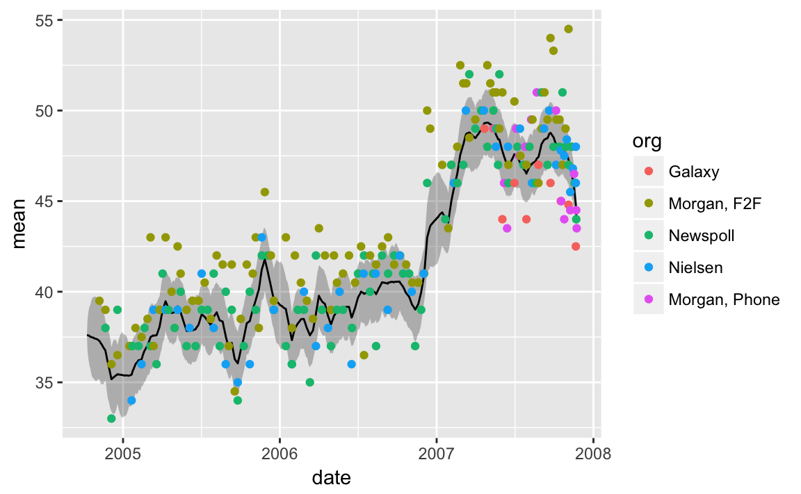

# Pooling the Polls Over an Election Campaign {#campaign}


```r
library("rstan")
library("tidyverse")
library("lubridate")
library("stringr")
library("pscl")
```

This is an example of pooling polls (public opinion surveys) over time to estimate public opinion.
This example comes from @Jackman2005a and @Jackman2009a, it uses Australian polls of political party preferences between the 2004 and 2007 Australian general elections.
This model is similar to, and a simplified form of the polling aggregation methods recently and most notably used by FiveThirtyEight, HuffingtonPost, DailyKos, NYTimes Upshot and others in US elections [@Linzer2013a].

## Data

The data for Australian 

```r
data("AustralianElectionPolling", package = "pscl")
glimpse(AustralianElectionPolling)
#> Observations: 239
#> Variables: 14
#> $ ALP         <dbl> 39.5, 39.0, 38.0, 36.0, 33.0, 36.5, 39.0, 37.0, 34...
#> $ Lib         <dbl> 44.5, 44.0, 46.0, 46.5, 47.0, 45.5, 46.0, 47.0, 52...
#> $ Nat         <dbl> 0, 0, 0, 0, 0, 0, 0, 0, 0, 0, 0, 0, 0, 0, 0, 0, 0,...
#> $ Green       <dbl> 8.5, 8.5, 6.0, 9.0, 8.0, 9.5, 6.0, 7.5, 8.0, 7.0, ...
#> $ FamilyFirst <dbl> 2.0, 1.5, 0.0, 2.5, 0.0, 2.0, 0.0, 2.0, 0.0, 0.0, ...
#> $ Dems        <dbl> 2.0, 2.0, 0.0, 1.5, 0.0, 1.5, 0.0, 1.5, 2.0, 0.0, ...
#> $ OneNation   <dbl> 1.0, 1.0, 0.0, 1.0, 0.0, 1.5, 0.0, 1.0, 1.0, 0.0, ...
#> $ DK          <dbl> 0, 0, 0, 0, 0, 0, 0, 0, 0, 0, 0, 0, 0, 0, 0, 0, 0,...
#> $ sampleSize  <dbl> 1451, 2090, 1150, 1451, 1130, 2136, 1132, 2010, 14...
#> $ org         <fctr> Morgan, F2F, Morgan, F2F, Newspoll, Morgan, F2F, ...
#> $ startDate   <date> 2004-10-30, 2004-11-13, 2004-11-19, 2004-11-27, 2...
#> $ endDate     <date> 2004-11-07, 2004-11-21, 2004-11-21, 2004-12-05, 2...
#> $ source      <chr> "", "http://www.roymorgan.com/news/polls/2004/3808...
#> $ remark      <chr> "", "face-to-face", "", "face-to-face", "", "face-...
```

The election result data for the House of Representatives: "first preferences".[^auselecsrc]

```r
elections <-
  list(
    `2007` = list(
      date = ymd(20071124),
      ALP = 43.4,
      Lib = 36.3,
      Nat = 5.5,
      Green = 7.8,
      FamilyFirst = 2,
      Dems = 0.7,
      OneNation = 0.3,
      sampleSize = 12419863
    ),
    `2004` = list(
      date = ymd(20041009),
      ALP = 37.6,
      Lib = 40.5,
      Nat = 5.9,
      Green = 7.2,
      FamilyFirst = 2.0,
      Dems = 1.2,
      OneNation = 1.2,
      sampleSize = 11715132      
    )
  )
```


```r
START_DATE <- elections[["2004"]][["date"]]
  
AustralianElectionPolling <-
  AustralianElectionPolling %>%
  mutate(midDate = as.Date(startDate + difftime(endDate, startDate)),
         ALP_se = ALP * (100 - ALP) / sampleSize,
         time = as.integer(difftime(midDate, START_DATE, units = "days")) + 1L,
         pollster = as.integer(factor(org)))
  
```

## Model

The Stan model is:

```r
campaign_mod <- stan_model("stan/campaign.stan")
```
<pre>
  <code class="stan">// polling model
data {
  int<lower = 1> N;
  int<lower = 1> T;
  vector[N] y;
  vector<lower = 0.>[N] s;
  int<lower = 1, upper = T> time[N];
  int H;
  int<lower = 1, upper = H> house[N];
  // initial and final values
  real xi_init;
  real xi_final;
  real delta_loc;
  real<lower = 0.> zeta_scale;
  real<lower = 0.> tau_scale;
}
parameters {
  vector[T - 1] omega;
  real<lower = 0.> tau;
  vector[H] delta_raw;
  real<lower = 0.> zeta;
}
transformed parameters {
  vector[H] delta;
  vector[T - 1] xi;
  vector[N] mu;
  // this is necessary. If not centered the model is unidentified
  delta = (delta_raw - mean(delta_raw)) / sd(delta_raw) * zeta;
  xi[1] = xi_init;
  for (i in 2:(T - 1)) {
    xi[i] = xi[i - 1] + tau * omega[i - 1];
  }
  for (i in 1:N) {
    mu[i] = xi[time[i]] + delta[house[i]];
  }
}
model {
  // house effects
  delta_raw ~ normal(0., 1.);
  zeta ~ normal(0., zeta_scale);
  // latent state innovations
  omega ~ normal(0., 1.);
  // scale of innovations
  tau ~ cauchy(0, tau_scale);
  // final known effect
  xi_final ~ normal(xi[T - 1], tau);
  // daily polls
  y ~ normal(mu, s);
}</code>
</pre>

For House effects assume mean zero and a standard deviation of 7.5. The standard deviation corresponds to house effects with a 95% confidence interval of between -15 and 15 (which would be large).

It is expected that most polling movements are $\pm 2$ percentage points.


## Estimation


```r
campaign_data <- within(list(), {
  y <- AustralianElectionPolling$ALP
  s <- AustralianElectionPolling$ALP_se
  time <- AustralianElectionPolling$time
  house <- AustralianElectionPolling$pollster
  H <- max(AustralianElectionPolling$pollster)
  N <- length(y)
  T <- as.integer(difftime(elections[["2007"]][["date"]], elections[["2004"]][["date"]], units = "days")) + 1
  xi_init <- elections[["2004"]][["ALP"]]
  xi_final <- elections[["2007"]][["ALP"]]
  delta_loc <- 0
  tau_scale <- sd(y)
  zeta_scale <- 5
})
```


```r
campaign_fit <- sampling(campaign_mod, data = campaign_data,
                         chains = 1,
                         init = list(list(xi = rep(mean(campaign_data$y), campaign_data$N))))
#> The following numerical problems occurred the indicated number of times on chain 1
#>                                                                                          count
#> Exception thrown at line 46: normal_lpdf: Location parameter is inf, but must be finite!     1
#> When a numerical problem occurs, the Hamiltonian proposal gets rejected.
#> See http://mc-stan.org/misc/warnings.html#exception-hamiltonian-proposal-rejected
#> If the number in the 'count' column is small, there is no need to ask about this message on stan-users.
```

```r
campaign_fit
#> Inference for Stan model: campaign.
#> 1 chains, each with iter=2000; warmup=1000; thin=1; 
#> post-warmup draws per chain=1000, total post-warmup draws=1000.
#> 
#>                 mean se_mean    sd    2.5%     25%     50%     75%   97.5%
#> omega[1]       -0.01    0.03  1.00   -1.98   -0.66   -0.01    0.65    1.96
#> omega[2]       -0.01    0.03  0.96   -1.79   -0.67   -0.05    0.65    1.93
#> omega[3]       -0.02    0.03  1.03   -2.20   -0.73    0.01    0.72    1.84
#> omega[4]       -0.01    0.03  0.98   -1.93   -0.69    0.01    0.66    1.89
#> omega[5]       -0.04    0.03  0.97   -1.83   -0.68   -0.07    0.62    1.77
#> omega[6]       -0.07    0.03  0.98   -1.85   -0.72   -0.08    0.60    1.90
#> omega[7]       -0.03    0.03  0.94   -1.91   -0.67   -0.03    0.63    1.76
#> omega[8]       -0.05    0.03  0.94   -1.86   -0.71   -0.02    0.60    1.80
#> omega[9]       -0.03    0.03  1.01   -2.02   -0.69   -0.06    0.64    1.84
#> omega[10]      -0.01    0.03  0.96   -1.87   -0.67   -0.02    0.62    1.85
#> omega[11]      -0.05    0.03  1.01   -2.01   -0.68   -0.04    0.62    1.95
#> omega[12]      -0.02    0.03  0.95   -1.84   -0.66   -0.04    0.62    1.96
#> omega[13]      -0.04    0.03  1.01   -1.97   -0.74   -0.03    0.67    1.90
#> omega[14]       0.00    0.03  0.97   -1.88   -0.66    0.00    0.63    1.91
#> omega[15]      -0.02    0.03  0.90   -1.76   -0.65   -0.02    0.60    1.78
#> omega[16]      -0.05    0.03  0.98   -2.03   -0.70   -0.06    0.61    1.76
#> omega[17]      -0.06    0.03  1.00   -1.94   -0.70   -0.06    0.58    1.89
#> omega[18]      -0.01    0.03  0.92   -1.84   -0.63   -0.03    0.60    1.85
#> omega[19]      -0.02    0.03  1.02   -1.88   -0.74   -0.05    0.67    1.96
#> omega[20]      -0.04    0.03  0.97   -1.91   -0.65   -0.01    0.59    1.87
#> omega[21]      -0.02    0.03  0.96   -1.92   -0.65   -0.05    0.61    1.96
#> omega[22]      -0.02    0.03  1.00   -1.95   -0.70   -0.04    0.65    1.95
#> omega[23]      -0.01    0.03  0.99   -1.92   -0.66   -0.03    0.63    1.98
#> omega[24]      -0.03    0.03  1.01   -2.02   -0.75   -0.01    0.69    1.92
#> omega[25]      -0.05    0.03  0.95   -1.88   -0.66   -0.04    0.55    1.87
#> omega[26]      -0.05    0.03  1.00   -1.99   -0.71   -0.06    0.63    1.85
#> omega[27]      -0.06    0.03  1.05   -2.10   -0.76   -0.03    0.67    1.95
#> omega[28]      -0.04    0.03  0.97   -2.06   -0.67   -0.08    0.60    1.87
#> omega[29]      -0.06    0.03  1.01   -2.04   -0.72   -0.05    0.58    1.92
#> omega[30]      -0.08    0.03  1.03   -2.16   -0.74   -0.09    0.62    1.99
#> omega[31]      -0.13    0.03  1.00   -2.06   -0.79   -0.16    0.51    1.82
#> omega[32]      -0.10    0.03  0.99   -1.93   -0.76   -0.10    0.54    1.81
#> omega[33]      -0.11    0.03  0.96   -1.98   -0.69   -0.13    0.49    1.81
#> omega[34]      -0.05    0.03  1.00   -2.12   -0.66   -0.04    0.57    1.99
#> omega[35]      -0.12    0.03  0.94   -1.96   -0.72   -0.10    0.53    1.61
#> omega[36]      -0.13    0.03  0.92   -2.02   -0.75   -0.15    0.49    1.62
#> omega[37]      -0.12    0.03  0.95   -1.94   -0.79   -0.14    0.52    1.73
#> omega[38]      -0.12    0.03  1.01   -2.10   -0.79   -0.14    0.53    1.91
#> omega[39]      -0.10    0.03  0.98   -1.94   -0.78   -0.08    0.59    1.78
#> omega[40]      -0.08    0.03  0.98   -2.01   -0.72   -0.10    0.57    1.92
#> omega[41]      -0.11    0.03  1.05   -2.19   -0.79   -0.10    0.55    1.90
#> omega[42]      -0.09    0.03  1.01   -2.01   -0.73   -0.12    0.53    1.91
#> omega[43]      -0.16    0.03  1.00   -2.06   -0.85   -0.18    0.56    1.78
#> omega[44]      -0.33    0.03  0.97   -2.14   -1.00   -0.32    0.36    1.49
#> omega[45]      -0.30    0.03  1.00   -2.20   -1.04   -0.30    0.39    1.57
#> omega[46]      -0.34    0.03  0.97   -2.25   -0.98   -0.34    0.28    1.58
#> omega[47]      -0.36    0.03  0.94   -2.33   -0.96   -0.38    0.25    1.50
#> omega[48]      -0.29    0.03  0.98   -2.25   -0.94   -0.26    0.37    1.61
#> omega[49]      -0.27    0.03  0.97   -2.11   -0.90   -0.25    0.40    1.65
#> omega[50]      -0.28    0.03  1.03   -2.32   -1.00   -0.26    0.47    1.66
#> omega[51]      -0.30    0.03  0.94   -2.14   -0.86   -0.30    0.31    1.56
#> omega[52]      -0.30    0.03  1.05   -2.42   -0.98   -0.30    0.36    1.79
#> omega[53]      -0.31    0.03  0.91   -2.16   -0.89   -0.31    0.28    1.45
#> omega[54]      -0.32    0.03  0.93   -2.15   -0.91   -0.31    0.29    1.47
#> omega[55]      -0.31    0.03  0.93   -2.06   -0.96   -0.31    0.34    1.49
#> omega[56]      -0.35    0.03  0.94   -2.22   -0.97   -0.36    0.29    1.47
#> omega[57]      -0.29    0.03  0.98   -2.21   -0.98   -0.28    0.41    1.65
#> omega[58]       0.03    0.03  0.97   -1.86   -0.63    0.03    0.68    2.05
#> omega[59]       0.08    0.03  0.97   -1.88   -0.58    0.12    0.76    1.93
#> omega[60]       0.06    0.03  1.04   -1.93   -0.65    0.04    0.75    2.03
#> omega[61]       0.04    0.03  1.07   -2.05   -0.68    0.03    0.76    2.14
#> omega[62]       0.06    0.03  0.93   -1.69   -0.58    0.09    0.73    1.82
#> omega[63]       0.04    0.03  1.07   -2.08   -0.66    0.02    0.72    2.20
#> omega[64]       0.06    0.03  0.95   -1.92   -0.58    0.10    0.67    1.96
#> omega[65]       0.05    0.03  0.97   -1.87   -0.57    0.05    0.68    1.96
#> omega[66]       0.04    0.03  0.93   -1.79   -0.53    0.06    0.64    1.95
#> omega[67]       0.08    0.03  0.94   -1.78   -0.58    0.08    0.75    1.88
#> omega[68]       0.04    0.03  1.02   -2.00   -0.65    0.05    0.76    1.93
#> omega[69]       0.03    0.03  0.94   -1.85   -0.56    0.05    0.65    1.92
#> omega[70]       0.02    0.03  0.95   -1.72   -0.62    0.01    0.68    1.91
#> omega[71]       0.11    0.03  0.96   -1.73   -0.54    0.11    0.74    1.98
#> omega[72]      -0.02    0.03  0.94   -1.78   -0.67   -0.01    0.60    1.86
#> omega[73]      -0.05    0.03  1.01   -2.10   -0.70   -0.07    0.60    2.05
#> omega[74]       0.02    0.03  1.00   -1.85   -0.65    0.04    0.73    1.87
#> omega[75]      -0.01    0.03  1.05   -2.13   -0.76    0.02    0.67    2.09
#> omega[76]       0.00    0.03  0.94   -1.77   -0.60   -0.02    0.60    1.81
#> omega[77]      -0.01    0.03  1.02   -1.94   -0.74    0.00    0.64    2.00
#> omega[78]      -0.04    0.03  1.04   -2.02   -0.76   -0.07    0.66    2.08
#> omega[79]      -0.01    0.03  0.97   -1.92   -0.68    0.02    0.64    1.87
#> omega[80]       0.01    0.03  1.03   -1.99   -0.69    0.02    0.71    1.91
#> omega[81]      -0.03    0.03  1.02   -2.00   -0.76   -0.01    0.71    1.85
#> omega[82]       0.00    0.03  0.98   -1.91   -0.67   -0.02    0.67    1.98
#> omega[83]       0.00    0.03  0.98   -1.98   -0.65    0.01    0.61    1.93
#> omega[84]      -0.03    0.03  1.02   -2.04   -0.72   -0.02    0.69    1.98
#> omega[85]      -0.03    0.03  1.00   -1.94   -0.73   -0.04    0.67    1.81
#> omega[86]       0.00    0.03  0.98   -1.94   -0.62    0.01    0.63    1.86
#> omega[87]       0.01    0.03  1.02   -1.95   -0.66    0.04    0.70    2.04
#> omega[88]      -0.03    0.03  0.97   -2.00   -0.63   -0.03    0.59    1.91
#> omega[89]       0.02    0.03  0.93   -1.84   -0.60    0.03    0.64    1.84
#> omega[90]       0.01    0.03  1.00   -2.02   -0.65    0.01    0.71    1.92
#> omega[91]      -0.02    0.03  0.97   -1.90   -0.68   -0.04    0.61    1.93
#> omega[92]       0.03    0.03  0.96   -1.79   -0.65    0.03    0.70    1.85
#> omega[93]       0.00    0.03  1.00   -1.91   -0.64    0.00    0.67    2.03
#> omega[94]      -0.02    0.03  1.01   -1.98   -0.68    0.03    0.69    1.89
#> omega[95]      -0.02    0.03  1.00   -1.97   -0.73   -0.01    0.63    1.91
#> omega[96]       0.01    0.03  0.99   -1.98   -0.67   -0.01    0.68    1.89
#> omega[97]      -0.02    0.03  0.98   -1.89   -0.71   -0.03    0.66    1.96
#> omega[98]       0.00    0.03  0.92   -1.92   -0.59    0.02    0.59    1.88
#> omega[99]       0.00    0.03  0.99   -1.88   -0.72    0.02    0.70    1.85
#> omega[100]      0.03    0.03  0.97   -1.80   -0.64    0.03    0.68    1.93
#> omega[101]      0.05    0.03  0.95   -1.89   -0.61    0.09    0.68    1.93
#> omega[102]      0.04    0.03  0.96   -1.80   -0.61    0.04    0.66    2.02
#> omega[103]      0.02    0.03  0.99   -2.07   -0.64    0.03    0.70    1.92
#> omega[104]      0.03    0.03  0.97   -1.77   -0.63    0.00    0.67    1.95
#> omega[105]      0.24    0.03  0.98   -1.75   -0.40    0.25    0.86    2.21
#> omega[106]      0.23    0.03  1.02   -1.88   -0.45    0.22    0.91    2.22
#> omega[107]      0.19    0.03  1.01   -1.75   -0.48    0.18    0.88    2.06
#> omega[108]      0.11    0.03  0.97   -1.71   -0.59    0.10    0.82    1.95
#> omega[109]      0.16    0.03  1.02   -1.75   -0.54    0.17    0.85    2.12
#> omega[110]      0.18    0.03  0.91   -1.52   -0.47    0.17    0.79    1.97
#> omega[111]      0.14    0.03  1.00   -1.87   -0.57    0.13    0.82    2.13
#> omega[112]      0.18    0.03  0.96   -1.67   -0.48    0.19    0.81    2.12
#> omega[113]      0.18    0.03  1.04   -1.82   -0.51    0.22    0.87    2.23
#> omega[114]      0.09    0.03  0.94   -1.84   -0.52    0.11    0.70    1.93
#> omega[115]      0.07    0.03  0.96   -1.77   -0.56    0.04    0.72    2.04
#> omega[116]      0.06    0.03  0.92   -1.84   -0.56    0.06    0.71    1.79
#> omega[117]      0.08    0.03  0.95   -1.76   -0.57    0.10    0.74    1.94
#> omega[118]      0.09    0.03  0.95   -1.83   -0.55    0.09    0.76    1.94
#> omega[119]      0.10    0.03  0.95   -1.80   -0.55    0.08    0.75    2.02
#> omega[120]      0.12    0.03  0.95   -1.76   -0.53    0.11    0.76    1.93
#> omega[121]      0.02    0.03  0.98   -1.87   -0.61    0.02    0.63    1.83
#> omega[122]     -0.02    0.03  0.95   -1.93   -0.68   -0.03    0.67    1.74
#> omega[123]      0.05    0.03  0.95   -1.83   -0.59    0.08    0.74    1.81
#> omega[124]      0.04    0.03  1.02   -1.84   -0.69    0.03    0.74    2.03
#> omega[125]      0.01    0.03  0.96   -1.89   -0.63   -0.01    0.68    1.93
#> omega[126]      0.04    0.03  0.99   -1.89   -0.65    0.01    0.76    2.00
#> omega[127]     -0.01    0.03  0.94   -1.83   -0.68   -0.01    0.65    1.84
#> omega[128]      0.19    0.03  0.94   -1.77   -0.41    0.18    0.85    1.95
#> omega[129]      0.23    0.03  0.94   -1.61   -0.43    0.23    0.86    2.12
#> omega[130]      0.21    0.03  1.02   -1.83   -0.45    0.22    0.88    2.26
#> omega[131]      0.18    0.03  1.01   -1.73   -0.53    0.18    0.86    2.13
#> omega[132]      0.20    0.03  0.96   -1.69   -0.44    0.18    0.82    2.17
#> omega[133]      0.16    0.03  0.96   -1.73   -0.51    0.18    0.81    2.08
#> omega[134]      0.19    0.03  0.95   -1.69   -0.49    0.21    0.84    1.87
#> omega[135]      0.07    0.03  0.97   -1.88   -0.56    0.07    0.71    1.93
#> omega[136]      0.14    0.03  1.00   -1.84   -0.52    0.16    0.82    2.07
#> omega[137]      0.12    0.03  0.95   -1.80   -0.55    0.12    0.72    2.03
#> omega[138]      0.14    0.03  0.95   -1.75   -0.47    0.13    0.79    1.92
#> omega[139]      0.09    0.03  0.98   -1.84   -0.53    0.09    0.73    2.02
#> omega[140]      0.10    0.03  0.94   -1.81   -0.52    0.08    0.74    1.95
#> omega[141]      0.08    0.03  0.99   -1.66   -0.64    0.06    0.77    1.88
#> omega[142]      0.23    0.03  0.96   -1.71   -0.41    0.24    0.89    2.11
#> omega[143]      0.18    0.03  1.00   -1.85   -0.50    0.16    0.84    2.21
#> omega[144]      0.19    0.03  0.97   -1.71   -0.48    0.17    0.87    2.03
#> omega[145]      0.17    0.03  1.00   -1.77   -0.53    0.20    0.86    2.02
#> omega[146]      0.17    0.03  0.96   -1.70   -0.48    0.19    0.83    1.97
#> omega[147]      0.22    0.03  0.96   -1.70   -0.41    0.21    0.85    2.09
#> omega[148]      0.19    0.03  1.01   -1.73   -0.51    0.19    0.88    2.24
#> omega[149]      0.06    0.03  0.98   -1.95   -0.55    0.06    0.68    2.00
#> omega[150]      0.04    0.03  0.98   -1.87   -0.71    0.05    0.71    1.95
#> omega[151]      0.04    0.03  1.00   -1.81   -0.66    0.02    0.72    2.07
#> omega[152]      0.02    0.03  0.92   -1.84   -0.53    0.04    0.58    1.92
#> omega[153]      0.08    0.03  0.99   -1.92   -0.57    0.12    0.73    1.95
#> omega[154]      0.01    0.03  1.01   -1.88   -0.70    0.01    0.72    2.00
#> omega[155]      0.02    0.03  0.99   -1.86   -0.68    0.03    0.74    1.93
#> omega[156]     -0.03    0.03  0.95   -1.85   -0.70   -0.04    0.69    1.72
#> omega[157]      0.02    0.03  0.92   -1.74   -0.62    0.00    0.63    1.77
#> omega[158]      0.03    0.03  1.03   -1.94   -0.70    0.06    0.79    1.89
#> omega[159]     -0.01    0.03  1.01   -2.00   -0.67   -0.03    0.68    2.01
#> omega[160]      0.01    0.03  0.98   -1.95   -0.64    0.01    0.72    1.90
#> omega[161]      0.02    0.03  0.94   -1.84   -0.60    0.01    0.63    1.83
#> omega[162]      0.01    0.03  0.98   -1.87   -0.61    0.01    0.65    1.88
#> omega[163]      0.18    0.03  0.94   -1.65   -0.48    0.17    0.78    2.07
#> omega[164]      0.17    0.03  0.96   -1.72   -0.44    0.18    0.80    2.09
#> omega[165]      0.20    0.03  0.97   -1.74   -0.45    0.23    0.91    1.95
#> omega[166]      0.20    0.03  0.98   -1.67   -0.47    0.20    0.89    2.10
#> omega[167]      0.17    0.03  0.97   -1.68   -0.48    0.17    0.83    2.01
#> omega[168]      0.18    0.03  0.96   -1.72   -0.46    0.16    0.77    2.15
#> omega[169]      0.19    0.03  0.97   -1.72   -0.43    0.24    0.85    2.09
#> omega[170]      0.37    0.03  0.95   -1.47   -0.26    0.38    1.01    2.16
#> omega[171]      0.35    0.03  0.97   -1.48   -0.32    0.34    1.02    2.22
#> omega[172]      0.36    0.03  0.95   -1.47   -0.27    0.35    1.01    2.24
#> omega[173]      0.38    0.03  0.97   -1.54   -0.32    0.39    1.08    2.21
#> omega[174]      0.32    0.03  1.02   -1.71   -0.30    0.34    1.01    2.30
#> omega[175]      0.35    0.03  1.01   -1.59   -0.33    0.34    1.07    2.29
#> omega[176]      0.34    0.03  0.96   -1.55   -0.26    0.35    0.99    2.26
#> omega[177]      0.17    0.03  0.93   -1.60   -0.51    0.16    0.82    2.01
#> omega[178]      0.21    0.03  0.96   -1.79   -0.41    0.23    0.83    2.04
#> omega[179]      0.21    0.03  0.93   -1.58   -0.40    0.21    0.82    2.06
#> omega[180]      0.21    0.03  0.97   -1.72   -0.44    0.18    0.85    2.18
#> omega[181]      0.24    0.03  0.99   -1.68   -0.49    0.30    0.91    2.17
#> omega[182]      0.20    0.03  1.00   -1.76   -0.50    0.21    0.84    2.19
#> omega[183]      0.22    0.03  1.03   -1.78   -0.46    0.24    0.87    2.27
#> omega[184]     -0.16    0.03  1.02   -2.22   -0.85   -0.15    0.53    1.90
#> omega[185]     -0.14    0.03  0.98   -2.08   -0.84   -0.14    0.56    1.73
#> omega[186]     -0.15    0.03  0.97   -2.02   -0.78   -0.16    0.48    1.74
#> omega[187]     -0.14    0.03  1.01   -2.11   -0.85   -0.14    0.55    1.81
#> omega[188]     -0.17    0.03  1.00   -2.05   -0.89   -0.16    0.53    1.74
#> omega[189]     -0.12    0.03  1.02   -2.13   -0.75   -0.12    0.53    1.89
#> omega[190]     -0.14    0.03  0.99   -2.15   -0.82   -0.15    0.58    1.76
#> omega[191]     -0.09    0.03  0.97   -1.95   -0.73   -0.11    0.57    1.77
#> omega[192]     -0.12    0.03  0.96   -1.98   -0.79   -0.10    0.55    1.72
#> omega[193]     -0.12    0.03  0.96   -2.03   -0.78   -0.12    0.52    1.79
#> omega[194]     -0.08    0.03  0.95   -1.93   -0.72   -0.07    0.62    1.63
#> omega[195]     -0.10    0.03  1.02   -2.10   -0.74   -0.10    0.53    2.01
#> omega[196]     -0.11    0.03  0.94   -1.89   -0.80   -0.13    0.51    1.77
#> omega[197]     -0.12    0.03  1.01   -2.20   -0.73   -0.12    0.56    1.95
#> omega[198]      0.00    0.03  0.97   -1.81   -0.68    0.00    0.70    1.89
#> omega[199]      0.03    0.03  1.02   -1.86   -0.69    0.05    0.71    1.93
#> omega[200]      0.03    0.03  0.99   -1.96   -0.62    0.02    0.69    1.95
#> omega[201]     -0.01    0.03  1.02   -1.93   -0.70   -0.02    0.68    2.10
#> omega[202]      0.01    0.03  0.93   -1.86   -0.58   -0.01    0.62    1.83
#> omega[203]      0.05    0.03  0.95   -1.88   -0.59    0.05    0.71    1.97
#> omega[204]      0.06    0.03  0.97   -1.94   -0.59    0.07    0.74    1.86
#> omega[205]      0.08    0.03  0.97   -1.85   -0.56    0.07    0.72    2.04
#> omega[206]      0.15    0.03  1.02   -1.81   -0.55    0.15    0.85    2.17
#> omega[207]      0.10    0.03  0.98   -1.88   -0.55    0.10    0.75    2.06
#> omega[208]      0.10    0.03  0.97   -1.80   -0.59    0.09    0.79    1.93
#> omega[209]      0.15    0.03  1.01   -1.79   -0.56    0.16    0.85    2.03
#> omega[210]      0.11    0.03  0.98   -1.72   -0.53    0.08    0.73    2.11
#> omega[211]      0.14    0.03  0.94   -1.65   -0.48    0.14    0.73    1.97
#> omega[212]     -0.13    0.03  1.04   -2.16   -0.87   -0.14    0.61    1.75
#> omega[213]     -0.09    0.03  0.95   -2.03   -0.73   -0.10    0.56    1.76
#> omega[214]     -0.13    0.03  0.98   -1.99   -0.80   -0.15    0.56    1.78
#> omega[215]     -0.09    0.03  1.01   -2.09   -0.77   -0.09    0.56    1.85
#> omega[216]     -0.10    0.03  1.00   -2.03   -0.75   -0.15    0.54    1.83
#> omega[217]     -0.15    0.03  0.92   -1.91   -0.74   -0.15    0.44    1.67
#> omega[218]     -0.16    0.03  0.95   -2.04   -0.83   -0.16    0.50    1.63
#> omega[219]     -0.28    0.03  0.99   -2.13   -0.97   -0.26    0.37    1.70
#> omega[220]     -0.22    0.03  1.02   -2.21   -0.96   -0.21    0.50    1.75
#> omega[221]     -0.19    0.03  0.97   -1.97   -0.84   -0.23    0.45    1.72
#> omega[222]     -0.20    0.03  1.00   -2.20   -0.90   -0.20    0.47    1.76
#> omega[223]     -0.21    0.03  0.97   -2.08   -0.88   -0.23    0.46    1.75
#> omega[224]     -0.22    0.03  1.00   -2.10   -0.89   -0.23    0.43    1.67
#> omega[225]     -0.18    0.03  0.99   -2.03   -0.84   -0.18    0.54    1.74
#> omega[226]     -0.22    0.03  1.00   -2.21   -0.88   -0.17    0.42    1.75
#> omega[227]     -0.19    0.03  1.02   -2.20   -0.86   -0.21    0.52    1.79
#> omega[228]     -0.19    0.03  0.95   -2.10   -0.83   -0.18    0.46    1.67
#> omega[229]     -0.19    0.03  0.99   -2.15   -0.83   -0.20    0.45    1.91
#> omega[230]     -0.18    0.03  0.96   -2.15   -0.79   -0.18    0.48    1.58
#> omega[231]     -0.20    0.03  0.92   -1.96   -0.85   -0.23    0.41    1.59
#> omega[232]     -0.21    0.03  0.94   -2.10   -0.85   -0.19    0.41    1.56
#> omega[233]     -0.03    0.03  0.92   -1.77   -0.65   -0.01    0.58    1.80
#> omega[234]     -0.03    0.03  0.98   -1.84   -0.73   -0.03    0.68    1.84
#> omega[235]      0.04    0.03  1.01   -1.91   -0.64    0.05    0.67    2.10
#> omega[236]      0.00    0.03  0.99   -1.98   -0.65    0.00    0.67    1.89
#> omega[237]     -0.02    0.03  1.00   -1.94   -0.73    0.01    0.68    1.90
#> omega[238]     -0.02    0.03  1.00   -1.89   -0.70    0.01    0.66    1.90
#> omega[239]      0.05    0.03  1.01   -1.95   -0.60    0.04    0.75    1.84
#> omega[240]      0.01    0.03  0.95   -1.86   -0.63   -0.01    0.62    1.97
#> omega[241]      0.01    0.03  0.98   -1.82   -0.64    0.03    0.62    1.88
#> omega[242]      0.03    0.03  0.92   -1.87   -0.54    0.05    0.65    1.80
#> omega[243]      0.03    0.03  0.94   -1.75   -0.57    0.00    0.65    1.91
#> omega[244]      0.02    0.03  0.96   -1.86   -0.64    0.04    0.66    1.94
#> omega[245]     -0.02    0.03  0.97   -1.92   -0.70   -0.04    0.62    1.96
#> omega[246]      0.02    0.03  0.98   -1.84   -0.65   -0.02    0.65    1.94
#> omega[247]      0.00    0.03  0.94   -1.89   -0.61    0.01    0.62    1.95
#> omega[248]      0.06    0.03  1.05   -1.99   -0.66    0.07    0.79    2.05
#> omega[249]      0.04    0.03  1.00   -1.83   -0.63    0.04    0.76    1.97
#> omega[250]      0.00    0.03  0.99   -1.97   -0.66   -0.02    0.71    1.91
#> omega[251]      0.05    0.03  0.95   -1.68   -0.62    0.06    0.72    1.88
#> omega[252]      0.00    0.03  1.03   -1.92   -0.69   -0.01    0.64    2.11
#> omega[253]      0.02    0.03  1.03   -2.00   -0.69    0.02    0.76    1.90
#> omega[254]      0.12    0.03  1.01   -1.88   -0.52    0.14    0.78    2.23
#> omega[255]      0.12    0.03  0.98   -1.72   -0.58    0.11    0.77    2.10
#> omega[256]      0.10    0.03  1.04   -1.94   -0.61    0.12    0.85    2.07
#> omega[257]      0.08    0.03  0.99   -1.96   -0.56    0.10    0.74    2.04
#> omega[258]      0.08    0.03  1.01   -1.82   -0.62    0.10    0.80    1.94
#> omega[259]      0.11    0.03  0.93   -1.70   -0.52    0.14    0.76    1.90
#> omega[260]      0.14    0.03  1.00   -1.76   -0.51    0.17    0.79    2.26
#> omega[261]      0.21    0.03  0.96   -1.65   -0.45    0.21    0.88    2.08
#> omega[262]      0.19    0.03  1.03   -1.78   -0.52    0.16    0.90    2.31
#> omega[263]      0.21    0.03  0.96   -1.61   -0.44    0.23    0.82    2.14
#> omega[264]      0.25    0.03  0.96   -1.59   -0.42    0.21    0.92    2.12
#> omega[265]      0.22    0.03  0.94   -1.74   -0.37    0.25    0.83    2.10
#> omega[266]      0.18    0.03  1.01   -1.77   -0.56    0.18    0.90    2.05
#> omega[267]      0.19    0.03  0.97   -1.61   -0.46    0.21    0.85    2.01
#> omega[268]     -0.05    0.03  1.00   -1.97   -0.71   -0.08    0.64    1.94
#> omega[269]     -0.02    0.03  0.97   -1.90   -0.70    0.02    0.63    1.91
#> omega[270]     -0.05    0.03  0.92   -1.83   -0.65   -0.04    0.54    1.80
#> omega[271]     -0.08    0.03  1.01   -2.05   -0.79   -0.09    0.65    1.82
#> omega[272]     -0.07    0.03  0.97   -1.95   -0.72   -0.10    0.59    1.84
#> omega[273]     -0.03    0.03  0.96   -1.85   -0.71   -0.05    0.65    1.86
#> omega[274]     -0.07    0.03  0.94   -1.90   -0.69   -0.06    0.58    1.80
#> omega[275]     -0.06    0.03  0.97   -1.90   -0.75   -0.06    0.63    1.75
#> omega[276]     -0.09    0.03  0.95   -1.94   -0.73   -0.10    0.50    1.82
#> omega[277]     -0.11    0.03  1.04   -2.15   -0.83   -0.09    0.61    2.02
#> omega[278]     -0.09    0.03  0.95   -1.87   -0.76   -0.08    0.52    1.82
#> omega[279]     -0.07    0.03  0.97   -1.96   -0.76   -0.04    0.58    1.77
#> omega[280]     -0.05    0.03  0.93   -1.84   -0.68   -0.06    0.58    1.74
#> omega[281]     -0.07    0.03  0.97   -1.96   -0.78   -0.09    0.57    1.83
#> omega[282]     -0.10    0.03  0.99   -2.12   -0.76   -0.11    0.56    1.81
#> omega[283]     -0.12    0.03  0.93   -1.85   -0.77   -0.13    0.50    1.68
#> omega[284]     -0.07    0.03  0.97   -2.12   -0.68   -0.05    0.57    1.87
#> omega[285]     -0.12    0.03  0.98   -2.04   -0.78   -0.12    0.56    1.78
#> omega[286]     -0.07    0.03  1.00   -1.98   -0.69   -0.08    0.57    2.07
#> omega[287]     -0.14    0.03  0.98   -2.07   -0.83   -0.10    0.51    1.83
#> omega[288]     -0.08    0.03  1.01   -2.06   -0.75   -0.07    0.59    2.00
#> omega[289]      0.17    0.03  0.92   -1.62   -0.43    0.17    0.71    2.08
#> omega[290]      0.20    0.03  0.96   -1.76   -0.46    0.22    0.82    2.11
#> omega[291]      0.18    0.03  1.02   -1.80   -0.53    0.19    0.89    2.12
#> omega[292]      0.17    0.03  1.01   -1.80   -0.50    0.16    0.89    2.06
#> omega[293]      0.21    0.03  1.00   -1.66   -0.49    0.23    0.94    2.05
#> omega[294]      0.14    0.03  0.99   -1.73   -0.49    0.11    0.80    2.05
#> omega[295]      0.17    0.03  0.96   -1.75   -0.46    0.19    0.81    2.06
#> omega[296]      0.09    0.03  0.95   -1.81   -0.56    0.12    0.74    1.80
#> omega[297]      0.12    0.03  0.93   -1.63   -0.52    0.10    0.72    1.99
#> omega[298]      0.11    0.03  0.99   -1.75   -0.57    0.13    0.79    1.99
#> omega[299]      0.09    0.03  0.96   -1.79   -0.55    0.09    0.74    1.91
#> omega[300]      0.07    0.03  0.99   -1.86   -0.62    0.08    0.74    2.02
#> omega[301]      0.12    0.03  0.99   -1.80   -0.59    0.13    0.79    2.02
#> omega[302]      0.10    0.03  0.93   -1.77   -0.54    0.14    0.72    1.95
#> omega[303]     -0.21    0.03  0.95   -2.21   -0.82   -0.22    0.39    1.66
#> omega[304]     -0.19    0.03  1.07   -2.25   -0.91   -0.23    0.53    1.89
#> omega[305]     -0.15    0.03  1.02   -2.28   -0.81   -0.11    0.56    1.84
#> omega[306]     -0.16    0.03  1.00   -2.22   -0.86   -0.18    0.50    1.83
#> omega[307]     -0.19    0.03  0.96   -2.02   -0.82   -0.21    0.40    1.77
#> omega[308]     -0.19    0.03  1.00   -2.17   -0.85   -0.22    0.46    1.78
#> omega[309]     -0.14    0.03  0.99   -2.15   -0.76   -0.17    0.50    1.92
#> omega[310]     -0.02    0.03  0.98   -1.89   -0.72    0.02    0.63    1.88
#> omega[311]     -0.01    0.03  0.98   -1.95   -0.69    0.00    0.66    1.93
#> omega[312]     -0.03    0.03  0.97   -1.97   -0.66   -0.01    0.63    1.85
#> omega[313]     -0.06    0.03  0.96   -1.81   -0.74   -0.08    0.59    1.86
#> omega[314]     -0.01    0.03  1.01   -1.96   -0.67    0.01    0.67    1.94
#> omega[315]     -0.02    0.03  1.04   -1.99   -0.69   -0.04    0.66    2.19
#> omega[316]     -0.05    0.03  0.96   -1.87   -0.70   -0.05    0.64    1.79
#> omega[317]     -0.33    0.03  0.94   -2.18   -0.94   -0.33    0.27    1.58
#> omega[318]     -0.34    0.03  0.97   -2.28   -0.98   -0.34    0.35    1.62
#> omega[319]     -0.32    0.03  1.02   -2.27   -0.99   -0.33    0.36    1.62
#> omega[320]     -0.29    0.03  0.97   -2.16   -0.91   -0.31    0.33    1.63
#> omega[321]     -0.33    0.03  1.01   -2.33   -0.96   -0.34    0.31    1.67
#> omega[322]     -0.28    0.03  0.98   -2.13   -0.94   -0.28    0.41    1.51
#> omega[323]     -0.33    0.03  0.98   -2.29   -0.97   -0.34    0.33    1.58
#> omega[324]     -0.27    0.03  1.00   -2.13   -0.92   -0.29    0.42    1.60
#> omega[325]     -0.25    0.03  1.01   -2.27   -0.91   -0.24    0.42    1.66
#> omega[326]     -0.24    0.03  0.93   -2.09   -0.86   -0.24    0.37    1.52
#> omega[327]     -0.28    0.03  0.99   -2.24   -0.91   -0.28    0.40    1.56
#> omega[328]     -0.29    0.03  0.95   -2.19   -0.97   -0.29    0.36    1.58
#> omega[329]     -0.30    0.03  0.98   -2.18   -0.96   -0.28    0.39    1.51
#> omega[330]     -0.30    0.03  0.94   -2.14   -0.91   -0.29    0.27    1.52
#> omega[331]      0.10    0.03  0.94   -1.78   -0.53    0.08    0.70    1.96
#> omega[332]      0.14    0.03  0.98   -1.77   -0.54    0.14    0.78    2.08
#> omega[333]      0.14    0.03  0.99   -1.75   -0.50    0.11    0.81    2.04
#> omega[334]      0.14    0.03  1.06   -1.97   -0.58    0.15    0.84    2.21
#> omega[335]      0.11    0.03  1.00   -1.80   -0.60    0.08    0.78    2.06
#> omega[336]      0.14    0.03  1.00   -1.92   -0.52    0.18    0.82    2.03
#> omega[337]      0.10    0.03  0.92   -1.76   -0.52    0.09    0.74    1.92
#> omega[338]     -0.34    0.03  0.95   -2.19   -0.95   -0.36    0.28    1.59
#> omega[339]     -0.38    0.03  0.93   -2.21   -1.01   -0.36    0.28    1.39
#> omega[340]     -0.35    0.03  1.03   -2.26   -1.07   -0.34    0.29    1.66
#> omega[341]     -0.36    0.03  1.03   -2.25   -1.12   -0.33    0.37    1.69
#> omega[342]     -0.34    0.03  0.96   -2.11   -0.97   -0.35    0.26    1.51
#> omega[343]     -0.35    0.03  0.99   -2.20   -1.04   -0.34    0.34    1.60
#> omega[344]     -0.33    0.03  0.96   -2.21   -0.97   -0.31    0.33    1.54
#> omega[345]     -0.10    0.03  1.08   -2.18   -0.91   -0.06    0.70    1.90
#> omega[346]     -0.10    0.03  0.93   -1.90   -0.74   -0.12    0.53    1.67
#> omega[347]     -0.10    0.03  0.98   -1.91   -0.80   -0.10    0.58    1.74
#> omega[348]     -0.07    0.03  0.92   -1.88   -0.68   -0.05    0.56    1.65
#> omega[349]     -0.09    0.03  0.94   -1.84   -0.76   -0.10    0.56    1.78
#> omega[350]     -0.10    0.03  0.91   -1.84   -0.69   -0.08    0.49    1.73
#> omega[351]     -0.10    0.03  0.99   -1.93   -0.78   -0.12    0.59    1.85
#> omega[352]      0.29    0.03  0.99   -1.57   -0.37    0.26    1.00    2.25
#> omega[353]      0.29    0.03  1.01   -1.67   -0.44    0.28    1.01    2.20
#> omega[354]      0.28    0.03  1.01   -1.72   -0.37    0.28    0.94    2.33
#> omega[355]      0.26    0.03  0.96   -1.71   -0.36    0.28    0.92    2.05
#> omega[356]      0.31    0.03  1.02   -1.58   -0.41    0.29    1.02    2.38
#> omega[357]      0.30    0.03  0.96   -1.61   -0.32    0.31    0.94    2.15
#> omega[358]      0.31    0.03  1.00   -1.55   -0.35    0.34    0.97    2.24
#> omega[359]      0.23    0.03  0.99   -1.72   -0.44    0.24    0.88    2.19
#> omega[360]      0.27    0.03  0.97   -1.65   -0.36    0.25    0.90    2.14
#> omega[361]      0.27    0.03  0.99   -1.68   -0.43    0.28    0.93    2.16
#> omega[362]      0.27    0.03  1.00   -1.63   -0.39    0.26    0.90    2.30
#> omega[363]      0.28    0.03  1.03   -1.71   -0.39    0.29    0.95    2.32
#> omega[364]      0.26    0.03  1.02   -1.64   -0.45    0.24    0.96    2.23
#> omega[365]      0.28    0.03  0.94   -1.49   -0.35    0.25    0.95    2.05
#> omega[366]      0.30    0.03  0.96   -1.50   -0.33    0.29    0.92    2.23
#> omega[367]      0.32    0.03  0.92   -1.43   -0.32    0.35    0.95    2.02
#> omega[368]      0.34    0.03  0.96   -1.57   -0.31    0.37    1.01    2.17
#> omega[369]      0.34    0.03  1.01   -1.67   -0.35    0.32    1.03    2.31
#> omega[370]      0.31    0.03  1.01   -1.59   -0.39    0.28    1.03    2.27
#> omega[371]      0.32    0.03  1.03   -1.64   -0.35    0.34    1.01    2.28
#> omega[372]      0.33    0.03  0.98   -1.57   -0.31    0.32    1.01    2.23
#> omega[373]      0.04    0.03  1.02   -2.03   -0.64    0.05    0.75    2.03
#> omega[374]      0.04    0.03  0.99   -1.91   -0.63    0.03    0.69    2.03
#> omega[375]      0.06    0.03  0.97   -1.79   -0.58    0.03    0.68    1.97
#> omega[376]      0.07    0.03  1.02   -1.89   -0.59    0.07    0.72    2.05
#> omega[377]      0.05    0.03  1.00   -1.81   -0.68    0.05    0.79    1.98
#> omega[378]      0.07    0.03  1.01   -1.89   -0.67    0.10    0.74    2.15
#> omega[379]      0.03    0.03  1.03   -2.05   -0.64    0.03    0.72    2.01
#> omega[380]      0.25    0.03  1.00   -1.68   -0.43    0.23    0.95    2.18
#> omega[381]      0.29    0.03  0.95   -1.71   -0.28    0.30    0.94    2.10
#> omega[382]      0.25    0.03  0.96   -1.64   -0.39    0.26    0.89    2.12
#> omega[383]      0.25    0.03  1.00   -1.65   -0.46    0.25    0.94    2.23
#> omega[384]      0.28    0.03  1.04   -1.80   -0.41    0.24    0.98    2.32
#> omega[385]      0.24    0.03  0.93   -1.47   -0.43    0.21    0.89    2.03
#> omega[386]      0.29    0.03  0.97   -1.57   -0.35    0.30    0.98    2.12
#> omega[387]      0.20    0.03  0.98   -1.74   -0.42    0.23    0.82    2.13
#> omega[388]      0.20    0.03  0.91   -1.63   -0.38    0.20    0.79    1.94
#> omega[389]      0.19    0.03  0.96   -1.67   -0.45    0.20    0.88    2.02
#> omega[390]      0.21    0.03  0.96   -1.72   -0.47    0.23    0.85    2.02
#> omega[391]      0.20    0.03  0.97   -1.68   -0.41    0.21    0.84    2.13
#> omega[392]      0.22    0.03  0.93   -1.54   -0.38    0.24    0.79    2.06
#> omega[393]      0.21    0.03  0.97   -1.73   -0.45    0.21    0.85    2.09
#> omega[394]      0.23    0.03  0.98   -1.69   -0.40    0.23    0.85    2.11
#> omega[395]      0.21    0.03  0.98   -1.66   -0.45    0.22    0.86    2.11
#> omega[396]      0.24    0.03  0.96   -1.72   -0.36    0.23    0.87    2.06
#> omega[397]      0.27    0.03  0.98   -1.66   -0.36    0.28    0.90    2.20
#> omega[398]      0.21    0.03  0.94   -1.53   -0.43    0.19    0.85    2.01
#> omega[399]      0.19    0.03  0.97   -1.67   -0.51    0.19    0.85    2.17
#> omega[400]      0.22    0.03  0.95   -1.67   -0.36    0.22    0.83    2.08
#> omega[401]      0.41    0.03  0.99   -1.53   -0.23    0.44    1.03    2.28
#> omega[402]      0.43    0.03  0.95   -1.45   -0.19    0.47    1.03    2.26
#> omega[403]      0.49    0.03  0.94   -1.31   -0.13    0.50    1.16    2.28
#> omega[404]      0.48    0.03  0.92   -1.33   -0.08    0.48    1.08    2.28
#> omega[405]      0.43    0.03  0.87   -1.30   -0.16    0.43    1.04    2.14
#> omega[406]      0.45    0.03  0.97   -1.48   -0.24    0.44    1.15    2.34
#> omega[407]      0.42    0.03  1.01   -1.57   -0.29    0.42    1.14    2.30
#> omega[408]      0.19    0.03  0.97   -1.77   -0.49    0.21    0.81    2.06
#> omega[409]      0.23    0.03  0.92   -1.49   -0.39    0.23    0.88    1.92
#> omega[410]      0.20    0.03  0.95   -1.71   -0.41    0.24    0.83    2.00
#> omega[411]      0.24    0.03  1.00   -1.75   -0.44    0.23    0.92    2.15
#> omega[412]      0.28    0.03  0.98   -1.61   -0.41    0.27    0.96    2.13
#> omega[413]      0.16    0.03  0.97   -1.88   -0.47    0.19    0.77    2.00
#> omega[414]      0.20    0.03  0.97   -1.71   -0.47    0.22    0.82    2.10
#> omega[415]     -0.27    0.03  0.92   -2.06   -0.86   -0.25    0.34    1.50
#> omega[416]     -0.25    0.03  0.94   -2.17   -0.87   -0.25    0.40    1.57
#> omega[417]     -0.26    0.03  0.97   -2.07   -0.95   -0.26    0.41    1.62
#> omega[418]     -0.29    0.03  0.97   -2.11   -0.95   -0.30    0.38    1.62
#> omega[419]     -0.25    0.03  0.97   -2.20   -0.86   -0.26    0.37    1.59
#> omega[420]     -0.29    0.03  0.93   -2.09   -0.91   -0.32    0.33    1.58
#> omega[421]     -0.26    0.03  0.98   -2.21   -0.93   -0.23    0.41    1.59
#> omega[422]     -0.33    0.03  0.98   -2.19   -1.02   -0.30    0.34    1.52
#> omega[423]     -0.28    0.03  0.97   -2.15   -0.93   -0.26    0.39    1.60
#> omega[424]     -0.32    0.03  0.96   -2.22   -0.99   -0.32    0.36    1.52
#> omega[425]     -0.29    0.03  0.95   -2.07   -0.94   -0.29    0.32    1.55
#> omega[426]     -0.28    0.03  0.99   -2.21   -0.93   -0.29    0.39    1.67
#> omega[427]     -0.31    0.03  1.00   -2.28   -0.98   -0.31    0.36    1.73
#> omega[428]     -0.33    0.03  0.96   -2.22   -0.98   -0.33    0.30    1.58
#> omega[429]     -0.30    0.03  0.98   -2.30   -0.93   -0.25    0.37    1.58
#> omega[430]     -0.33    0.03  0.96   -2.21   -0.99   -0.35    0.35    1.55
#> omega[431]     -0.30    0.03  0.98   -2.22   -0.97   -0.30    0.40    1.57
#> omega[432]     -0.28    0.03  0.94   -2.12   -0.94   -0.26    0.38    1.58
#> omega[433]     -0.30    0.03  0.93   -2.15   -0.95   -0.29    0.35    1.44
#> omega[434]     -0.21    0.03  1.02   -2.19   -0.89   -0.20    0.50    1.80
#> omega[435]     -0.30    0.03  0.99   -2.23   -0.98   -0.31    0.39    1.51
#> omega[436]     -0.07    0.03  1.07   -2.14   -0.81   -0.05    0.71    1.93
#> omega[437]     -0.06    0.03  0.95   -1.95   -0.70   -0.05    0.57    1.81
#> omega[438]     -0.05    0.03  1.04   -2.05   -0.74   -0.05    0.65    2.04
#> omega[439]     -0.07    0.03  1.01   -2.07   -0.73   -0.08    0.61    1.82
#> omega[440]     -0.06    0.03  1.04   -2.03   -0.77   -0.03    0.67    1.90
#> omega[441]     -0.05    0.03  0.96   -1.91   -0.73   -0.04    0.64    1.80
#> omega[442]     -0.01    0.03  1.04   -2.01   -0.73    0.01    0.69    2.06
#> omega[443]     -0.07    0.03  0.96   -1.91   -0.70   -0.07    0.61    1.79
#> omega[444]     -0.07    0.03  1.00   -1.92   -0.81   -0.06    0.63    1.85
#> omega[445]     -0.09    0.03  1.00   -2.07   -0.76   -0.07    0.56    1.86
#> omega[446]     -0.06    0.03  0.98   -2.02   -0.71   -0.06    0.60    1.78
#> omega[447]     -0.08    0.03  0.92   -1.87   -0.69   -0.13    0.52    1.82
#> omega[448]     -0.07    0.03  1.01   -2.12   -0.74   -0.07    0.61    1.84
#> omega[449]     -0.11    0.03  0.93   -1.87   -0.71   -0.15    0.52    1.74
#> omega[450]     -0.07    0.03  1.02   -2.15   -0.72   -0.09    0.64    1.88
#> omega[451]     -0.02    0.03  1.00   -1.90   -0.71   -0.02    0.65    2.06
#> omega[452]     -0.06    0.03  1.00   -2.09   -0.69   -0.07    0.62    1.88
#> omega[453]     -0.04    0.03  0.94   -1.92   -0.66   -0.05    0.61    1.79
#> omega[454]     -0.06    0.03  0.96   -1.99   -0.72   -0.04    0.59    1.82
#> omega[455]     -0.02    0.03  1.00   -1.82   -0.70   -0.02    0.67    1.85
#> omega[456]     -0.13    0.03  1.02   -2.15   -0.84   -0.13    0.56    1.82
#> omega[457]     -0.05    0.03  1.03   -2.07   -0.73   -0.05    0.64    1.98
#> omega[458]     -0.06    0.03  0.98   -1.95   -0.69   -0.04    0.61    1.75
#> omega[459]     -0.03    0.03  0.96   -2.02   -0.67   -0.02    0.60    1.80
#> omega[460]     -0.05    0.03  0.96   -1.92   -0.71   -0.06    0.57    1.79
#> omega[461]     -0.04    0.03  1.04   -2.18   -0.74   -0.04    0.71    1.88
#> omega[462]     -0.02    0.03  0.97   -1.90   -0.66    0.00    0.67    1.95
#> omega[463]     -0.04    0.03  0.94   -1.85   -0.66   -0.03    0.61    1.77
#> omega[464]     -0.36    0.03  0.95   -2.17   -1.02   -0.33    0.30    1.52
#> omega[465]     -0.33    0.03  0.95   -2.16   -1.01   -0.33    0.31    1.46
#> omega[466]     -0.34    0.03  0.98   -2.31   -1.00   -0.32    0.29    1.50
#> omega[467]     -0.31    0.03  0.99   -2.13   -1.03   -0.32    0.38    1.66
#> omega[468]     -0.31    0.03  1.00   -2.26   -0.99   -0.31    0.40    1.52
#> omega[469]     -0.35    0.03  1.00   -2.36   -0.97   -0.37    0.30    1.68
#> omega[470]     -0.34    0.03  1.00   -2.36   -1.01   -0.34    0.30    1.62
#> omega[471]     -0.37    0.03  0.98   -2.26   -1.04   -0.38    0.27    1.59
#> omega[472]     -0.34    0.03  1.04   -2.36   -1.05   -0.34    0.35    1.67
#> omega[473]     -0.33    0.03  0.94   -2.16   -0.98   -0.36    0.32    1.49
#> omega[474]     -0.32    0.03  0.92   -2.07   -0.94   -0.35    0.33    1.46
#> omega[475]     -0.38    0.03  1.00   -2.27   -1.05   -0.40    0.29    1.57
#> omega[476]     -0.33    0.03  1.00   -2.19   -1.03   -0.33    0.36    1.58
#> omega[477]     -0.33    0.03  1.01   -2.36   -1.02   -0.35    0.39    1.61
#> omega[478]      0.23    0.03  0.98   -1.70   -0.45    0.22    0.91    2.16
#> omega[479]      0.25    0.03  1.04   -1.75   -0.47    0.29    0.98    2.20
#> omega[480]      0.26    0.03  0.96   -1.66   -0.41    0.25    0.92    2.14
#> omega[481]      0.27    0.03  1.04   -1.82   -0.39    0.26    0.94    2.32
#> omega[482]      0.25    0.03  1.01   -1.77   -0.44    0.26    0.97    2.22
#> omega[483]      0.23    0.03  0.96   -1.62   -0.46    0.22    0.92    2.09
#> omega[484]      0.27    0.03  1.02   -1.70   -0.44    0.25    0.99    2.29
#> omega[485]      0.10    0.03  0.97   -1.69   -0.55    0.10    0.73    2.02
#> omega[486]      0.14    0.03  1.03   -1.83   -0.56    0.13    0.84    2.18
#> omega[487]      0.13    0.03  1.10   -2.06   -0.62    0.14    0.86    2.25
#> omega[488]      0.10    0.03  0.99   -1.95   -0.49    0.07    0.75    2.13
#> omega[489]      0.10    0.03  1.02   -1.85   -0.57    0.08    0.80    2.17
#> omega[490]      0.13    0.03  1.01   -1.91   -0.51    0.09    0.80    2.15
#> omega[491]      0.12    0.03  0.97   -1.78   -0.56    0.10    0.81    1.93
#> omega[492]      0.06    0.03  1.00   -1.83   -0.63    0.05    0.73    2.06
#> omega[493]      0.09    0.03  1.02   -1.86   -0.58    0.08    0.77    2.04
#> omega[494]      0.09    0.03  0.93   -1.76   -0.58    0.11    0.68    1.94
#> omega[495]      0.07    0.03  1.00   -1.85   -0.60    0.08    0.73    2.09
#> omega[496]      0.10    0.03  0.97   -1.80   -0.53    0.08    0.76    1.99
#> omega[497]      0.10    0.03  0.98   -1.86   -0.50    0.10    0.70    2.06
#> omega[498]      0.10    0.03  0.99   -1.87   -0.57    0.10    0.81    1.96
#> omega[499]      0.01    0.03  0.98   -1.84   -0.69    0.00    0.75    1.90
#> omega[500]      0.02    0.03  0.89   -1.70   -0.61    0.05    0.62    1.76
#> omega[501]      0.00    0.03  1.01   -1.98   -0.66    0.00    0.71    1.96
#> omega[502]      0.03    0.03  0.97   -1.88   -0.60    0.02    0.67    1.96
#> omega[503]      0.02    0.03  0.96   -1.91   -0.60    0.04    0.67    1.89
#> omega[504]     -0.05    0.03  0.98   -1.90   -0.70   -0.07    0.59    1.87
#> omega[505]      0.01    0.03  0.98   -1.83   -0.66   -0.03    0.67    1.94
#> omega[506]     -0.21    0.03  0.93   -2.05   -0.76   -0.22    0.39    1.57
#> omega[507]     -0.21    0.03  0.98   -2.04   -0.85   -0.23    0.44    1.77
#> omega[508]     -0.15    0.03  0.98   -2.10   -0.82   -0.16    0.50    1.84
#> omega[509]     -0.22    0.03  0.98   -2.02   -0.92   -0.22    0.52    1.52
#> omega[510]     -0.22    0.03  1.00   -2.10   -0.93   -0.24    0.47    1.73
#> omega[511]     -0.18    0.03  0.88   -1.88   -0.75   -0.21    0.43    1.52
#> omega[512]     -0.19    0.03  1.01   -2.16   -0.85   -0.23    0.52    1.66
#> omega[513]     -0.14    0.03  0.91   -1.90   -0.78   -0.16    0.49    1.68
#> omega[514]     -0.15    0.03  0.95   -2.00   -0.78   -0.11    0.49    1.66
#> omega[515]     -0.16    0.03  1.00   -2.18   -0.85   -0.17    0.54    1.67
#> omega[516]     -0.16    0.03  0.99   -2.12   -0.83   -0.11    0.53    1.69
#> omega[517]     -0.15    0.03  0.96   -1.98   -0.83   -0.16    0.51    1.81
#> omega[518]     -0.18    0.03  0.95   -2.09   -0.78   -0.17    0.44    1.69
#> omega[519]     -0.16    0.03  0.98   -2.08   -0.82   -0.16    0.50    1.71
#> omega[520]      0.12    0.03  1.01   -1.87   -0.57    0.09    0.83    2.07
#> omega[521]      0.08    0.03  0.99   -1.86   -0.56    0.09    0.73    2.14
#> omega[522]      0.11    0.03  0.97   -1.81   -0.58    0.09    0.76    1.97
#> omega[523]      0.11    0.03  1.03   -1.95   -0.54    0.11    0.77    2.13
#> omega[524]      0.10    0.03  0.97   -1.76   -0.60    0.14    0.81    1.91
#> omega[525]      0.09    0.03  0.92   -1.77   -0.50    0.10    0.74    1.86
#> omega[526]      0.09    0.03  1.05   -2.02   -0.62    0.09    0.81    2.11
#> omega[527]      0.35    0.03  0.96   -1.58   -0.25    0.34    0.99    2.22
#> omega[528]      0.36    0.03  0.96   -1.59   -0.28    0.35    0.99    2.27
#> omega[529]      0.37    0.03  0.94   -1.49   -0.26    0.36    0.98    2.19
#> omega[530]      0.35    0.03  0.93   -1.52   -0.31    0.36    0.98    2.15
#> omega[531]      0.38    0.03  0.99   -1.59   -0.26    0.40    1.03    2.28
#> omega[532]      0.42    0.03  0.99   -1.50   -0.22    0.42    1.08    2.40
#> omega[533]      0.38    0.03  0.98   -1.56   -0.29    0.40    0.99    2.33
#> omega[534]      0.40    0.03  0.95   -1.50   -0.26    0.38    1.07    2.14
#> omega[535]      0.39    0.03  1.02   -1.67   -0.28    0.41    1.08    2.36
#> omega[536]      0.38    0.03  0.98   -1.61   -0.29    0.41    1.04    2.29
#> omega[537]      0.41    0.03  0.98   -1.53   -0.27    0.40    1.07    2.35
#> omega[538]      0.38    0.03  1.02   -1.66   -0.32    0.39    1.06    2.47
#> omega[539]      0.39    0.03  0.98   -1.52   -0.31    0.36    1.06    2.24
#> omega[540]      0.37    0.03  0.95   -1.49   -0.27    0.36    1.01    2.31
#> omega[541]     -0.14    0.03  0.97   -2.08   -0.81   -0.10    0.53    1.62
#> omega[542]     -0.14    0.03  0.98   -1.98   -0.84   -0.15    0.57    1.80
#> omega[543]     -0.12    0.03  0.94   -1.94   -0.77   -0.12    0.56    1.62
#> omega[544]     -0.10    0.03  0.99   -2.00   -0.77   -0.08    0.62    1.76
#> omega[545]     -0.11    0.03  0.92   -1.94   -0.72   -0.10    0.52    1.69
#> omega[546]     -0.08    0.03  0.95   -2.02   -0.73   -0.06    0.54    1.70
#> omega[547]     -0.12    0.03  0.94   -2.01   -0.75   -0.12    0.51    1.70
#> omega[548]     -0.09    0.03  0.97   -1.91   -0.81   -0.08    0.59    1.77
#> omega[549]     -0.06    0.03  0.98   -1.93   -0.70   -0.06    0.61    1.86
#> omega[550]     -0.06    0.03  0.96   -1.91   -0.68   -0.04    0.52    1.81
#> omega[551]     -0.04    0.03  0.97   -1.87   -0.74   -0.05    0.64    1.86
#> omega[552]     -0.04    0.03  1.00   -1.95   -0.71   -0.04    0.62    1.90
#> omega[553]     -0.08    0.03  0.96   -2.04   -0.70   -0.09    0.51    1.87
#> omega[554]     -0.05    0.03  0.97   -1.85   -0.74   -0.04    0.62    1.78
#> omega[555]     -0.27    0.03  0.94   -2.05   -0.90   -0.28    0.37    1.63
#> omega[556]     -0.24    0.03  0.97   -2.19   -0.88   -0.26    0.42    1.74
#> omega[557]     -0.26    0.03  1.02   -2.23   -1.01   -0.24    0.39    1.76
#> omega[558]     -0.29    0.03  0.95   -2.23   -0.95   -0.27    0.34    1.56
#> omega[559]     -0.22    0.03  0.96   -2.07   -0.85   -0.23    0.41    1.65
#> omega[560]     -0.25    0.03  0.99   -2.09   -0.94   -0.25    0.44    1.62
#> omega[561]     -0.29    0.03  0.98   -2.12   -0.99   -0.27    0.38    1.64
#> omega[562]     -0.17    0.03  0.98   -2.06   -0.85   -0.15    0.49    1.70
#> omega[563]     -0.19    0.03  0.94   -2.01   -0.83   -0.20    0.49    1.49
#> omega[564]     -0.19    0.03  1.02   -2.19   -0.87   -0.20    0.47    1.90
#> omega[565]     -0.21    0.03  0.90   -1.94   -0.82   -0.23    0.40    1.58
#> omega[566]     -0.16    0.03  0.98   -1.97   -0.84   -0.14    0.52    1.76
#> omega[567]     -0.23    0.03  0.96   -2.15   -0.90   -0.25    0.46    1.59
#> omega[568]     -0.16    0.03  0.93   -1.97   -0.83   -0.13    0.52    1.61
#> omega[569]      0.18    0.03  1.04   -1.78   -0.50    0.15    0.83    2.20
#> omega[570]      0.20    0.03  0.98   -1.66   -0.48    0.21    0.86    2.05
#> omega[571]      0.18    0.03  1.01   -1.82   -0.51    0.16    0.87    2.08
#> omega[572]      0.18    0.03  1.01   -1.89   -0.51    0.17    0.87    2.09
#> omega[573]      0.17    0.03  0.97   -1.69   -0.53    0.21    0.87    1.97
#> omega[574]      0.20    0.03  0.95   -1.58   -0.45    0.19    0.90    1.96
#> omega[575]      0.23    0.03  0.99   -1.70   -0.41    0.21    0.94    2.11
#> omega[576]      0.09    0.03  0.99   -1.82   -0.56    0.07    0.76    2.03
#> omega[577]      0.07    0.03  0.97   -1.86   -0.57    0.06    0.73    1.93
#> omega[578]      0.11    0.03  0.96   -1.73   -0.50    0.10    0.73    2.11
#> omega[579]      0.09    0.03  0.91   -1.71   -0.52    0.07    0.67    1.99
#> omega[580]      0.07    0.03  0.94   -1.68   -0.58    0.10    0.76    1.86
#> omega[581]      0.10    0.03  0.98   -1.86   -0.58    0.13    0.77    2.00
#> omega[582]      0.08    0.03  1.00   -1.81   -0.62    0.10    0.78    1.94
#> omega[583]      0.12    0.03  1.00   -1.79   -0.58    0.12    0.82    2.06
#> omega[584]      0.07    0.03  1.07   -1.95   -0.68    0.03    0.78    1.97
#> omega[585]      0.10    0.03  0.96   -1.67   -0.56    0.10    0.74    2.06
#> omega[586]      0.07    0.03  1.05   -1.99   -0.59    0.05    0.70    2.23
#> omega[587]      0.12    0.03  1.01   -1.81   -0.56    0.09    0.83    1.99
#> omega[588]      0.11    0.03  0.99   -1.91   -0.54    0.09    0.76    2.06
#> omega[589]      0.02    0.03  0.94   -1.76   -0.64    0.01    0.67    1.85
#> omega[590]     -0.02    0.03  0.96   -1.87   -0.69   -0.02    0.66    1.96
#> omega[591]      0.03    0.03  1.00   -2.01   -0.66    0.03    0.72    2.00
#> omega[592]     -0.01    0.03  1.02   -2.05   -0.63   -0.01    0.66    2.01
#> omega[593]      0.01    0.03  0.99   -1.93   -0.67    0.00    0.65    2.02
#> omega[594]      0.01    0.03  0.92   -1.72   -0.69   -0.03    0.71    1.74
#> omega[595]      0.03    0.03  0.97   -1.84   -0.62    0.01    0.65    2.02
#> omega[596]      0.03    0.03  0.95   -1.86   -0.60    0.02    0.70    1.89
#> omega[597]      0.02    0.03  0.93   -1.70   -0.63    0.02    0.65    1.81
#> omega[598]     -0.05    0.03  1.00   -2.11   -0.68   -0.04    0.62    1.87
#> omega[599]      0.03    0.03  0.99   -1.94   -0.64    0.04    0.73    1.87
#> omega[600]     -0.01    0.03  1.01   -1.96   -0.69    0.02    0.72    1.91
#> omega[601]      0.05    0.03  0.98   -1.80   -0.62    0.04    0.69    1.96
#> omega[602]      0.02    0.03  0.90   -1.79   -0.58    0.00    0.59    1.87
#> omega[603]     -0.01    0.03  0.94   -1.80   -0.67   -0.01    0.65    1.83
#> omega[604]      0.01    0.03  1.00   -1.98   -0.64    0.00    0.66    2.05
#> omega[605]     -0.02    0.03  1.01   -1.98   -0.66    0.00    0.70    1.96
#> omega[606]      0.00    0.03  0.96   -1.81   -0.64   -0.01    0.63    1.86
#> omega[607]      0.02    0.03  0.96   -1.89   -0.62    0.04    0.72    1.84
#> omega[608]     -0.02    0.03  1.02   -1.94   -0.69    0.00    0.67    2.00
#> omega[609]      0.00    0.03  0.96   -1.94   -0.61    0.04    0.66    1.93
#> omega[610]      0.02    0.03  0.97   -1.95   -0.60    0.02    0.67    1.88
#> omega[611]     -0.27    0.03  0.97   -2.21   -0.90   -0.28    0.39    1.57
#> omega[612]     -0.26    0.03  1.04   -2.35   -0.92   -0.25    0.41    1.77
#> omega[613]     -0.27    0.03  1.01   -2.18   -0.98   -0.26    0.42    1.69
#> omega[614]     -0.27    0.03  0.96   -2.12   -0.90   -0.22    0.36    1.61
#> omega[615]     -0.31    0.03  0.95   -2.18   -0.91   -0.26    0.29    1.55
#> omega[616]     -0.24    0.03  1.00   -2.12   -0.93   -0.28    0.47    1.62
#> omega[617]      0.10    0.03  1.04   -2.04   -0.59    0.09    0.78    2.26
#> omega[618]      0.20    0.03  0.95   -1.72   -0.41    0.15    0.81    2.21
#> omega[619]      0.21    0.03  0.94   -1.65   -0.43    0.25    0.81    2.12
#> omega[620]      0.18    0.03  0.98   -1.71   -0.48    0.19    0.84    2.13
#> omega[621]      0.19    0.03  1.00   -1.64   -0.48    0.17    0.83    2.23
#> omega[622]      0.19    0.03  0.99   -1.63   -0.52    0.18    0.87    2.13
#> omega[623]      0.18    0.03  0.99   -1.76   -0.48    0.17    0.82    2.21
#> omega[624]      0.19    0.03  0.94   -1.59   -0.46    0.18    0.87    2.00
#> omega[625]      0.23    0.03  1.01   -1.70   -0.47    0.23    0.88    2.27
#> omega[626]      0.23    0.03  1.04   -1.77   -0.54    0.19    0.98    2.17
#> omega[627]      0.23    0.03  0.94   -1.58   -0.42    0.23    0.88    2.11
#> omega[628]      0.24    0.03  0.95   -1.56   -0.41    0.21    0.85    2.21
#> omega[629]      0.21    0.03  1.01   -1.64   -0.56    0.23    0.93    2.20
#> omega[630]      0.24    0.03  1.02   -1.85   -0.48    0.24    0.94    2.12
#> omega[631]      0.23    0.03  1.01   -1.68   -0.47    0.22    0.95    2.16
#> omega[632]      0.15    0.03  0.99   -1.73   -0.52    0.13    0.82    2.14
#> omega[633]      0.12    0.03  1.04   -2.03   -0.60    0.13    0.85    2.12
#> omega[634]      0.12    0.03  1.01   -1.77   -0.63    0.13    0.83    2.03
#> omega[635]      0.11    0.03  1.02   -1.84   -0.58    0.11    0.81    2.18
#> omega[636]      0.12    0.03  0.97   -1.75   -0.56    0.11    0.75    2.05
#> omega[637]      0.15    0.03  1.00   -1.83   -0.53    0.16    0.83    2.04
#> omega[638]      0.15    0.03  1.08   -1.95   -0.61    0.15    0.88    2.26
#> omega[639]     -0.03    0.03  0.99   -2.01   -0.70   -0.03    0.64    1.95
#> omega[640]     -0.09    0.03  0.98   -2.05   -0.74   -0.10    0.57    1.75
#> omega[641]     -0.03    0.03  1.01   -2.00   -0.74   -0.03    0.67    1.96
#> omega[642]     -0.01    0.03  0.94   -1.91   -0.60   -0.01    0.62    1.70
#> omega[643]     -0.03    0.03  0.95   -1.93   -0.69   -0.02    0.63    1.88
#> omega[644]     -0.03    0.03  0.96   -1.91   -0.68   -0.04    0.58    1.94
#> omega[645]     -0.13    0.03  1.00   -2.19   -0.78   -0.09    0.52    1.77
#> omega[646]      0.05    0.03  1.03   -1.94   -0.65    0.04    0.72    2.06
#> omega[647]      0.04    0.03  1.00   -1.89   -0.63    0.03    0.70    2.01
#> omega[648]      0.01    0.03  1.00   -1.85   -0.62   -0.02    0.71    1.98
#> omega[649]      0.03    0.03  0.97   -1.82   -0.63    0.01    0.68    2.00
#> omega[650]      0.03    0.03  0.98   -1.95   -0.60    0.03    0.69    1.97
#> omega[651]      0.04    0.03  1.02   -1.95   -0.58    0.05    0.61    2.08
#> omega[652]      0.00    0.03  0.93   -1.84   -0.60   -0.01    0.61    1.80
#> omega[653]      0.05    0.03  0.98   -1.79   -0.61    0.10    0.70    1.88
#> omega[654]      0.01    0.03  0.95   -1.75   -0.70    0.02    0.71    1.82
#> omega[655]      0.03    0.03  1.04   -1.91   -0.69    0.05    0.68    2.10
#> omega[656]      0.03    0.03  0.98   -1.79   -0.69    0.04    0.74    1.88
#> omega[657]      0.06    0.03  1.03   -1.95   -0.66    0.06    0.79    1.95
#> omega[658]      0.04    0.03  0.89   -1.64   -0.54    0.04    0.63    1.81
#> omega[659]      0.06    0.03  0.99   -1.93   -0.63    0.06    0.75    2.01
#> omega[660]      0.00    0.03  0.98   -1.97   -0.61    0.03    0.65    1.80
#> omega[661]     -0.02    0.03  0.96   -1.95   -0.68    0.01    0.62    1.99
#> omega[662]      0.00    0.03  1.08   -2.06   -0.79   -0.01    0.76    2.12
#> omega[663]      0.00    0.03  0.90   -1.79   -0.58   -0.01    0.56    1.80
#> omega[664]     -0.01    0.03  1.05   -2.12   -0.70   -0.02    0.68    2.01
#> omega[665]      0.04    0.03  1.01   -2.00   -0.59    0.03    0.69    2.02
#> omega[666]     -0.02    0.03  1.01   -2.00   -0.72   -0.04    0.67    1.99
#> omega[667]     -0.05    0.03  0.98   -1.90   -0.72   -0.05    0.61    1.74
#> omega[668]     -0.06    0.03  0.91   -1.81   -0.68   -0.06    0.56    1.66
#> omega[669]     -0.08    0.03  0.92   -1.91   -0.67   -0.09    0.56    1.84
#> omega[670]     -0.04    0.03  0.96   -1.83   -0.71   -0.07    0.62    1.81
#> omega[671]     -0.05    0.03  1.02   -1.95   -0.73   -0.05    0.62    1.96
#> omega[672]     -0.09    0.03  1.01   -2.03   -0.76   -0.09    0.60    1.91
#> omega[673]     -0.16    0.03  0.99   -2.11   -0.83   -0.16    0.52    1.80
#> omega[674]      0.13    0.03  0.95   -1.82   -0.51    0.14    0.80    1.88
#> omega[675]      0.13    0.03  1.01   -1.88   -0.53    0.11    0.79    2.12
#> omega[676]      0.12    0.04  1.13   -2.04   -0.59    0.12    0.87    2.26
#> omega[677]      0.15    0.03  0.95   -1.74   -0.47    0.15    0.83    2.00
#> omega[678]      0.12    0.03  1.00   -1.83   -0.59    0.10    0.84    2.04
#> omega[679]      0.17    0.03  0.96   -1.74   -0.49    0.15    0.82    2.10
#> omega[680]      0.12    0.03  0.98   -1.67   -0.56    0.12    0.76    2.02
#> omega[681]      0.11    0.03  0.99   -1.81   -0.55    0.11    0.81    2.03
#> omega[682]      0.13    0.03  0.99   -1.70   -0.54    0.17    0.80    2.03
#> omega[683]      0.12    0.03  1.02   -1.86   -0.58    0.13    0.82    2.04
#> omega[684]      0.14    0.03  0.97   -1.89   -0.48    0.14    0.80    2.00
#> omega[685]      0.11    0.03  0.98   -1.79   -0.59    0.15    0.77    2.09
#> omega[686]      0.15    0.03  0.98   -1.81   -0.55    0.15    0.86    2.06
#> omega[687]      0.12    0.03  0.99   -1.69   -0.52    0.11    0.79    1.99
#> omega[688]     -0.01    0.03  0.97   -1.93   -0.64   -0.01    0.60    1.87
#> omega[689]      0.01    0.03  0.93   -1.73   -0.66    0.03    0.63    1.82
#> omega[690]     -0.02    0.03  0.98   -1.95   -0.67   -0.01    0.66    1.84
#> omega[691]     -0.01    0.03  1.01   -1.95   -0.70    0.03    0.65    1.96
#> omega[692]     -0.01    0.03  0.97   -1.85   -0.72   -0.03    0.68    1.84
#> omega[693]      0.00    0.03  1.02   -1.97   -0.66    0.01    0.69    2.01
#> omega[694]      0.02    0.03  0.96   -1.82   -0.60    0.01    0.63    1.95
#> omega[695]     -0.04    0.03  0.96   -1.95   -0.71   -0.03    0.58    1.81
#> omega[696]     -0.03    0.03  1.04   -2.14   -0.70   -0.04    0.65    2.17
#> omega[697]      0.00    0.03  1.03   -1.99   -0.70   -0.04    0.70    2.08
#> omega[698]     -0.03    0.03  0.98   -1.87   -0.70    0.02    0.68    1.87
#> omega[699]     -0.03    0.03  0.99   -1.97   -0.73   -0.04    0.68    1.95
#> omega[700]     -0.02    0.03  0.95   -1.83   -0.73    0.00    0.67    1.73
#> omega[701]      0.16    0.03  0.96   -1.75   -0.47    0.16    0.79    2.10
#> omega[702]     -0.02    0.03  0.94   -1.87   -0.64   -0.04    0.62    1.82
#> omega[703]      0.04    0.03  1.00   -1.86   -0.65    0.05    0.76    1.93
#> omega[704]     -0.03    0.03  0.93   -1.86   -0.66   -0.01    0.57    1.77
#> omega[705]      0.01    0.03  0.95   -1.88   -0.57    0.03    0.66    1.79
#> omega[706]      0.04    0.03  1.00   -1.87   -0.67    0.06    0.76    1.85
#> omega[707]      0.04    0.03  1.04   -1.88   -0.66    0.03    0.74    2.05
#> omega[708]     -0.01    0.03  0.99   -2.09   -0.65    0.02    0.67    1.84
#> omega[709]      0.01    0.03  1.03   -2.07   -0.62    0.03    0.71    2.03
#> omega[710]      0.03    0.03  1.01   -2.04   -0.66    0.06    0.71    2.10
#> omega[711]     -0.03    0.03  1.02   -1.90   -0.76   -0.03    0.65    1.90
#> omega[712]      0.01    0.03  0.95   -1.86   -0.65    0.00    0.68    1.84
#> omega[713]      0.00    0.03  0.99   -1.96   -0.67    0.03    0.66    1.95
#> omega[714]     -0.07    0.03  0.96   -1.94   -0.75   -0.10    0.54    1.87
#> omega[715]      0.04    0.03  1.00   -1.87   -0.65    0.05    0.70    2.00
#> omega[716]      0.02    0.03  1.03   -2.03   -0.68    0.03    0.73    1.93
#> omega[717]      0.01    0.03  0.94   -1.81   -0.63    0.01    0.65    1.87
#> omega[718]     -0.01    0.03  0.93   -1.77   -0.67    0.02    0.66    1.67
#> omega[719]      0.01    0.03  0.99   -2.00   -0.71    0.01    0.77    1.86
#> omega[720]      0.02    0.03  1.00   -2.03   -0.62    0.02    0.67    2.02
#> omega[721]     -0.01    0.03  0.98   -1.80   -0.68   -0.02    0.64    1.94
#> omega[722]     -0.01    0.03  0.98   -1.88   -0.68    0.02    0.65    1.86
#> omega[723]      0.03    0.03  1.03   -1.94   -0.66    0.04    0.69    2.05
#> omega[724]     -0.04    0.03  0.97   -1.86   -0.70   -0.06    0.61    1.79
#> omega[725]      0.03    0.03  1.01   -1.97   -0.66    0.03    0.75    1.99
#> omega[726]      0.01    0.03  0.98   -1.84   -0.65    0.00    0.71    1.98
#> omega[727]     -0.02    0.03  1.00   -2.03   -0.68    0.01    0.65    1.84
#> omega[728]      0.01    0.03  0.96   -1.90   -0.60    0.01    0.65    1.87
#> omega[729]     -0.19    0.03  1.00   -2.13   -0.84   -0.21    0.50    1.78
#> omega[730]     -0.09    0.03  0.91   -1.84   -0.69   -0.08    0.53    1.68
#> omega[731]     -0.07    0.03  0.98   -2.01   -0.69   -0.07    0.55    1.91
#> omega[732]     -0.08    0.03  0.99   -1.98   -0.74   -0.07    0.58    1.93
#> omega[733]     -0.11    0.03  1.00   -2.03   -0.79   -0.11    0.60    1.80
#> omega[734]     -0.07    0.03  0.93   -1.80   -0.76   -0.04    0.61    1.64
#> omega[735]     -0.09    0.03  1.03   -2.09   -0.79   -0.09    0.60    1.92
#> omega[736]     -0.11    0.03  0.95   -1.90   -0.76   -0.10    0.54    1.75
#> omega[737]     -0.13    0.03  0.99   -2.15   -0.76   -0.14    0.48    1.91
#> omega[738]     -0.11    0.03  1.01   -2.04   -0.82   -0.14    0.60    1.93
#> omega[739]     -0.14    0.03  0.98   -2.10   -0.78   -0.15    0.46    1.90
#> omega[740]     -0.17    0.03  0.96   -2.08   -0.81   -0.16    0.51    1.68
#> omega[741]     -0.16    0.03  0.97   -1.99   -0.82   -0.16    0.49    1.71
#> omega[742]     -0.12    0.03  0.95   -1.96   -0.72   -0.13    0.50    1.70
#> omega[743]     -0.11    0.03  0.96   -2.07   -0.75   -0.12    0.54    1.78
#> omega[744]     -0.08    0.03  0.93   -1.96   -0.69   -0.08    0.54    1.80
#> omega[745]     -0.09    0.03  1.01   -2.10   -0.75   -0.09    0.63    1.84
#> omega[746]     -0.05    0.03  0.91   -1.82   -0.66   -0.07    0.58    1.73
#> omega[747]     -0.10    0.03  1.00   -2.00   -0.82   -0.09    0.59    1.88
#> omega[748]     -0.07    0.03  0.98   -1.90   -0.74   -0.08    0.58    1.86
#> omega[749]     -0.11    0.03  1.06   -2.22   -0.82   -0.09    0.64    1.96
#> omega[750]     -0.06    0.03  1.00   -2.11   -0.76   -0.04    0.61    1.85
#> omega[751]     -0.19    0.03  0.99   -2.10   -0.88   -0.19    0.50    1.68
#> omega[752]     -0.15    0.03  0.91   -1.89   -0.78   -0.17    0.50    1.60
#> omega[753]     -0.17    0.03  0.99   -2.01   -0.82   -0.20    0.49    1.71
#> omega[754]     -0.18    0.03  1.04   -2.22   -0.85   -0.19    0.60    1.88
#> omega[755]     -0.20    0.03  0.98   -2.04   -0.89   -0.20    0.48    1.63
#> omega[756]     -0.17    0.03  0.98   -2.16   -0.82   -0.16    0.50    1.75
#> omega[757]     -0.19    0.03  0.97   -2.03   -0.86   -0.19    0.46    1.69
#> omega[758]     -0.06    0.03  0.99   -1.92   -0.74   -0.07    0.63    1.89
#> omega[759]     -0.08    0.03  0.95   -1.91   -0.75   -0.06    0.60    1.68
#> omega[760]     -0.09    0.03  0.95   -1.90   -0.73   -0.15    0.57    1.88
#> omega[761]     -0.11    0.03  0.89   -1.96   -0.72   -0.11    0.49    1.66
#> omega[762]     -0.10    0.03  1.00   -2.03   -0.75   -0.07    0.56    1.86
#> omega[763]     -0.10    0.03  0.96   -1.93   -0.73   -0.12    0.52    1.74
#> omega[764]     -0.13    0.03  0.89   -1.78   -0.79   -0.13    0.49    1.69
#> omega[765]      0.11    0.03  0.94   -1.69   -0.60    0.10    0.79    1.89
#> omega[766]      0.10    0.03  0.95   -1.64   -0.56    0.11    0.75    2.04
#> omega[767]      0.11    0.03  0.96   -1.67   -0.52    0.09    0.79    1.96
#> omega[768]      0.11    0.03  0.93   -1.75   -0.49    0.13    0.72    1.95
#> omega[769]      0.10    0.03  1.00   -2.01   -0.54    0.11    0.74    2.10
#> omega[770]      0.15    0.03  0.96   -1.79   -0.48    0.16    0.76    2.13
#> omega[771]      0.11    0.03  0.97   -1.70   -0.56    0.08    0.77    1.96
#> omega[772]      0.26    0.03  1.01   -1.63   -0.45    0.25    0.99    2.19
#> omega[773]      0.25    0.03  0.93   -1.75   -0.30    0.24    0.83    2.02
#> omega[774]      0.29    0.03  1.05   -1.76   -0.42    0.28    1.00    2.40
#> omega[775]      0.29    0.03  1.03   -1.66   -0.47    0.31    1.04    2.24
#> omega[776]      0.27    0.03  0.92   -1.47   -0.35    0.23    0.86    2.16
#> omega[777]      0.28    0.03  1.04   -1.75   -0.45    0.31    0.99    2.25
#> omega[778]      0.25    0.03  0.98   -1.69   -0.44    0.26    0.96    2.13
#> omega[779]      0.41    0.03  0.98   -1.47   -0.22    0.38    1.06    2.31
#> omega[780]      0.38    0.03  0.97   -1.43   -0.30    0.39    1.06    2.21
#> omega[781]      0.40    0.03  0.96   -1.44   -0.26    0.39    1.05    2.31
#> omega[782]      0.38    0.03  0.98   -1.48   -0.32    0.38    1.08    2.28
#> omega[783]      0.37    0.03  0.94   -1.40   -0.33    0.38    1.02    2.18
#> omega[784]      0.42    0.03  0.97   -1.42   -0.24    0.40    1.07    2.34
#> omega[785]      0.33    0.03  1.00   -1.61   -0.32    0.36    1.02    2.27
#> omega[786]      0.81    0.03  0.97   -1.13    0.14    0.82    1.49    2.65
#> omega[787]      0.80    0.03  1.04   -1.25    0.09    0.80    1.48    3.02
#> omega[788]      0.80    0.03  0.98   -1.07    0.13    0.82    1.48    2.69
#> omega[789]      0.81    0.03  0.96   -1.16    0.16    0.81    1.45    2.74
#> omega[790]      0.83    0.03  0.95   -1.00    0.19    0.81    1.48    2.73
#> omega[791]      0.81    0.03  0.98   -1.08    0.12    0.80    1.49    2.69
#> omega[792]      0.82    0.03  0.98   -1.12    0.14    0.85    1.50    2.74
#> omega[793]      0.24    0.03  0.91   -1.60   -0.38    0.26    0.86    2.14
#> omega[794]      0.28    0.03  1.00   -1.69   -0.39    0.27    0.96    2.20
#> omega[795]      0.25    0.03  0.92   -1.55   -0.40    0.28    0.88    1.97
#> omega[796]      0.24    0.03  0.99   -1.76   -0.40    0.22    0.89    2.16
#> omega[797]      0.27    0.03  1.02   -1.75   -0.43    0.26    0.95    2.20
#> omega[798]      0.25    0.03  1.00   -1.76   -0.38    0.26    0.89    2.19
#> omega[799]      0.27    0.03  0.93   -1.59   -0.37    0.27    0.88    1.99
#> omega[800]      0.08    0.03  0.99   -1.74   -0.63    0.06    0.76    2.07
#> omega[801]      0.09    0.03  1.02   -1.88   -0.67    0.11    0.82    1.97
#> omega[802]      0.11    0.03  0.91   -1.63   -0.51    0.11    0.72    1.93
#> omega[803]      0.06    0.03  0.96   -1.83   -0.58    0.07    0.72    1.87
#> omega[804]      0.08    0.03  1.00   -1.82   -0.62    0.08    0.76    2.07
#> omega[805]      0.09    0.03  0.96   -1.64   -0.60    0.08    0.74    1.91
#> omega[806]      0.08    0.03  0.99   -1.85   -0.57    0.09    0.75    2.01
#> omega[807]      0.05    0.03  1.04   -1.98   -0.67    0.05    0.77    2.15
#> omega[808]      0.10    0.03  0.98   -1.82   -0.52    0.09    0.76    2.07
#> omega[809]      0.08    0.03  1.00   -1.82   -0.62    0.09    0.78    2.00
#> omega[810]      0.05    0.03  0.99   -1.95   -0.61    0.05    0.74    2.00
#> omega[811]      0.05    0.03  0.93   -1.73   -0.62    0.03    0.67    1.82
#> omega[812]      0.09    0.03  0.98   -1.90   -0.53    0.10    0.72    2.12
#> omega[813]      0.06    0.03  1.01   -1.86   -0.61    0.08    0.78    2.05
#> omega[814]      0.10    0.03  0.92   -1.67   -0.52    0.11    0.76    1.87
#> omega[815]      0.07    0.03  1.01   -1.97   -0.60    0.09    0.79    2.00
#> omega[816]      0.09    0.03  0.98   -1.85   -0.55    0.10    0.72    1.96
#> omega[817]      0.04    0.03  0.97   -1.84   -0.61    0.05    0.71    1.96
#> omega[818]      0.12    0.03  1.04   -1.96   -0.55    0.13    0.82    2.21
#> omega[819]      0.08    0.03  0.99   -1.75   -0.59    0.09    0.73    1.99
#> omega[820]      0.10    0.03  0.96   -1.75   -0.53    0.07    0.69    2.02
#> omega[821]      0.12    0.03  0.96   -1.76   -0.53    0.13    0.76    1.94
#> omega[822]      0.06    0.03  1.01   -1.98   -0.56    0.04    0.69    2.09
#> omega[823]      0.06    0.03  0.92   -1.72   -0.57    0.05    0.67    1.92
#> omega[824]      0.08    0.03  0.96   -1.76   -0.59    0.08    0.75    1.88
#> omega[825]      0.05    0.03  1.06   -2.03   -0.71    0.03    0.78    2.15
#> omega[826]      0.07    0.03  0.95   -1.79   -0.54    0.06    0.70    1.94
#> omega[827]      0.04    0.03  0.96   -1.93   -0.54    0.05    0.66    1.88
#> omega[828]     -0.09    0.03  1.02   -2.13   -0.82   -0.05    0.61    1.87
#> omega[829]     -0.14    0.03  0.99   -2.09   -0.82   -0.17    0.51    1.94
#> omega[830]     -0.11    0.03  0.92   -1.90   -0.76   -0.14    0.51    1.65
#> omega[831]     -0.11    0.03  0.96   -1.97   -0.77   -0.13    0.52    1.82
#> omega[832]     -0.15    0.03  0.93   -2.04   -0.75   -0.13    0.49    1.60
#> omega[833]     -0.12    0.03  1.01   -2.11   -0.86   -0.11    0.61    1.83
#> omega[834]     -0.05    0.03  0.95   -1.93   -0.67   -0.06    0.55    1.90
#> omega[835]     -0.10    0.03  0.97   -1.93   -0.74   -0.13    0.57    1.75
#> omega[836]     -0.10    0.03  0.95   -1.98   -0.80   -0.07    0.58    1.61
#> omega[837]     -0.11    0.03  0.99   -1.96   -0.80   -0.10    0.57    1.85
#> omega[838]     -0.10    0.03  0.93   -1.93   -0.69   -0.13    0.48    1.83
#> omega[839]     -0.07    0.03  0.97   -1.89   -0.75   -0.06    0.61    1.69
#> omega[840]     -0.09    0.03  0.97   -1.90   -0.80   -0.06    0.61    1.80
#> omega[841]     -0.11    0.03  1.06   -2.18   -0.77   -0.12    0.58    1.96
#> omega[842]      0.50    0.03  0.98   -1.39   -0.19    0.51    1.19    2.37
#> omega[843]      0.46    0.03  1.00   -1.55   -0.23    0.46    1.11    2.43
#> omega[844]      0.49    0.03  0.98   -1.44   -0.18    0.48    1.15    2.46
#> omega[845]      0.44    0.03  0.94   -1.40   -0.18    0.43    1.07    2.27
#> omega[846]      0.44    0.03  0.97   -1.50   -0.19    0.47    1.11    2.29
#> omega[847]      0.41    0.03  1.00   -1.64   -0.29    0.40    1.08    2.31
#> omega[848]      0.47    0.03  0.97   -1.32   -0.22    0.52    1.12    2.32
#> omega[849]      0.32    0.03  1.08   -1.76   -0.41    0.34    1.06    2.38
#> omega[850]      0.35    0.03  1.02   -1.60   -0.31    0.34    1.05    2.23
#> omega[851]      0.33    0.03  0.97   -1.52   -0.32    0.34    1.00    2.22
#> omega[852]      0.30    0.03  0.99   -1.64   -0.35    0.31    1.01    2.12
#> omega[853]      0.35    0.03  1.00   -1.68   -0.31    0.34    1.04    2.30
#> omega[854]      0.29    0.03  1.02   -1.76   -0.37    0.31    0.95    2.29
#> omega[855]      0.32    0.03  0.95   -1.61   -0.31    0.33    0.94    2.14
#> omega[856]      0.26    0.03  1.08   -1.86   -0.47    0.25    0.94    2.42
#> omega[857]      0.29    0.03  0.96   -1.61   -0.38    0.32    0.98    2.15
#> omega[858]      0.33    0.03  0.93   -1.41   -0.28    0.34    0.95    2.05
#> omega[859]      0.29    0.03  1.00   -1.52   -0.42    0.31    1.02    2.16
#> omega[860]      0.28    0.03  0.98   -1.63   -0.42    0.29    0.97    2.11
#> omega[861]      0.29    0.03  0.97   -1.69   -0.35    0.32    0.92    2.14
#> omega[862]      0.30    0.03  1.00   -1.57   -0.35    0.29    0.98    2.30
#> omega[863]      0.39    0.03  1.02   -1.74   -0.26    0.44    1.06    2.36
#> omega[864]      0.40    0.03  0.99   -1.60   -0.28    0.41    1.07    2.29
#> omega[865]      0.40    0.03  1.00   -1.66   -0.26    0.40    1.06    2.38
#> omega[866]      0.42    0.03  0.99   -1.50   -0.22    0.40    1.04    2.46
#> omega[867]      0.47    0.03  0.99   -1.46   -0.16    0.46    1.13    2.40
#> omega[868]      0.43    0.03  0.96   -1.37   -0.21    0.42    1.05    2.35
#> omega[869]      0.39    0.03  1.00   -1.60   -0.28    0.37    1.09    2.31
#> omega[870]      0.20    0.03  0.94   -1.69   -0.43    0.24    0.85    2.02
#> omega[871]      0.23    0.03  1.01   -1.79   -0.41    0.23    0.90    2.19
#> omega[872]      0.24    0.03  0.97   -1.64   -0.48    0.28    0.95    2.10
#> omega[873]      0.22    0.03  0.93   -1.56   -0.47    0.23    0.85    2.08
#> omega[874]      0.23    0.03  1.03   -1.76   -0.42    0.26    0.92    2.19
#> omega[875]      0.25    0.03  0.99   -1.75   -0.45    0.25    0.93    2.19
#> omega[876]      0.22    0.03  0.96   -1.66   -0.44    0.21    0.91    2.03
#> omega[877]      0.24    0.03  0.96   -1.54   -0.44    0.19    0.90    2.11
#> omega[878]      0.28    0.03  0.96   -1.61   -0.32    0.24    0.92    2.22
#> omega[879]      0.27    0.03  0.96   -1.62   -0.43    0.24    0.96    2.11
#> omega[880]      0.27    0.03  1.06   -1.81   -0.45    0.21    0.94    2.55
#> omega[881]      0.24    0.03  0.95   -1.64   -0.38    0.21    0.86    2.07
#> omega[882]      0.22    0.03  0.95   -1.62   -0.43    0.23    0.85    2.11
#> omega[883]      0.14    0.03  0.98   -1.77   -0.53    0.17    0.84    1.96
#> omega[884]      0.05    0.03  1.01   -1.93   -0.63    0.07    0.72    1.97
#> omega[885]      0.02    0.03  0.96   -1.87   -0.60    0.03    0.65    1.88
#> omega[886]      0.04    0.03  0.93   -1.91   -0.53    0.06    0.61    1.85
#> omega[887]      0.01    0.03  0.95   -1.91   -0.59    0.03    0.63    1.88
#> omega[888]      0.04    0.03  0.98   -1.84   -0.62    0.04    0.65    1.97
#> omega[889]      0.04    0.03  0.98   -1.81   -0.63    0.01    0.67    1.99
#> omega[890]      0.03    0.03  1.01   -1.93   -0.64    0.02    0.71    1.91
#> omega[891]     -0.04    0.03  0.98   -1.86   -0.67   -0.02    0.60    1.98
#> omega[892]     -0.08    0.03  1.01   -1.99   -0.82   -0.13    0.62    1.96
#> omega[893]     -0.09    0.03  0.94   -1.82   -0.73   -0.08    0.57    1.71
#> omega[894]     -0.08    0.03  0.98   -1.99   -0.79   -0.05    0.66    1.75
#> omega[895]     -0.05    0.03  0.97   -1.99   -0.67   -0.04    0.61    1.78
#> omega[896]     -0.03    0.03  0.96   -1.95   -0.63   -0.05    0.57    2.00
#> omega[897]     -0.09    0.03  1.04   -2.08   -0.78   -0.09    0.62    1.92
#> omega[898]     -0.08    0.03  1.01   -2.01   -0.78   -0.08    0.63    1.90
#> omega[899]     -0.04    0.03  1.02   -1.95   -0.76   -0.05    0.66    1.85
#> omega[900]     -0.05    0.03  0.95   -1.88   -0.69   -0.03    0.62    1.74
#> omega[901]     -0.01    0.03  0.96   -1.94   -0.64   -0.05    0.59    1.90
#> omega[902]     -0.06    0.03  1.02   -2.06   -0.73   -0.05    0.66    1.79
#> omega[903]     -0.09    0.03  1.00   -1.97   -0.77   -0.05    0.57    1.89
#> omega[904]     -0.05    0.03  0.97   -1.86   -0.70   -0.04    0.63    1.86
#> omega[905]      0.11    0.03  0.97   -1.72   -0.55    0.09    0.71    2.09
#> omega[906]      0.06    0.03  1.00   -1.97   -0.63    0.06    0.73    2.06
#> omega[907]      0.11    0.03  0.95   -1.72   -0.53    0.08    0.76    2.00
#> omega[908]      0.09    0.03  0.95   -1.72   -0.58    0.12    0.73    1.92
#> omega[909]      0.10    0.03  0.95   -1.77   -0.53    0.08    0.75    1.99
#> omega[910]      0.05    0.03  1.00   -1.95   -0.57    0.02    0.71    1.99
#> omega[911]      0.10    0.03  1.02   -1.90   -0.56    0.10    0.77    2.04
#> omega[912]      0.10    0.03  1.02   -1.89   -0.60    0.10    0.80    2.13
#> omega[913]      0.11    0.03  0.97   -1.81   -0.53    0.12    0.77    2.17
#> omega[914]      0.07    0.03  1.06   -1.99   -0.66    0.06    0.79    2.18
#> omega[915]      0.10    0.03  0.95   -1.72   -0.52    0.11    0.77    1.98
#> omega[916]      0.10    0.03  0.99   -1.88   -0.51    0.10    0.72    2.10
#> omega[917]      0.08    0.03  0.99   -1.87   -0.59    0.08    0.74    1.94
#> omega[918]      0.09    0.03  0.96   -1.79   -0.54    0.08    0.73    1.95
#> omega[919]      0.12    0.03  1.05   -1.90   -0.59    0.10    0.86    2.20
#> omega[920]      0.18    0.03  0.98   -1.73   -0.49    0.20    0.87    2.12
#> omega[921]      0.13    0.03  0.95   -1.69   -0.52    0.15    0.84    1.87
#> omega[922]      0.15    0.03  0.94   -1.73   -0.46    0.15    0.81    1.98
#> omega[923]      0.16    0.03  0.97   -1.68   -0.52    0.19    0.85    1.97
#> omega[924]      0.16    0.03  1.02   -1.75   -0.55    0.13    0.84    2.09
#> omega[925]      0.11    0.03  0.93   -1.79   -0.50    0.13    0.75    1.93
#> omega[926]      0.02    0.03  0.93   -1.87   -0.65    0.01    0.66    1.78
#> omega[927]      0.01    0.03  0.93   -1.77   -0.60    0.01    0.64    1.74
#> omega[928]      0.02    0.03  0.93   -1.89   -0.60    0.02    0.62    1.84
#> omega[929]      0.00    0.03  0.97   -1.97   -0.63   -0.01    0.59    1.91
#> omega[930]      0.01    0.03  0.92   -1.88   -0.59    0.00    0.62    1.83
#> omega[931]      0.00    0.03  0.96   -1.87   -0.66   -0.02    0.66    1.88
#> omega[932]     -0.01    0.03  0.97   -1.85   -0.72   -0.01    0.68    1.90
#> omega[933]      0.02    0.03  0.98   -1.88   -0.68    0.02    0.68    1.92
#> omega[934]     -0.01    0.03  0.97   -1.95   -0.67   -0.02    0.61    1.83
#> omega[935]     -0.03    0.03  0.98   -1.90   -0.69   -0.04    0.59    1.89
#> omega[936]     -0.08    0.03  0.98   -2.00   -0.74   -0.10    0.57    1.95
#> omega[937]     -0.06    0.03  0.99   -1.99   -0.73   -0.06    0.60    1.90
#> omega[938]      0.00    0.03  1.00   -1.93   -0.67    0.02    0.69    1.96
#> omega[939]     -0.02    0.03  1.00   -2.01   -0.66    0.01    0.62    1.87
#> omega[940]     -0.06    0.03  0.92   -1.93   -0.63   -0.06    0.54    1.76
#> omega[941]     -0.04    0.03  0.96   -2.00   -0.68   -0.06    0.58    1.89
#> omega[942]     -0.06    0.03  0.93   -1.97   -0.65   -0.06    0.58    1.70
#> omega[943]     -0.06    0.03  1.00   -2.01   -0.74   -0.06    0.58    1.89
#> omega[944]     -0.04    0.03  0.99   -2.12   -0.66    0.02    0.59    1.96
#> omega[945]     -0.02    0.03  0.98   -1.97   -0.69   -0.05    0.63    1.96
#> omega[946]     -0.06    0.03  1.01   -2.07   -0.78   -0.06    0.66    1.87
#> omega[947]     -0.23    0.03  0.97   -2.05   -0.94   -0.23    0.45    1.54
#> omega[948]     -0.15    0.03  0.96   -2.00   -0.82   -0.17    0.53    1.64
#> omega[949]     -0.25    0.03  0.96   -2.22   -0.85   -0.24    0.35    1.65
#> omega[950]     -0.20    0.03  0.98   -2.16   -0.86   -0.19    0.47    1.63
#> omega[951]     -0.18    0.03  1.00   -2.21   -0.83   -0.18    0.52    1.71
#> omega[952]     -0.24    0.03  0.96   -2.17   -0.88   -0.23    0.38    1.58
#> omega[953]     -0.12    0.03  1.01   -1.98   -0.79   -0.11    0.57    1.79
#> omega[954]     -0.14    0.03  0.94   -1.97   -0.76   -0.15    0.48    1.75
#> omega[955]     -0.16    0.03  0.97   -1.98   -0.82   -0.15    0.49    1.68
#> omega[956]     -0.13    0.03  0.97   -2.01   -0.76   -0.18    0.53    1.74
#> omega[957]     -0.18    0.03  0.98   -2.14   -0.83   -0.15    0.48    1.69
#> omega[958]     -0.03    0.03  0.98   -1.97   -0.69   -0.02    0.65    1.90
#> omega[959]     -0.01    0.03  0.95   -1.91   -0.70    0.00    0.65    1.84
#> omega[960]     -0.01    0.03  1.02   -1.98   -0.70    0.00    0.67    1.93
#> omega[961]     -0.23    0.03  0.95   -2.04   -0.88   -0.19    0.42    1.65
#> omega[962]     -0.27    0.03  1.01   -2.23   -0.95   -0.26    0.40    1.64
#> omega[963]     -0.28    0.03  1.00   -2.19   -0.92   -0.27    0.41    1.60
#> omega[964]     -0.26    0.03  0.99   -2.27   -0.92   -0.30    0.43    1.65
#> omega[965]     -0.24    0.03  0.99   -2.18   -0.91   -0.26    0.43    1.72
#> omega[966]     -0.25    0.03  0.96   -2.10   -0.94   -0.26    0.42    1.58
#> omega[967]     -0.23    0.03  1.01   -2.19   -0.89   -0.26    0.46    1.86
#> omega[968]     -0.21    0.03  0.99   -2.19   -0.87   -0.19    0.49    1.59
#> omega[969]     -0.22    0.03  1.02   -2.23   -0.93   -0.22    0.46    1.78
#> omega[970]     -0.21    0.03  1.01   -2.20   -0.92   -0.21    0.46    1.81
#> omega[971]     -0.21    0.03  1.00   -2.13   -0.92   -0.22    0.52    1.77
#> omega[972]     -0.16    0.03  1.02   -2.05   -0.93   -0.18    0.58    1.79
#> omega[973]     -0.19    0.03  0.95   -1.97   -0.90   -0.20    0.49    1.59
#> omega[974]     -0.20    0.03  1.02   -2.20   -0.86   -0.22    0.45    1.84
#> omega[975]     -0.19    0.03  1.02   -2.22   -0.84   -0.17    0.50    1.77
#> omega[976]     -0.15    0.03  1.01   -2.06   -0.88   -0.17    0.57    1.92
#> omega[977]     -0.17    0.03  0.93   -1.82   -0.79   -0.19    0.45    1.67
#> omega[978]     -0.15    0.03  0.98   -2.06   -0.78   -0.15    0.46    1.71
#> omega[979]     -0.12    0.03  0.94   -1.88   -0.80   -0.12    0.57    1.63
#> omega[980]     -0.11    0.03  0.98   -1.98   -0.79   -0.14    0.58    1.79
#> omega[981]     -0.21    0.03  1.01   -2.22   -0.83   -0.23    0.44    1.83
#> omega[982]      0.13    0.03  0.93   -1.63   -0.52    0.15    0.76    1.99
#> omega[983]      0.16    0.03  1.00   -1.78   -0.49    0.14    0.83    2.08
#> omega[984]      0.13    0.03  0.98   -1.76   -0.52    0.10    0.78    2.11
#> omega[985]      0.14    0.03  1.01   -1.77   -0.56    0.12    0.79    2.11
#> omega[986]      0.12    0.03  1.00   -1.81   -0.58    0.13    0.83    2.08
#> omega[987]      0.16    0.03  1.01   -1.72   -0.59    0.16    0.88    2.10
#> omega[988]      0.17    0.03  1.03   -1.96   -0.53    0.18    0.87    2.14
#> omega[989]      0.14    0.03  0.99   -1.91   -0.52    0.18    0.80    2.11
#> omega[990]      0.11    0.03  0.95   -1.79   -0.54    0.10    0.78    1.90
#> omega[991]      0.12    0.03  1.00   -1.79   -0.58    0.13    0.77    2.14
#> omega[992]      0.13    0.03  0.93   -1.76   -0.47    0.14    0.75    2.03
#> omega[993]      0.17    0.03  0.99   -1.78   -0.49    0.18    0.82    2.15
#> omega[994]      0.15    0.03  0.99   -1.74   -0.52    0.16    0.78    2.20
#> omega[995]      0.12    0.03  0.96   -1.60   -0.53    0.06    0.74    2.07
#> omega[996]     -0.03    0.03  0.98   -1.94   -0.70   -0.02    0.65    1.85
#> omega[997]     -0.08    0.03  0.99   -2.07   -0.71   -0.11    0.53    1.96
#> omega[998]     -0.06    0.03  0.96   -1.83   -0.73   -0.06    0.60    1.85
#> omega[999]     -0.07    0.03  0.94   -1.80   -0.68   -0.10    0.56    1.78
#> omega[1000]    -0.08    0.03  1.01   -1.99   -0.72   -0.07    0.58    1.80
#> omega[1001]    -0.09    0.03  0.98   -1.97   -0.79   -0.10    0.65    1.76
#> omega[1002]    -0.10    0.03  0.97   -1.89   -0.81   -0.09    0.54    1.76
#> omega[1003]    -0.09    0.03  0.92   -1.93   -0.72   -0.05    0.51    1.66
#> omega[1004]    -0.13    0.03  0.98   -2.03   -0.82   -0.15    0.59    1.78
#> omega[1005]    -0.12    0.03  0.97   -1.95   -0.78   -0.12    0.53    1.82
#> omega[1006]    -0.12    0.03  0.95   -1.99   -0.75   -0.13    0.51    1.73
#> omega[1007]    -0.15    0.03  0.97   -2.06   -0.80   -0.15    0.50    1.74
#> omega[1008]    -0.11    0.03  1.00   -2.09   -0.74   -0.11    0.53    1.90
#> omega[1009]    -0.31    0.03  0.89   -2.10   -0.87   -0.30    0.27    1.46
#> omega[1010]    -0.08    0.03  0.98   -2.05   -0.71   -0.11    0.56    1.83
#> omega[1011]    -0.08    0.03  0.99   -2.02   -0.72   -0.08    0.58    1.90
#> omega[1012]    -0.09    0.03  0.95   -1.82   -0.75   -0.10    0.54    1.86
#> omega[1013]    -0.08    0.03  0.94   -1.93   -0.73   -0.09    0.57    1.81
#> omega[1014]    -0.13    0.03  0.98   -2.01   -0.84   -0.12    0.56    1.83
#> omega[1015]    -0.09    0.03  0.97   -1.95   -0.76   -0.08    0.61    1.78
#> omega[1016]    -0.12    0.03  1.02   -2.21   -0.76   -0.09    0.55    1.88
#> omega[1017]    -0.08    0.03  0.98   -1.88   -0.72   -0.11    0.59    1.80
#> omega[1018]    -0.09    0.03  0.92   -1.93   -0.67   -0.09    0.51    1.84
#> omega[1019]    -0.12    0.03  1.01   -2.06   -0.78   -0.14    0.59    1.80
#> omega[1020]    -0.03    0.03  0.99   -1.95   -0.69   -0.03    0.58    1.94
#> omega[1021]    -0.13    0.03  1.02   -2.11   -0.85   -0.14    0.56    1.91
#> omega[1022]    -0.15    0.03  1.03   -2.13   -0.85   -0.16    0.56    1.87
#> omega[1023]    -0.15    0.03  0.98   -1.95   -0.81   -0.17    0.52    1.77
#> omega[1024]     0.18    0.03  0.96   -1.66   -0.47    0.17    0.80    2.04
#> omega[1025]     0.14    0.03  0.96   -1.75   -0.49    0.12    0.79    2.05
#> omega[1026]     0.13    0.03  0.93   -1.67   -0.51    0.13    0.76    1.83
#> omega[1027]     0.12    0.03  0.98   -1.84   -0.56    0.12    0.77    2.05
#> omega[1028]     0.17    0.03  1.02   -1.85   -0.53    0.18    0.84    2.19
#> omega[1029]     0.14    0.03  0.95   -1.66   -0.51    0.12    0.77    2.09
#> omega[1030]     0.13    0.03  0.95   -1.75   -0.49    0.13    0.77    2.08
#> omega[1031]     0.07    0.03  0.92   -1.73   -0.54    0.04    0.68    1.88
#> omega[1032]     0.12    0.03  0.97   -1.73   -0.58    0.13    0.73    2.06
#> omega[1033]     0.10    0.03  1.05   -1.91   -0.62    0.10    0.85    2.04
#> omega[1034]     0.12    0.03  1.01   -1.84   -0.57    0.14    0.80    1.98
#> omega[1035]     0.00    0.03  1.01   -2.03   -0.64   -0.02    0.63    2.12
#> omega[1036]     0.02    0.03  1.04   -1.95   -0.73    0.01    0.73    2.03
#> omega[1037]     0.13    0.03  0.98   -1.73   -0.53    0.13    0.76    2.07
#> omega[1038]     0.03    0.03  0.99   -1.88   -0.62    0.04    0.75    1.84
#> omega[1039]     0.06    0.03  0.93   -1.83   -0.53    0.06    0.65    1.99
#> omega[1040]     0.05    0.03  0.99   -1.87   -0.64    0.05    0.79    1.90
#> omega[1041]     0.01    0.03  0.97   -1.94   -0.65    0.05    0.66    1.98
#> omega[1042]     0.07    0.03  0.99   -1.84   -0.56    0.08    0.75    1.98
#> omega[1043]     0.02    0.03  1.04   -2.02   -0.72    0.02    0.66    2.19
#> omega[1044]     0.05    0.03  1.02   -2.06   -0.60    0.04    0.71    2.11
#> omega[1045]     0.14    0.03  1.01   -1.84   -0.51    0.15    0.81    2.13
#> omega[1046]     0.14    0.03  0.94   -1.69   -0.46    0.15    0.79    1.91
#> omega[1047]     0.16    0.03  0.99   -1.71   -0.49    0.15    0.83    2.13
#> omega[1048]     0.05    0.03  1.01   -1.95   -0.63    0.04    0.74    1.96
#> omega[1049]     0.05    0.03  0.99   -1.87   -0.63    0.05    0.76    1.95
#> omega[1050]     0.07    0.03  0.95   -1.82   -0.53    0.08    0.68    1.92
#> omega[1051]     0.06    0.03  1.02   -1.88   -0.61    0.03    0.77    2.10
#> omega[1052]     0.23    0.03  0.99   -1.71   -0.44    0.22    0.91    2.23
#> omega[1053]     0.26    0.03  0.94   -1.72   -0.34    0.27    0.90    2.08
#> omega[1054]     0.31    0.03  0.94   -1.50   -0.33    0.31    0.94    2.10
#> omega[1055]     0.27    0.03  0.93   -1.63   -0.37    0.29    0.91    2.15
#> omega[1056]     0.27    0.03  0.96   -1.62   -0.36    0.26    0.93    2.17
#> omega[1057]     0.30    0.03  1.00   -1.67   -0.39    0.27    0.97    2.18
#> omega[1058]     0.31    0.03  0.99   -1.55   -0.36    0.30    1.00    2.32
#> omega[1059]     0.10    0.03  1.02   -1.99   -0.50    0.10    0.74    2.14
#> omega[1060]     0.13    0.03  0.99   -1.83   -0.52    0.13    0.84    2.05
#> omega[1061]     0.10    0.03  0.95   -1.64   -0.54    0.07    0.74    1.91
#> omega[1062]     0.11    0.03  1.03   -2.08   -0.56    0.14    0.82    1.94
#> omega[1063]     0.12    0.03  1.01   -1.77   -0.58    0.11    0.80    2.10
#> omega[1064]     0.11    0.03  1.00   -1.78   -0.56    0.09    0.80    2.00
#> omega[1065]     0.07    0.03  0.95   -1.69   -0.59    0.03    0.74    1.92
#> omega[1066]     0.02    0.03  0.96   -1.86   -0.67   -0.01    0.68    1.84
#> omega[1067]     0.06    0.03  0.99   -1.93   -0.59    0.05    0.72    2.02
#> omega[1068]     0.03    0.03  1.07   -2.09   -0.70    0.04    0.75    2.13
#> omega[1069]     0.02    0.03  0.97   -1.80   -0.63   -0.01    0.66    1.86
#> omega[1070]     0.04    0.03  0.96   -1.85   -0.59    0.07    0.70    1.85
#> omega[1071]     0.05    0.03  0.92   -1.81   -0.53    0.07    0.66    1.78
#> omega[1072]    -0.02    0.03  0.94   -1.89   -0.64   -0.02    0.60    1.83
#> omega[1073]     0.18    0.03  0.96   -1.67   -0.45    0.15    0.84    2.05
#> omega[1074]     0.14    0.03  1.04   -1.77   -0.59    0.14    0.85    2.20
#> omega[1075]     0.17    0.03  0.95   -1.66   -0.48    0.17    0.81    2.07
#> omega[1076]     0.19    0.03  1.01   -1.71   -0.51    0.17    0.89    2.27
#> omega[1077]     0.03    0.03  0.98   -1.85   -0.62    0.04    0.66    1.99
#> omega[1078]     0.06    0.03  0.94   -1.70   -0.58    0.07    0.69    1.87
#> omega[1079]     0.05    0.03  0.94   -1.82   -0.59    0.04    0.70    1.83
#> omega[1080]    -0.09    0.03  1.00   -1.96   -0.79   -0.13    0.56    1.98
#> omega[1081]    -0.10    0.03  0.99   -1.92   -0.76   -0.12    0.59    1.88
#> omega[1082]    -0.09    0.03  1.02   -2.09   -0.81   -0.06    0.55    1.97
#> omega[1083]    -0.09    0.03  0.99   -1.89   -0.74   -0.11    0.54    1.85
#> omega[1084]    -0.10    0.03  0.95   -1.88   -0.81   -0.09    0.54    1.61
#> omega[1085]    -0.09    0.03  0.93   -1.88   -0.73   -0.09    0.52    1.83
#> omega[1086]    -0.10    0.03  0.96   -1.99   -0.75   -0.11    0.55    1.79
#> omega[1087]    -0.19    0.03  1.00   -2.14   -0.86   -0.17    0.52    1.72
#> omega[1088]    -0.19    0.03  0.95   -2.10   -0.78   -0.20    0.45    1.66
#> omega[1089]    -0.18    0.03  0.96   -1.98   -0.79   -0.18    0.44    1.78
#> omega[1090]    -0.17    0.03  1.06   -2.19   -0.88   -0.19    0.52    1.94
#> omega[1091]    -0.20    0.03  0.94   -2.06   -0.86   -0.19    0.44    1.63
#> omega[1092]    -0.17    0.03  0.93   -1.99   -0.79   -0.17    0.45    1.58
#> omega[1093]    -0.09    0.03  1.00   -2.07   -0.73   -0.08    0.56    1.86
#> omega[1094]    -0.06    0.03  0.97   -2.11   -0.66   -0.04    0.55    1.89
#> omega[1095]    -0.08    0.03  0.96   -2.05   -0.73   -0.06    0.59    1.80
#> omega[1096]    -0.06    0.03  0.94   -1.84   -0.71   -0.06    0.55    1.86
#> omega[1097]    -0.04    0.03  1.02   -2.11   -0.73   -0.04    0.67    1.91
#> omega[1098]    -0.08    0.03  1.02   -2.06   -0.83   -0.04    0.64    1.77
#> omega[1099]    -0.05    0.03  0.97   -1.92   -0.68   -0.05    0.60    1.82
#> omega[1100]    -0.01    0.03  1.05   -2.01   -0.68   -0.05    0.69    2.04
#> omega[1101]    -0.04    0.03  0.99   -2.01   -0.69   -0.03    0.65    1.78
#> omega[1102]    -0.04    0.03  0.98   -1.87   -0.75   -0.03    0.63    1.92
#> omega[1103]    -0.02    0.03  0.98   -2.10   -0.63   -0.01    0.61    1.95
#> omega[1104]    -0.02    0.03  0.94   -1.88   -0.67    0.02    0.59    1.72
#> omega[1105]     0.13    0.03  0.97   -1.80   -0.52    0.15    0.81    2.00
#> omega[1106]     0.08    0.03  0.93   -1.77   -0.53    0.05    0.72    1.85
#> omega[1107]     0.11    0.03  1.06   -1.88   -0.61    0.10    0.87    2.15
#> omega[1108]    -0.18    0.03  0.91   -2.08   -0.81   -0.20    0.45    1.51
#> omega[1109]    -0.17    0.03  0.97   -2.12   -0.85   -0.18    0.47    1.73
#> omega[1110]    -0.22    0.03  1.00   -2.09   -0.93   -0.24    0.46    1.68
#> omega[1111]    -0.21    0.03  1.00   -2.22   -0.85   -0.25    0.46    1.74
#> omega[1112]    -0.14    0.03  0.98   -2.02   -0.79   -0.11    0.52    1.80
#> omega[1113]    -0.11    0.03  0.97   -2.03   -0.75   -0.16    0.56    1.76
#> omega[1114]    -0.09    0.03  0.98   -2.09   -0.71   -0.09    0.55    1.77
#> omega[1115]    -0.06    0.03  0.90   -1.78   -0.68   -0.05    0.54    1.62
#> omega[1116]    -0.09    0.03  0.95   -1.92   -0.74   -0.08    0.53    1.70
#> omega[1117]    -0.13    0.03  0.98   -2.07   -0.79   -0.12    0.53    1.77
#> omega[1118]    -0.17    0.03  0.99   -2.13   -0.83   -0.15    0.46    1.85
#> omega[1119]    -0.19    0.03  0.98   -2.18   -0.80   -0.20    0.44    1.70
#> omega[1120]    -0.19    0.03  0.94   -2.02   -0.81   -0.19    0.46    1.59
#> omega[1121]    -0.18    0.03  0.95   -1.91   -0.84   -0.22    0.50    1.63
#> omega[1122]    -0.39    0.03  0.98   -2.37   -1.04   -0.39    0.27    1.52
#> omega[1123]    -0.41    0.03  0.96   -2.28   -1.06   -0.40    0.25    1.53
#> omega[1124]    -0.34    0.03  0.95   -2.23   -1.00   -0.34    0.28    1.52
#> omega[1125]    -0.37    0.03  1.02   -2.47   -1.02   -0.40    0.24    1.78
#> omega[1126]    -0.15    0.03  0.92   -1.93   -0.79   -0.14    0.46    1.61
#> omega[1127]    -0.16    0.03  0.96   -2.07   -0.79   -0.16    0.53    1.64
#> omega[1128]    -0.19    0.03  0.98   -2.17   -0.81   -0.18    0.42    1.78
#> omega[1129]    -0.42    0.03  0.95   -2.26   -1.04   -0.44    0.21    1.39
#> omega[1130]    -0.36    0.03  0.91   -2.14   -0.95   -0.35    0.28    1.36
#> omega[1131]    -0.36    0.03  1.01   -2.35   -1.04   -0.36    0.33    1.67
#> omega[1132]    -0.45    0.03  0.92   -2.35   -1.04   -0.43    0.14    1.38
#> omega[1133]    -0.43    0.03  0.96   -2.21   -1.11   -0.43    0.22    1.41
#> omega[1134]    -0.44    0.03  1.06   -2.58   -1.17   -0.46    0.29    1.75
#> omega[1135]    -0.63    0.03  0.96   -2.43   -1.27   -0.65   -0.04    1.27
#> omega[1136]    -0.59    0.03  0.89   -2.38   -1.17   -0.62    0.03    1.09
#> omega[1137]    -0.61    0.03  0.94   -2.41   -1.22   -0.63    0.00    1.19
#> omega[1138]    -0.65    0.03  0.94   -2.39   -1.28   -0.66   -0.04    1.22
#> omega[1139]    -1.42    0.03  0.89   -3.14   -2.04   -1.41   -0.81    0.28
#> omega[1140]    -1.26    0.03  0.90   -3.06   -1.86   -1.28   -0.61    0.49
#> omega[1141]    -0.03    0.03  1.01   -1.98   -0.78   -0.04    0.72    1.85
#> tau             0.36    0.00  0.05    0.28    0.33    0.36    0.39    0.47
#> delta_raw[1]   -1.25    0.02  0.64   -2.50   -1.67   -1.24   -0.80   -0.06
#> delta_raw[2]    1.21    0.02  0.63    0.02    0.79    1.21    1.62    2.42
#> delta_raw[3]    0.18    0.01  0.47   -0.70   -0.15    0.20    0.51    1.08
#> delta_raw[4]    0.06    0.01  0.46   -0.84   -0.28    0.05    0.37    0.92
#> delta_raw[5]   -0.16    0.02  0.57   -1.28   -0.57   -0.15    0.25    0.91
#> zeta            1.35    0.01  0.29    0.83    1.15    1.36    1.53    1.95
#> delta[1]       -1.89    0.02  0.62   -3.13   -2.32   -1.89   -1.45   -0.69
#> delta[2]        1.74    0.01  0.28    1.20    1.55    1.75    1.93    2.27
#> delta[3]        0.27    0.01  0.28   -0.26    0.09    0.27    0.46    0.81
#> delta[4]        0.10    0.01  0.31   -0.51   -0.10    0.09    0.31    0.70
#> delta[5]       -0.23    0.02  0.55   -1.28   -0.59   -0.22    0.14    0.84
#> xi[1]          37.60    0.00  0.00   37.60   37.60   37.60   37.60   37.60
#> xi[2]          37.60    0.01  0.37   36.89   37.36   37.60   37.84   38.31
#> xi[3]          37.60    0.02  0.51   36.59   37.23   37.60   37.93   38.62
#> xi[4]          37.59    0.02  0.60   36.41   37.17   37.58   37.97   38.85
#> xi[5]          37.58    0.02  0.69   36.15   37.15   37.57   38.04   39.01
#> xi[6]          37.57    0.02  0.76   36.12   37.06   37.57   38.05   39.18
#> xi[7]          37.55    0.03  0.82   35.93   37.00   37.55   38.03   39.17
#> xi[8]          37.53    0.03  0.85   35.89   36.99   37.51   38.06   39.25
#> xi[9]          37.52    0.03  0.89   35.85   36.92   37.50   38.07   39.36
#> xi[10]         37.50    0.03  0.95   35.71   36.88   37.49   38.14   39.43
#> xi[11]         37.50    0.03  1.00   35.61   36.83   37.52   38.21   39.36
#> xi[12]         37.48    0.03  1.06   35.35   36.81   37.49   38.25   39.57
#> xi[13]         37.48    0.03  1.08   35.32   36.78   37.48   38.23   39.49
#> xi[14]         37.47    0.03  1.10   35.41   36.73   37.51   38.22   39.64
#> xi[15]         37.47    0.04  1.11   35.35   36.71   37.44   38.24   39.73
#> xi[16]         37.47    0.04  1.14   35.20   36.70   37.46   38.25   39.87
#> xi[17]         37.45    0.04  1.12   35.30   36.72   37.45   38.22   39.75
#> xi[18]         37.42    0.04  1.14   35.18   36.67   37.39   38.24   39.71
#> xi[19]         37.42    0.04  1.16   35.14   36.65   37.41   38.21   39.77
#> xi[20]         37.42    0.04  1.16   35.22   36.62   37.40   38.20   39.85
#> xi[21]         37.41    0.04  1.16   35.11   36.60   37.40   38.23   39.74
#> xi[22]         37.40    0.04  1.15   35.17   36.62   37.37   38.14   39.64
#> xi[23]         37.39    0.04  1.16   35.19   36.61   37.39   38.17   39.74
#> xi[24]         37.38    0.04  1.16   35.08   36.62   37.38   38.19   39.66
#> xi[25]         37.37    0.04  1.13   35.19   36.61   37.37   38.14   39.55
#> xi[26]         37.36    0.03  1.09   35.27   36.63   37.33   38.09   39.52
#> xi[27]         37.34    0.03  1.08   35.27   36.60   37.32   38.06   39.44
#> xi[28]         37.32    0.03  1.09   35.18   36.58   37.35   38.02   39.53
#> xi[29]         37.30    0.03  1.08   35.21   36.56   37.36   37.99   39.39
#> xi[30]         37.28    0.03  1.06   35.22   36.55   37.29   38.03   39.32
#> xi[31]         37.25    0.03  1.07   35.17   36.54   37.26   38.01   39.34
#> xi[32]         37.20    0.03  1.10   35.11   36.43   37.23   37.92   39.35
#> xi[33]         37.17    0.04  1.11   35.05   36.34   37.16   37.93   39.34
#> xi[34]         37.13    0.04  1.12   35.05   36.35   37.13   37.87   39.31
#> xi[35]         37.11    0.03  1.10   34.99   36.37   37.08   37.87   39.24
#> xi[36]         37.06    0.03  1.07   35.01   36.32   37.05   37.79   39.27
#> xi[37]         37.02    0.03  1.08   34.89   36.31   36.99   37.76   39.16
#> xi[38]         36.98    0.03  1.03   34.98   36.28   36.94   37.71   38.99
#> xi[39]         36.93    0.03  1.02   34.99   36.25   36.91   37.57   38.94
#> xi[40]         36.90    0.03  0.98   35.01   36.22   36.90   37.53   38.90
#> xi[41]         36.86    0.03  0.95   35.05   36.23   36.85   37.48   38.83
#> xi[42]         36.82    0.03  0.91   35.07   36.20   36.81   37.40   38.68
#> xi[43]         36.80    0.03  0.87   35.12   36.21   36.78   37.36   38.58
#> xi[44]         36.74    0.03  0.82   35.16   36.20   36.73   37.27   38.40
#> xi[45]         36.62    0.03  0.85   35.06   36.02   36.61   37.16   38.34
#> xi[46]         36.51    0.03  0.87   34.84   35.93   36.50   37.07   38.21
#> xi[47]         36.39    0.03  0.92   34.61   35.77   36.38   37.00   38.21
#> xi[48]         36.26    0.03  0.94   34.38   35.67   36.24   36.86   38.11
#> xi[49]         36.15    0.03  0.98   34.30   35.53   36.16   36.80   38.09
#> xi[50]         36.06    0.03  0.99   34.18   35.39   36.07   36.74   37.91
#> xi[51]         35.95    0.03  0.99   34.02   35.25   35.99   36.63   37.88
#> xi[52]         35.85    0.03  0.96   33.97   35.19   35.86   36.50   37.79
#> xi[53]         35.74    0.03  0.97   33.81   35.10   35.71   36.37   37.65
#> xi[54]         35.63    0.03  0.98   33.73   34.99   35.63   36.27   37.47
#> xi[55]         35.51    0.03  0.96   33.68   34.86   35.53   36.18   37.41
#> xi[56]         35.40    0.03  0.95   33.57   34.79   35.41   36.03   37.21
#> xi[57]         35.27    0.03  0.91   33.44   34.69   35.29   35.86   36.99
#> xi[58]         35.17    0.03  0.89   33.50   34.60   35.16   35.72   36.92
#> xi[59]         35.18    0.03  0.93   33.36   34.58   35.17   35.80   37.00
#> xi[60]         35.21    0.03  0.95   33.36   34.58   35.20   35.86   37.18
#> xi[61]         35.24    0.03  0.98   33.25   34.59   35.25   35.85   37.21
#> xi[62]         35.26    0.03  0.99   33.31   34.62   35.27   35.89   37.21
#> xi[63]         35.28    0.03  1.02   33.24   34.60   35.29   35.93   37.33
#> xi[64]         35.29    0.03  1.01   33.29   34.65   35.31   36.00   37.26
#> xi[65]         35.31    0.03  1.02   33.26   34.65   35.35   35.93   37.29
#> xi[66]         35.33    0.03  1.00   33.42   34.67   35.33   36.03   37.30
#> xi[67]         35.35    0.03  1.01   33.36   34.65   35.39   36.01   37.22
#> xi[68]         35.38    0.03  0.98   33.52   34.72   35.40   36.05   37.27
#> xi[69]         35.39    0.03  0.96   33.57   34.74   35.43   36.07   37.22
#> xi[70]         35.40    0.03  0.91   33.65   34.80   35.39   36.08   37.17
#> xi[71]         35.41    0.03  0.86   33.78   34.84   35.42   35.98   37.04
#> xi[72]         35.45    0.03  0.82   33.86   34.90   35.45   36.01   37.05
#> xi[73]         35.44    0.03  0.87   33.80   34.83   35.44   36.03   37.22
#> xi[74]         35.42    0.03  0.91   33.64   34.79   35.41   36.06   37.21
#> xi[75]         35.43    0.03  0.96   33.62   34.77   35.41   36.12   37.34
#> xi[76]         35.43    0.03  1.00   33.51   34.70   35.44   36.11   37.41
#> xi[77]         35.43    0.03  1.05   33.51   34.65   35.44   36.19   37.51
#> xi[78]         35.43    0.03  1.10   33.34   34.62   35.47   36.23   37.45
#> xi[79]         35.41    0.03  1.10   33.39   34.63   35.42   36.20   37.48
#> xi[80]         35.41    0.04  1.13   33.23   34.57   35.41   36.24   37.52
#> xi[81]         35.41    0.04  1.15   33.16   34.59   35.43   36.20   37.64
#> xi[82]         35.41    0.04  1.17   33.18   34.57   35.41   36.20   37.66
#> xi[83]         35.41    0.04  1.18   33.09   34.57   35.40   36.19   37.70
#> xi[84]         35.40    0.04  1.15   33.17   34.62   35.38   36.17   37.68
#> xi[85]         35.39    0.04  1.15   33.25   34.58   35.37   36.21   37.66
#> xi[86]         35.38    0.04  1.16   33.14   34.60   35.38   36.20   37.60
#> xi[87]         35.38    0.04  1.13   33.23   34.62   35.38   36.14   37.56
#> xi[88]         35.38    0.04  1.12   33.28   34.60   35.36   36.12   37.59
#> xi[89]         35.37    0.04  1.13   33.19   34.58   35.34   36.13   37.55
#> xi[90]         35.38    0.03  1.09   33.32   34.63   35.38   36.12   37.54
#> xi[91]         35.39    0.04  1.12   33.40   34.57   35.36   36.19   37.54
#> xi[92]         35.38    0.03  1.10   33.34   34.60   35.40   36.10   37.53
#> xi[93]         35.38    0.03  1.08   33.30   34.61   35.36   36.09   37.57
#> xi[94]         35.38    0.03  1.05   33.37   34.67   35.40   36.09   37.50
#> xi[95]         35.38    0.03  1.03   33.46   34.66   35.34   36.08   37.35
#> xi[96]         35.37    0.03  0.96   33.57   34.70   35.32   36.06   37.18
#> xi[97]         35.37    0.03  0.95   33.67   34.71   35.36   36.04   37.16
#> xi[98]         35.37    0.03  0.89   33.55   34.77   35.35   35.97   37.05
#> xi[99]         35.37    0.03  0.85   33.73   34.78   35.34   35.93   36.97
#> xi[100]        35.37    0.03  0.84   33.78   34.80   35.36   35.94   36.99
#> xi[101]        35.38    0.03  0.85   33.70   34.82   35.37   35.93   36.98
#> xi[102]        35.39    0.03  0.86   33.66   34.78   35.37   35.98   37.05
#> xi[103]        35.40    0.03  0.87   33.71   34.83   35.42   35.98   37.10
#> xi[104]        35.41    0.03  0.86   33.72   34.86   35.39   36.01   37.09
#> xi[105]        35.42    0.03  0.85   33.65   34.86   35.44   36.00   37.07
#> xi[106]        35.51    0.03  0.86   33.84   34.88   35.54   36.12   37.18
#> xi[107]        35.60    0.03  0.85   33.82   35.00   35.61   36.17   37.22
#> xi[108]        35.66    0.03  0.86   34.04   35.08   35.66   36.24   37.38
#> xi[109]        35.70    0.03  0.86   34.07   35.13   35.70   36.31   37.37
#> xi[110]        35.76    0.03  0.86   34.10   35.17   35.75   36.32   37.44
#> xi[111]        35.82    0.03  0.88   34.10   35.22   35.81   36.44   37.45
#> xi[112]        35.87    0.03  0.84   34.18   35.32   35.85   36.44   37.53
#> xi[113]        35.94    0.03  0.82   34.35   35.37   35.90   36.52   37.49
#> xi[114]        36.00    0.03  0.80   34.47   35.45   36.01   36.55   37.49
#> xi[115]        36.03    0.03  0.82   34.46   35.45   36.05   36.62   37.62
#> xi[116]        36.06    0.03  0.85   34.40   35.48   36.07   36.66   37.71
#> xi[117]        36.09    0.03  0.87   34.35   35.47   36.07   36.72   37.74
#> xi[118]        36.11    0.03  0.88   34.38   35.53   36.10   36.74   37.89
#> xi[119]        36.15    0.03  0.87   34.47   35.56   36.13   36.74   37.80
#> xi[120]        36.18    0.03  0.86   34.43   35.61   36.19   36.75   37.82
#> xi[121]        36.22    0.03  0.83   34.60   35.68   36.23   36.78   37.91
#> xi[122]        36.22    0.03  0.81   34.60   35.71   36.21   36.76   37.79
#> xi[123]        36.21    0.03  0.81   34.52   35.67   36.20   36.80   37.73
#> xi[124]        36.23    0.03  0.84   34.57   35.68   36.26   36.80   37.82
#> xi[125]        36.24    0.03  0.86   34.54   35.68   36.25   36.81   37.85
#> xi[126]        36.25    0.03  0.83   34.60   35.71   36.25   36.80   37.86
#> xi[127]        36.26    0.02  0.79   34.68   35.75   36.25   36.83   37.71
#> xi[128]        36.26    0.02  0.74   34.75   35.74   36.28   36.78   37.62
#> xi[129]        36.33    0.02  0.78   34.80   35.79   36.34   36.87   37.86
#> xi[130]        36.42    0.03  0.82   34.74   35.90   36.43   36.97   37.99
#> xi[131]        36.49    0.03  0.83   34.92   35.98   36.48   37.07   38.00
#> xi[132]        36.56    0.03  0.83   34.96   36.01   36.55   37.11   38.15
#> xi[133]        36.63    0.03  0.85   35.03   36.09   36.64   37.18   38.27
#> xi[134]        36.69    0.03  0.85   35.01   36.14   36.65   37.24   38.39
#> xi[135]        36.75    0.03  0.85   35.05   36.18   36.73   37.31   38.37
#> xi[136]        36.78    0.03  0.89   35.06   36.20   36.78   37.38   38.57
#> xi[137]        36.83    0.03  0.87   35.08   36.29   36.83   37.39   38.50
#> xi[138]        36.87    0.03  0.87   35.15   36.32   36.88   37.49   38.46
#> xi[139]        36.92    0.03  0.84   35.30   36.37   36.88   37.48   38.58
#> xi[140]        36.95    0.03  0.85   35.30   36.38   36.94   37.53   38.63
#> xi[141]        36.98    0.03  0.83   35.36   36.45   36.97   37.53   38.61
#> xi[142]        37.01    0.03  0.80   35.44   36.50   37.04   37.53   38.65
#> xi[143]        37.10    0.03  0.84   35.52   36.54   37.08   37.65   38.82
#> xi[144]        37.16    0.03  0.88   35.37   36.61   37.14   37.72   38.93
#> xi[145]        37.23    0.03  0.91   35.46   36.66   37.22   37.79   38.97
#> xi[146]        37.29    0.03  0.91   35.48   36.71   37.29   37.86   39.11
#> xi[147]        37.35    0.03  0.93   35.48   36.75   37.35   37.93   39.17
#> xi[148]        37.43    0.03  0.91   35.65   36.79   37.42   38.03   39.21
#> xi[149]        37.50    0.03  0.87   35.84   36.90   37.50   38.07   39.21
#> xi[150]        37.51    0.03  0.89   35.81   36.91   37.53   38.14   39.24
#> xi[151]        37.53    0.03  0.90   35.82   36.91   37.51   38.15   39.30
#> xi[152]        37.54    0.03  0.92   35.87   36.89   37.54   38.23   39.33
#> xi[153]        37.55    0.03  0.89   35.90   36.92   37.57   38.17   39.28
#> xi[154]        37.58    0.03  0.88   35.93   36.97   37.56   38.19   39.35
#> xi[155]        37.58    0.03  0.85   35.82   36.99   37.56   38.14   39.30
#> xi[156]        37.59    0.03  0.82   36.07   37.03   37.58   38.12   39.29
#> xi[157]        37.57    0.03  0.84   36.02   37.02   37.52   38.13   39.23
#> xi[158]        37.58    0.03  0.85   35.91   37.01   37.56   38.13   39.27
#> xi[159]        37.59    0.03  0.88   35.95   36.97   37.56   38.22   39.25
#> xi[160]        37.58    0.03  0.87   35.87   37.00   37.59   38.21   39.24
#> xi[161]        37.59    0.03  0.86   35.96   37.01   37.59   38.13   39.25
#> xi[162]        37.59    0.03  0.87   35.91   37.02   37.59   38.17   39.30
#> xi[163]        37.60    0.03  0.89   35.80   37.00   37.61   38.21   39.35
#> xi[164]        37.66    0.03  0.89   35.82   37.06   37.70   38.28   39.37
#> xi[165]        37.72    0.03  0.88   35.88   37.14   37.72   38.34   39.39
#> xi[166]        37.79    0.03  0.89   35.96   37.20   37.84   38.40   39.56
#> xi[167]        37.86    0.03  0.87   36.07   37.32   37.90   38.44   39.54
#> xi[168]        37.93    0.03  0.87   36.21   37.33   37.93   38.51   39.59
#> xi[169]        37.99    0.03  0.86   36.29   37.42   38.03   38.58   39.70
#> xi[170]        38.06    0.03  0.84   36.40   37.52   38.06   38.63   39.71
#> xi[171]        38.19    0.03  0.86   36.53   37.62   38.18   38.73   39.89
#> xi[172]        38.32    0.03  0.86   36.69   37.76   38.32   38.89   40.01
#> xi[173]        38.45    0.03  0.89   36.79   37.82   38.41   39.04   40.23
#> xi[174]        38.59    0.03  0.92   36.92   37.95   38.58   39.18   40.46
#> xi[175]        38.71    0.03  0.93   37.09   38.03   38.69   39.34   40.59
#> xi[176]        38.83    0.03  0.93   37.10   38.20   38.79   39.47   40.71
#> xi[177]        38.96    0.03  0.90   37.30   38.36   38.94   39.54   40.80
#> xi[178]        39.01    0.03  0.90   37.40   38.38   39.00   39.58   40.94
#> xi[179]        39.09    0.03  0.91   37.40   38.47   39.08   39.64   40.96
#> xi[180]        39.17    0.03  0.91   37.56   38.53   39.16   39.75   41.11
#> xi[181]        39.24    0.03  0.90   37.57   38.62   39.23   39.83   40.99
#> xi[182]        39.33    0.03  0.89   37.69   38.73   39.32   39.92   41.11
#> xi[183]        39.40    0.03  0.85   37.85   38.81   39.38   39.94   41.12
#> xi[184]        39.47    0.03  0.80   37.98   38.94   39.42   40.01   41.13
#> xi[185]        39.41    0.03  0.84   37.80   38.85   39.36   39.99   41.08
#> xi[186]        39.36    0.03  0.86   37.73   38.81   39.35   39.90   41.04
#> xi[187]        39.31    0.03  0.87   37.64   38.73   39.31   39.86   41.02
#> xi[188]        39.26    0.03  0.87   37.61   38.68   39.27   39.80   41.06
#> xi[189]        39.19    0.03  0.89   37.50   38.61   39.14   39.80   40.97
#> xi[190]        39.15    0.03  0.88   37.42   38.58   39.11   39.76   40.90
#> xi[191]        39.09    0.03  0.87   37.42   38.53   39.05   39.67   40.83
#> xi[192]        39.06    0.03  0.90   37.36   38.45   39.05   39.71   40.77
#> xi[193]        39.02    0.03  0.90   37.29   38.42   38.99   39.64   40.72
#> xi[194]        38.97    0.03  0.90   37.20   38.36   38.95   39.58   40.68
#> xi[195]        38.95    0.03  0.89   37.28   38.34   38.96   39.54   40.66
#> xi[196]        38.91    0.03  0.87   37.20   38.33   38.88   39.51   40.60
#> xi[197]        38.87    0.03  0.84   37.13   38.30   38.86   39.43   40.52
#> xi[198]        38.83    0.03  0.81   37.25   38.27   38.84   39.38   40.34
#> xi[199]        38.83    0.03  0.84   37.15   38.28   38.82   39.38   40.52
#> xi[200]        38.84    0.03  0.87   36.95   38.27   38.85   39.40   40.53
#> xi[201]        38.85    0.03  0.88   37.06   38.26   38.86   39.45   40.53
#> xi[202]        38.85    0.03  0.88   37.15   38.27   38.86   39.42   40.63
#> xi[203]        38.85    0.03  0.87   37.02   38.28   38.84   39.41   40.58
#> xi[204]        38.87    0.03  0.86   37.19   38.33   38.90   39.42   40.54
#> xi[205]        38.89    0.03  0.85   37.22   38.34   38.88   39.44   40.58
#> xi[206]        38.92    0.03  0.86   37.20   38.36   38.90   39.48   40.71
#> xi[207]        38.97    0.03  0.87   37.25   38.39   38.96   39.55   40.76
#> xi[208]        39.01    0.03  0.88   37.34   38.46   38.97   39.58   40.72
#> xi[209]        39.05    0.03  0.87   37.34   38.48   39.03   39.65   40.74
#> xi[210]        39.10    0.03  0.85   37.51   38.56   39.09   39.65   40.84
#> xi[211]        39.14    0.03  0.81   37.60   38.63   39.15   39.67   40.71
#> xi[212]        39.20    0.02  0.77   37.63   38.67   39.19   39.72   40.65
#> xi[213]        39.15    0.03  0.83   37.45   38.59   39.13   39.70   40.82
#> xi[214]        39.12    0.03  0.86   37.38   38.57   39.13   39.71   40.82
#> xi[215]        39.07    0.03  0.87   37.37   38.52   39.03   39.64   40.80
#> xi[216]        39.04    0.03  0.87   37.39   38.47   39.03   39.60   40.75
#> xi[217]        39.00    0.03  0.87   37.35   38.40   39.00   39.61   40.74
#> xi[218]        38.95    0.03  0.86   37.29   38.40   38.93   39.50   40.72
#> xi[219]        38.89    0.03  0.86   37.26   38.34   38.89   39.47   40.60
#> xi[220]        38.79    0.03  0.89   37.02   38.21   38.79   39.39   40.59
#> xi[221]        38.71    0.03  0.92   36.89   38.12   38.72   39.31   40.49
#> xi[222]        38.65    0.03  0.93   36.88   38.00   38.64   39.26   40.48
#> xi[223]        38.58    0.03  0.95   36.69   37.93   38.57   39.18   40.51
#> xi[224]        38.50    0.03  0.98   36.52   37.84   38.51   39.15   40.40
#> xi[225]        38.42    0.03  0.98   36.59   37.72   38.43   39.06   40.24
#> xi[226]        38.35    0.03  0.95   36.46   37.70   38.37   38.99   40.15
#> xi[227]        38.27    0.03  0.95   36.38   37.61   38.27   38.95   40.04
#> xi[228]        38.20    0.03  0.93   36.35   37.55   38.19   38.85   40.00
#> xi[229]        38.13    0.03  0.92   36.32   37.50   38.13   38.72   39.95
#> xi[230]        38.06    0.03  0.91   36.19   37.48   38.05   38.65   39.81
#> xi[231]        37.99    0.03  0.89   36.22   37.40   38.01   38.59   39.67
#> xi[232]        37.92    0.03  0.86   36.24   37.35   37.94   38.50   39.59
#> xi[233]        37.84    0.03  0.82   36.20   37.31   37.86   38.40   39.38
#> xi[234]        37.84    0.03  0.83   36.16   37.27   37.84   38.42   39.38
#> xi[235]        37.82    0.03  0.86   36.14   37.26   37.80   38.44   39.41
#> xi[236]        37.84    0.03  0.89   36.06   37.26   37.83   38.47   39.57
#> xi[237]        37.84    0.03  0.90   36.06   37.24   37.84   38.44   39.59
#> xi[238]        37.83    0.03  0.91   36.05   37.24   37.83   38.43   39.56
#> xi[239]        37.83    0.03  0.90   36.07   37.22   37.83   38.43   39.52
#> xi[240]        37.84    0.03  0.89   36.12   37.25   37.83   38.41   39.63
#> xi[241]        37.84    0.03  0.92   36.03   37.26   37.85   38.43   39.71
#> xi[242]        37.85    0.03  0.95   36.04   37.21   37.84   38.48   39.75
#> xi[243]        37.86    0.03  0.94   36.07   37.26   37.85   38.45   39.75
#> xi[244]        37.87    0.03  0.93   36.10   37.25   37.86   38.48   39.69
#> xi[245]        37.87    0.03  0.91   36.14   37.27   37.85   38.49   39.81
#> xi[246]        37.87    0.03  0.88   36.15   37.29   37.84   38.49   39.57
#> xi[247]        37.87    0.03  0.85   36.26   37.26   37.86   38.45   39.52
#> xi[248]        37.87    0.03  0.88   36.10   37.28   37.91   38.46   39.64
#> xi[249]        37.89    0.03  0.90   36.07   37.29   37.88   38.48   39.75
#> xi[250]        37.91    0.03  0.89   36.20   37.33   37.91   38.48   39.67
#> xi[251]        37.91    0.03  0.90   36.18   37.32   37.91   38.48   39.79
#> xi[252]        37.92    0.03  0.90   36.20   37.37   37.91   38.53   39.66
#> xi[253]        37.92    0.03  0.89   36.17   37.34   37.93   38.51   39.70
#> xi[254]        37.93    0.03  0.89   36.23   37.34   37.93   38.53   39.67
#> xi[255]        37.98    0.03  0.91   36.23   37.35   38.00   38.59   39.77
#> xi[256]        38.02    0.03  0.90   36.21   37.41   38.02   38.64   39.79
#> xi[257]        38.06    0.03  0.87   36.30   37.46   38.04   38.67   39.78
#> xi[258]        38.09    0.03  0.87   36.45   37.52   38.06   38.67   39.82
#> xi[259]        38.11    0.03  0.85   36.48   37.53   38.09   38.69   39.77
#> xi[260]        38.15    0.03  0.82   36.62   37.61   38.14   38.72   39.74
#> xi[261]        38.21    0.03  0.80   36.61   37.67   38.20   38.74   39.79
#> xi[262]        38.28    0.03  0.81   36.75   37.73   38.27   38.85   39.84
#> xi[263]        38.36    0.03  0.84   36.80   37.75   38.34   38.94   40.00
#> xi[264]        38.43    0.03  0.84   36.83   37.87   38.42   39.02   40.00
#> xi[265]        38.52    0.03  0.87   36.84   37.96   38.53   39.11   40.17
#> xi[266]        38.60    0.03  0.83   36.97   38.04   38.59   39.16   40.30
#> xi[267]        38.67    0.03  0.82   36.92   38.14   38.68   39.20   40.31
#> xi[268]        38.74    0.03  0.79   37.18   38.22   38.76   39.27   40.34
#> xi[269]        38.72    0.03  0.81   37.17   38.19   38.74   39.26   40.27
#> xi[270]        38.72    0.03  0.82   37.10   38.20   38.73   39.27   40.28
#> xi[271]        38.70    0.03  0.84   37.09   38.14   38.69   39.27   40.42
#> xi[272]        38.67    0.03  0.84   37.03   38.11   38.66   39.26   40.31
#> xi[273]        38.65    0.03  0.83   37.08   38.11   38.64   39.22   40.19
#> xi[274]        38.64    0.03  0.81   37.09   38.11   38.63   39.19   40.25
#> xi[275]        38.61    0.03  0.80   37.01   38.07   38.64   39.17   40.11
#> xi[276]        38.59    0.03  0.83   36.95   38.00   38.62   39.15   40.22
#> xi[277]        38.56    0.03  0.87   36.86   37.93   38.56   39.19   40.24
#> xi[278]        38.52    0.03  0.88   36.86   37.93   38.51   39.12   40.25
#> xi[279]        38.48    0.03  0.90   36.73   37.89   38.48   39.12   40.26
#> xi[280]        38.46    0.03  0.91   36.65   37.87   38.45   39.07   40.28
#> xi[281]        38.44    0.03  0.93   36.55   37.87   38.43   39.06   40.33
#> xi[282]        38.41    0.03  0.92   36.52   37.84   38.45   38.95   40.23
#> xi[283]        38.38    0.03  0.92   36.56   37.81   38.36   38.98   40.16
#> xi[284]        38.33    0.03  0.92   36.54   37.73   38.36   38.94   40.05
#> xi[285]        38.31    0.03  0.91   36.50   37.70   38.33   38.93   40.00
#> xi[286]        38.27    0.03  0.90   36.48   37.63   38.30   38.86   40.04
#> xi[287]        38.24    0.03  0.87   36.58   37.65   38.23   38.80   39.90
#> xi[288]        38.19    0.03  0.84   36.59   37.63   38.18   38.73   39.92
#> xi[289]        38.16    0.03  0.81   36.63   37.57   38.16   38.68   39.74
#> xi[290]        38.22    0.03  0.83   36.62   37.68   38.22   38.76   39.91
#> xi[291]        38.30    0.03  0.85   36.68   37.75   38.31   38.86   39.99
#> xi[292]        38.36    0.03  0.87   36.65   37.75   38.37   38.94   40.13
#> xi[293]        38.42    0.03  0.85   36.79   37.85   38.37   38.96   40.13
#> xi[294]        38.50    0.03  0.84   36.88   37.95   38.52   39.06   40.09
#> xi[295]        38.55    0.03  0.82   36.98   37.99   38.58   39.10   40.12
#> xi[296]        38.61    0.03  0.80   37.01   38.06   38.60   39.15   40.15
#> xi[297]        38.65    0.03  0.81   37.00   38.10   38.62   39.21   40.22
#> xi[298]        38.69    0.03  0.82   37.15   38.11   38.68   39.24   40.26
#> xi[299]        38.73    0.03  0.84   37.12   38.18   38.70   39.32   40.37
#> xi[300]        38.76    0.03  0.83   37.19   38.19   38.76   39.33   40.41
#> xi[301]        38.79    0.03  0.84   37.22   38.21   38.77   39.37   40.37
#> xi[302]        38.83    0.03  0.84   37.23   38.28   38.82   39.41   40.46
#> xi[303]        38.86    0.03  0.82   37.24   38.32   38.87   39.41   40.48
#> xi[304]        38.79    0.03  0.83   37.25   38.21   38.77   39.36   40.51
#> xi[305]        38.72    0.03  0.86   37.04   38.14   38.69   39.29   40.45
#> xi[306]        38.66    0.03  0.87   36.96   38.10   38.60   39.28   40.37
#> xi[307]        38.61    0.03  0.88   36.85   38.02   38.56   39.23   40.26
#> xi[308]        38.53    0.03  0.91   36.72   37.93   38.51   39.15   40.30
#> xi[309]        38.47    0.03  0.91   36.71   37.85   38.45   39.07   40.24
#> xi[310]        38.41    0.03  0.90   36.69   37.79   38.43   39.03   40.18
#> xi[311]        38.41    0.03  0.90   36.63   37.81   38.41   38.98   40.18
#> xi[312]        38.40    0.03  0.92   36.62   37.76   38.42   38.99   40.24
#> xi[313]        38.40    0.03  0.93   36.60   37.75   38.40   38.99   40.27
#> xi[314]        38.38    0.03  0.91   36.59   37.77   38.39   38.96   40.18
#> xi[315]        38.37    0.03  0.87   36.68   37.79   38.36   38.93   40.09
#> xi[316]        38.37    0.03  0.85   36.70   37.79   38.36   38.90   40.09
#> xi[317]        38.35    0.03  0.82   36.74   37.81   38.37   38.90   39.91
#> xi[318]        38.23    0.03  0.84   36.61   37.67   38.25   38.78   39.81
#> xi[319]        38.11    0.03  0.86   36.48   37.52   38.15   38.67   39.75
#> xi[320]        37.99    0.03  0.87   36.23   37.39   37.99   38.58   39.63
#> xi[321]        37.89    0.03  0.87   36.07   37.33   37.90   38.48   39.54
#> xi[322]        37.77    0.03  0.87   35.93   37.21   37.80   38.34   39.42
#> xi[323]        37.67    0.03  0.88   35.88   37.11   37.70   38.25   39.32
#> xi[324]        37.55    0.03  0.83   35.91   37.01   37.57   38.10   39.19
#> xi[325]        37.45    0.03  0.87   35.69   36.88   37.47   38.02   39.11
#> xi[326]        37.36    0.03  0.87   35.59   36.79   37.37   37.97   39.02
#> xi[327]        37.28    0.03  0.87   35.56   36.69   37.28   37.86   39.04
#> xi[328]        37.17    0.03  0.84   35.56   36.60   37.21   37.74   38.75
#> xi[329]        37.07    0.03  0.82   35.47   36.50   37.11   37.62   38.60
#> xi[330]        36.96    0.03  0.83   35.28   36.40   37.00   37.54   38.52
#> xi[331]        36.85    0.03  0.82   35.16   36.29   36.90   37.43   38.39
#> xi[332]        36.89    0.03  0.83   35.18   36.35   36.89   37.48   38.52
#> xi[333]        36.94    0.03  0.87   35.25   36.35   36.96   37.53   38.61
#> xi[334]        36.99    0.03  0.87   35.38   36.38   36.97   37.59   38.67
#> xi[335]        37.05    0.03  0.89   35.36   36.42   37.05   37.62   38.71
#> xi[336]        37.09    0.03  0.90   35.35   36.44   37.11   37.70   38.71
#> xi[337]        37.14    0.03  0.88   35.47   36.53   37.14   37.74   38.80
#> xi[338]        37.18    0.03  0.86   35.51   36.57   37.18   37.76   38.88
#> xi[339]        37.05    0.03  0.88   35.30   36.43   37.08   37.65   38.73
#> xi[340]        36.91    0.03  0.89   35.13   36.28   36.92   37.51   38.74
#> xi[341]        36.79    0.03  0.91   35.12   36.16   36.79   37.35   38.61
#> xi[342]        36.65    0.03  0.93   34.88   35.96   36.68   37.28   38.49
#> xi[343]        36.53    0.03  0.94   34.68   35.92   36.56   37.21   38.33
#> xi[344]        36.40    0.03  0.95   34.51   35.78   36.38   37.04   38.21
#> xi[345]        36.28    0.03  0.94   34.43   35.63   36.33   36.93   38.04
#> xi[346]        36.24    0.03  0.94   34.30   35.64   36.27   36.87   38.00
#> xi[347]        36.21    0.03  0.93   34.27   35.62   36.24   36.80   38.02
#> xi[348]        36.18    0.03  0.92   34.30   35.55   36.17   36.80   37.94
#> xi[349]        36.15    0.03  0.89   34.44   35.54   36.14   36.75   37.92
#> xi[350]        36.12    0.03  0.90   34.35   35.48   36.12   36.72   37.87
#> xi[351]        36.08    0.03  0.90   34.33   35.49   36.06   36.69   37.73
#> xi[352]        36.05    0.03  0.85   34.41   35.47   36.01   36.64   37.73
#> xi[353]        36.15    0.03  0.88   34.45   35.54   36.16   36.74   37.87
#> xi[354]        36.25    0.03  0.89   34.59   35.64   36.25   36.88   38.10
#> xi[355]        36.35    0.03  0.88   34.66   35.72   36.37   36.95   38.04
#> xi[356]        36.44    0.03  0.87   34.79   35.84   36.46   37.05   38.11
#> xi[357]        36.56    0.03  0.86   34.90   35.99   36.54   37.13   38.21
#> xi[358]        36.67    0.03  0.87   34.90   36.06   36.67   37.27   38.30
#> xi[359]        36.78    0.03  0.85   35.18   36.18   36.80   37.36   38.41
#> xi[360]        36.86    0.03  0.88   35.20   36.24   36.88   37.48   38.60
#> xi[361]        36.96    0.03  0.92   35.14   36.35   36.96   37.59   38.80
#> xi[362]        37.05    0.03  0.91   35.23   36.45   37.06   37.70   38.75
#> xi[363]        37.15    0.03  0.92   35.24   36.54   37.17   37.77   38.90
#> xi[364]        37.25    0.03  0.92   35.47   36.65   37.27   37.85   39.09
#> xi[365]        37.34    0.03  0.91   35.53   36.74   37.35   37.96   39.08
#> xi[366]        37.44    0.03  0.91   35.63   36.83   37.46   38.04   39.13
#> xi[367]        37.55    0.03  0.93   35.68   36.96   37.56   38.14   39.43
#> xi[368]        37.67    0.03  0.92   35.81   37.07   37.66   38.26   39.52
#> xi[369]        37.80    0.03  0.92   36.06   37.17   37.79   38.43   39.56
#> xi[370]        37.91    0.03  0.91   36.18   37.32   37.89   38.53   39.71
#> xi[371]        38.03    0.03  0.90   36.34   37.44   38.00   38.62   39.82
#> xi[372]        38.14    0.03  0.87   36.55   37.58   38.12   38.68   39.82
#> xi[373]        38.26    0.03  0.84   36.61   37.67   38.26   38.81   39.99
#> xi[374]        38.28    0.03  0.86   36.59   37.72   38.28   38.85   40.01
#> xi[375]        38.29    0.03  0.88   36.65   37.72   38.25   38.87   40.09
#> xi[376]        38.31    0.03  0.88   36.57   37.72   38.30   38.90   40.08
#> xi[377]        38.33    0.03  0.87   36.55   37.74   38.35   38.93   40.05
#> xi[378]        38.35    0.03  0.84   36.72   37.75   38.35   38.93   39.91
#> xi[379]        38.37    0.03  0.82   36.78   37.82   38.35   38.94   39.93
#> xi[380]        38.37    0.02  0.77   36.80   37.87   38.39   38.88   39.85
#> xi[381]        38.46    0.03  0.82   36.83   37.91   38.45   39.00   40.09
#> xi[382]        38.57    0.03  0.83   36.96   38.00   38.58   39.13   40.17
#> xi[383]        38.65    0.03  0.84   36.99   38.09   38.66   39.22   40.31
#> xi[384]        38.74    0.03  0.83   37.04   38.22   38.77   39.30   40.38
#> xi[385]        38.84    0.03  0.81   37.27   38.32   38.87   39.37   40.52
#> xi[386]        38.93    0.03  0.79   37.39   38.40   38.92   39.45   40.52
#> xi[387]        39.04    0.02  0.79   37.55   38.50   39.03   39.55   40.58
#> xi[388]        39.11    0.03  0.83   37.51   38.58   39.13   39.62   40.79
#> xi[389]        39.18    0.03  0.84   37.53   38.61   39.19   39.71   40.84
#> xi[390]        39.25    0.03  0.86   37.56   38.68   39.23   39.86   40.98
#> xi[391]        39.32    0.03  0.87   37.62   38.74   39.31   39.93   40.99
#> xi[392]        39.39    0.03  0.88   37.62   38.80   39.39   39.99   40.97
#> xi[393]        39.47    0.03  0.87   37.74   38.89   39.47   40.06   41.12
#> xi[394]        39.55    0.03  0.87   37.86   38.96   39.55   40.16   41.28
#> xi[395]        39.63    0.03  0.88   37.90   39.01   39.64   40.25   41.27
#> xi[396]        39.70    0.03  0.90   37.99   39.04   39.72   40.32   41.53
#> xi[397]        39.79    0.03  0.94   37.93   39.17   39.78   40.41   41.62
#> xi[398]        39.89    0.03  0.98   37.94   39.19   39.90   40.55   41.70
#> xi[399]        39.96    0.03  0.97   37.97   39.31   39.97   40.63   41.77
#> xi[400]        40.03    0.03  1.00   38.06   39.34   40.05   40.70   41.81
#> xi[401]        40.11    0.03  0.98   38.19   39.42   40.12   40.80   41.87
#> xi[402]        40.26    0.03  0.98   38.37   39.56   40.25   40.98   42.01
#> xi[403]        40.41    0.03  0.97   38.55   39.74   40.42   41.11   42.24
#> xi[404]        40.59    0.03  0.95   38.69   39.95   40.61   41.26   42.36
#> xi[405]        40.77    0.03  0.92   38.92   40.15   40.78   41.43   42.44
#> xi[406]        40.92    0.03  0.88   39.26   40.32   40.91   41.56   42.51
#> xi[407]        41.08    0.03  0.87   39.36   40.50   41.06   41.73   42.71
#> xi[408]        41.23    0.03  0.85   39.59   40.67   41.22   41.80   42.94
#> xi[409]        41.30    0.03  0.87   39.63   40.71   41.27   41.93   43.04
#> xi[410]        41.39    0.03  0.91   39.61   40.77   41.36   42.01   43.22
#> xi[411]        41.46    0.03  0.93   39.63   40.85   41.43   42.09   43.31
#> xi[412]        41.55    0.03  0.95   39.64   40.90   41.47   42.20   43.48
#> xi[413]        41.65    0.03  0.93   39.93   40.96   41.66   42.27   43.54
#> xi[414]        41.71    0.03  0.90   40.03   41.08   41.68   42.28   43.54
#> xi[415]        41.78    0.03  0.87   40.12   41.19   41.77   42.38   43.54
#> xi[416]        41.68    0.03  0.89   40.05   41.09   41.63   42.27   43.42
#> xi[417]        41.59    0.03  0.90   39.87   40.97   41.57   42.21   43.33
#> xi[418]        41.50    0.03  0.93   39.70   40.88   41.45   42.13   43.33
#> xi[419]        41.39    0.03  0.92   39.52   40.78   41.41   42.03   43.15
#> xi[420]        41.30    0.03  0.94   39.43   40.66   41.31   41.96   43.04
#> xi[421]        41.19    0.03  0.92   39.31   40.53   41.20   41.81   42.95
#> xi[422]        41.10    0.03  0.91   39.38   40.51   41.10   41.72   42.87
#> xi[423]        40.98    0.03  0.89   39.21   40.40   40.94   41.59   42.74
#> xi[424]        40.88    0.03  0.88   39.11   40.32   40.87   41.46   42.67
#> xi[425]        40.76    0.03  0.88   39.01   40.19   40.73   41.32   42.58
#> xi[426]        40.65    0.03  0.88   38.91   40.07   40.65   41.21   42.42
#> xi[427]        40.55    0.03  0.87   38.85   40.00   40.56   41.12   42.27
#> xi[428]        40.44    0.03  0.83   38.85   39.92   40.43   41.00   42.03
#> xi[429]        40.32    0.03  0.81   38.72   39.77   40.32   40.87   41.88
#> xi[430]        40.21    0.03  0.84   38.60   39.66   40.18   40.82   41.91
#> xi[431]        40.10    0.03  0.85   38.42   39.51   40.09   40.67   41.80
#> xi[432]        39.99    0.03  0.86   38.32   39.39   39.98   40.55   41.72
#> xi[433]        39.89    0.03  0.87   38.27   39.32   39.88   40.47   41.65
#> xi[434]        39.78    0.03  0.85   38.10   39.20   39.78   40.33   41.40
#> xi[435]        39.70    0.03  0.85   37.98   39.14   39.72   40.27   41.31
#> xi[436]        39.59    0.03  0.83   37.94   39.06   39.61   40.15   41.13
#> xi[437]        39.57    0.03  0.92   37.69   38.97   39.57   40.18   41.31
#> xi[438]        39.54    0.03  0.96   37.56   38.97   39.55   40.15   41.45
#> xi[439]        39.53    0.03  1.02   37.29   38.90   39.58   40.21   41.42
#> xi[440]        39.50    0.03  1.04   37.25   38.81   39.55   40.20   41.48
#> xi[441]        39.48    0.03  1.10   37.06   38.76   39.56   40.23   41.48
#> xi[442]        39.46    0.04  1.14   37.06   38.74   39.53   40.27   41.57
#> xi[443]        39.46    0.04  1.15   37.09   38.71   39.51   40.26   41.68
#> xi[444]        39.44    0.04  1.15   37.08   38.72   39.49   40.21   41.65
#> xi[445]        39.42    0.04  1.14   37.10   38.70   39.41   40.18   41.60
#> xi[446]        39.39    0.04  1.14   37.09   38.67   39.42   40.13   41.56
#> xi[447]        39.37    0.04  1.14   37.00   38.63   39.37   40.14   41.49
#> xi[448]        39.34    0.04  1.14   36.88   38.63   39.37   40.12   41.36
#> xi[449]        39.31    0.04  1.16   36.91   38.59   39.36   40.08   41.47
#> xi[450]        39.27    0.04  1.17   36.77   38.51   39.33   40.09   41.48
#> xi[451]        39.25    0.04  1.19   36.68   38.50   39.30   39.99   41.56
#> xi[452]        39.25    0.04  1.21   36.77   38.44   39.28   40.08   41.74
#> xi[453]        39.23    0.04  1.21   36.80   38.44   39.27   40.04   41.51
#> xi[454]        39.22    0.04  1.19   36.79   38.46   39.28   40.00   41.52
#> xi[455]        39.20    0.04  1.16   36.82   38.44   39.24   39.93   41.45
#> xi[456]        39.19    0.04  1.17   36.87   38.42   39.21   39.94   41.53
#> xi[457]        39.15    0.04  1.16   36.84   38.45   39.15   39.89   41.36
#> xi[458]        39.14    0.04  1.11   36.92   38.43   39.12   39.87   41.19
#> xi[459]        39.12    0.03  1.09   37.04   38.42   39.08   39.85   41.21
#> xi[460]        39.11    0.03  1.04   37.07   38.42   39.10   39.80   41.10
#> xi[461]        39.09    0.03  1.00   37.12   38.43   39.10   39.77   40.93
#> xi[462]        39.07    0.03  0.96   37.12   38.43   39.08   39.71   40.92
#> xi[463]        39.06    0.03  0.92   37.23   38.48   39.08   39.66   40.82
#> xi[464]        39.05    0.03  0.87   37.27   38.45   39.07   39.63   40.69
#> xi[465]        38.91    0.03  0.88   37.12   38.35   38.92   39.52   40.55
#> xi[466]        38.80    0.03  0.91   37.00   38.21   38.78   39.41   40.50
#> xi[467]        38.67    0.03  0.95   36.85   38.04   38.68   39.31   40.58
#> xi[468]        38.56    0.03  0.98   36.73   37.84   38.56   39.22   40.50
#> xi[469]        38.45    0.03  0.98   36.65   37.77   38.42   39.08   40.43
#> xi[470]        38.32    0.03  1.00   36.41   37.63   38.30   38.99   40.25
#> xi[471]        38.20    0.03  1.00   36.26   37.51   38.19   38.91   40.15
#> xi[472]        38.06    0.03  0.99   36.18   37.39   38.08   38.77   39.94
#> xi[473]        37.93    0.03  0.96   35.99   37.30   37.92   38.59   39.74
#> xi[474]        37.82    0.03  0.91   36.05   37.20   37.82   38.42   39.57
#> xi[475]        37.70    0.03  0.89   35.91   37.10   37.70   38.29   39.41
#> xi[476]        37.56    0.03  0.86   35.86   36.99   37.57   38.14   39.22
#> xi[477]        37.45    0.03  0.81   35.75   36.88   37.46   37.99   38.95
#> xi[478]        37.33    0.02  0.74   35.87   36.82   37.34   37.83   38.75
#> xi[479]        37.41    0.03  0.80   35.81   36.89   37.42   37.92   38.91
#> xi[480]        37.50    0.03  0.82   35.95   36.93   37.51   38.05   39.12
#> xi[481]        37.60    0.03  0.85   35.91   37.03   37.61   38.15   39.28
#> xi[482]        37.70    0.03  0.85   36.07   37.14   37.69   38.25   39.35
#> xi[483]        37.79    0.03  0.85   36.14   37.25   37.80   38.33   39.43
#> xi[484]        37.87    0.03  0.86   36.20   37.31   37.87   38.43   39.55
#> xi[485]        37.97    0.03  0.91   36.25   37.35   37.96   38.53   39.83
#> xi[486]        38.00    0.03  0.93   36.20   37.35   38.00   38.58   39.92
#> xi[487]        38.05    0.03  0.94   36.27   37.40   38.06   38.65   39.94
#> xi[488]        38.10    0.03  0.95   36.29   37.44   38.08   38.76   39.91
#> xi[489]        38.13    0.03  0.95   36.28   37.51   38.10   38.80   40.00
#> xi[490]        38.17    0.03  0.95   36.33   37.54   38.16   38.79   39.96
#> xi[491]        38.22    0.03  0.95   36.34   37.57   38.23   38.86   40.01
#> xi[492]        38.26    0.03  0.93   36.48   37.64   38.25   38.90   40.01
#> xi[493]        38.28    0.03  0.94   36.45   37.67   38.27   38.88   40.14
#> xi[494]        38.31    0.03  0.94   36.44   37.71   38.30   38.90   40.22
#> xi[495]        38.34    0.03  0.91   36.49   37.73   38.34   38.94   40.16
#> xi[496]        38.37    0.03  0.88   36.70   37.79   38.34   38.96   40.09
#> xi[497]        38.40    0.03  0.84   36.74   37.83   38.41   38.98   40.00
#> xi[498]        38.44    0.03  0.81   36.92   37.89   38.44   38.95   40.02
#> xi[499]        38.48    0.03  0.80   36.88   37.95   38.48   38.99   40.03
#> xi[500]        38.48    0.03  0.82   36.85   37.96   38.49   39.01   40.02
#> xi[501]        38.49    0.03  0.83   36.84   37.92   38.49   39.04   40.14
#> xi[502]        38.49    0.03  0.82   36.93   37.93   38.51   39.06   40.04
#> xi[503]        38.50    0.03  0.84   36.94   37.91   38.51   39.07   40.22
#> xi[504]        38.50    0.03  0.82   36.93   37.96   38.51   39.05   40.08
#> xi[505]        38.49    0.03  0.82   36.86   37.93   38.47   39.01   40.17
#> xi[506]        38.49    0.03  0.81   36.89   37.92   38.46   39.05   40.11
#> xi[507]        38.41    0.03  0.85   36.75   37.81   38.40   39.02   40.11
#> xi[508]        38.34    0.03  0.86   36.71   37.72   38.33   38.95   39.98
#> xi[509]        38.28    0.03  0.86   36.61   37.69   38.28   38.88   39.95
#> xi[510]        38.20    0.03  0.87   36.54   37.58   38.21   38.81   39.91
#> xi[511]        38.12    0.03  0.86   36.52   37.53   38.13   38.70   39.82
#> xi[512]        38.06    0.03  0.84   36.46   37.50   38.06   38.62   39.68
#> xi[513]        37.99    0.03  0.80   36.42   37.46   37.99   38.52   39.67
#> xi[514]        37.93    0.03  0.82   36.30   37.38   37.92   38.46   39.47
#> xi[515]        37.88    0.03  0.85   36.21   37.31   37.86   38.48   39.46
#> xi[516]        37.82    0.03  0.89   36.03   37.22   37.83   38.48   39.53
#> xi[517]        37.77    0.03  0.89   36.04   37.15   37.78   38.39   39.42
#> xi[518]        37.71    0.03  0.92   35.94   37.09   37.71   38.35   39.52
#> xi[519]        37.65    0.03  0.89   35.91   37.04   37.65   38.24   39.41
#> xi[520]        37.59    0.03  0.88   35.87   37.01   37.60   38.15   39.42
#> xi[521]        37.63    0.03  0.86   35.92   37.07   37.66   38.17   39.30
#> xi[522]        37.67    0.03  0.87   35.98   37.06   37.67   38.24   39.38
#> xi[523]        37.71    0.03  0.86   36.06   37.14   37.71   38.29   39.38
#> xi[524]        37.75    0.03  0.88   36.03   37.17   37.78   38.32   39.48
#> xi[525]        37.78    0.03  0.89   35.99   37.18   37.82   38.39   39.55
#> xi[526]        37.82    0.03  0.85   36.17   37.24   37.85   38.41   39.51
#> xi[527]        37.85    0.03  0.80   36.34   37.31   37.85   38.41   39.39
#> xi[528]        37.97    0.03  0.83   36.39   37.42   37.97   38.53   39.55
#> xi[529]        38.10    0.03  0.82   36.48   37.53   38.14   38.65   39.71
#> xi[530]        38.24    0.03  0.85   36.57   37.66   38.25   38.82   39.85
#> xi[531]        38.36    0.03  0.83   36.77   37.82   38.35   38.88   40.04
#> xi[532]        38.50    0.03  0.83   36.83   37.96   38.52   39.06   40.11
#> xi[533]        38.65    0.03  0.81   37.04   38.13   38.66   39.22   40.19
#> xi[534]        38.79    0.03  0.81   37.18   38.24   38.77   39.35   40.41
#> xi[535]        38.93    0.03  0.84   37.31   38.36   38.91   39.52   40.65
#> xi[536]        39.07    0.03  0.88   37.42   38.46   39.05   39.65   40.87
#> xi[537]        39.21    0.03  0.89   37.47   38.60   39.18   39.81   40.95
#> xi[538]        39.36    0.03  0.89   37.66   38.74   39.33   39.97   41.11
#> xi[539]        39.50    0.03  0.86   37.89   38.88   39.49   40.10   41.20
#> xi[540]        39.64    0.03  0.84   38.03   39.04   39.67   40.20   41.33
#> xi[541]        39.78    0.03  0.83   38.20   39.19   39.78   40.35   41.36
#> xi[542]        39.73    0.03  0.87   38.07   39.10   39.72   40.30   41.49
#> xi[543]        39.67    0.03  0.88   37.92   39.10   39.67   40.26   41.43
#> xi[544]        39.63    0.03  0.88   37.97   39.03   39.63   40.21   41.41
#> xi[545]        39.59    0.03  0.89   37.97   38.98   39.58   40.20   41.38
#> xi[546]        39.55    0.03  0.89   37.83   38.94   39.54   40.17   41.30
#> xi[547]        39.52    0.03  0.91   37.77   38.92   39.49   40.17   41.26
#> xi[548]        39.47    0.03  0.91   37.80   38.88   39.46   40.12   41.23
#> xi[549]        39.44    0.03  0.91   37.79   38.82   39.43   40.04   41.32
#> xi[550]        39.42    0.03  0.93   37.72   38.75   39.44   40.00   41.33
#> xi[551]        39.40    0.03  0.91   37.68   38.77   39.40   39.96   41.26
#> xi[552]        39.38    0.03  0.91   37.72   38.75   39.38   39.98   41.15
#> xi[553]        39.37    0.03  0.90   37.70   38.73   39.34   39.96   41.27
#> xi[554]        39.34    0.03  0.88   37.75   38.73   39.32   39.93   41.20
#> xi[555]        39.33    0.03  0.85   37.69   38.72   39.30   39.92   41.09
#> xi[556]        39.23    0.03  0.86   37.61   38.64   39.22   39.80   40.95
#> xi[557]        39.14    0.03  0.88   37.47   38.53   39.10   39.73   40.89
#> xi[558]        39.05    0.03  0.90   37.26   38.44   39.05   39.67   40.76
#> xi[559]        38.94    0.03  0.88   37.25   38.35   38.92   39.53   40.66
#> xi[560]        38.86    0.03  0.90   37.13   38.25   38.84   39.47   40.61
#> xi[561]        38.77    0.03  0.88   37.12   38.16   38.75   39.40   40.48
#> xi[562]        38.66    0.03  0.88   37.00   38.05   38.68   39.24   40.30
#> xi[563]        38.61    0.03  0.87   36.98   38.00   38.62   39.18   40.30
#> xi[564]        38.54    0.03  0.86   36.85   37.96   38.53   39.11   40.26
#> xi[565]        38.47    0.03  0.85   36.80   37.88   38.47   39.04   40.15
#> xi[566]        38.39    0.03  0.85   36.79   37.83   38.39   38.96   40.06
#> xi[567]        38.34    0.03  0.86   36.73   37.76   38.33   38.89   39.97
#> xi[568]        38.25    0.03  0.84   36.70   37.66   38.23   38.83   39.87
#> xi[569]        38.19    0.02  0.78   36.82   37.66   38.19   38.69   39.70
#> xi[570]        38.26    0.03  0.82   36.65   37.70   38.25   38.81   39.84
#> xi[571]        38.33    0.03  0.85   36.64   37.75   38.32   38.91   39.90
#> xi[572]        38.40    0.03  0.90   36.49   37.79   38.43   39.01   40.09
#> xi[573]        38.46    0.03  0.94   36.59   37.82   38.49   39.08   40.27
#> xi[574]        38.52    0.03  0.93   36.76   37.88   38.53   39.16   40.31
#> xi[575]        38.59    0.03  0.92   36.87   37.94   38.59   39.25   40.32
#> xi[576]        38.67    0.03  0.91   36.87   38.08   38.70   39.29   40.40
#> xi[577]        38.71    0.03  0.93   36.90   38.11   38.72   39.31   40.59
#> xi[578]        38.73    0.03  0.92   36.91   38.11   38.75   39.31   40.54
#> xi[579]        38.77    0.03  0.92   36.99   38.19   38.77   39.36   40.57
#> xi[580]        38.80    0.03  0.91   36.92   38.18   38.82   39.40   40.60
#> xi[581]        38.83    0.03  0.89   37.03   38.23   38.81   39.40   40.62
#> xi[582]        38.86    0.03  0.90   37.09   38.25   38.82   39.47   40.61
#> xi[583]        38.89    0.03  0.88   37.14   38.34   38.89   39.50   40.64
#> xi[584]        38.93    0.03  0.88   37.10   38.37   38.93   39.50   40.70
#> xi[585]        38.96    0.03  0.91   37.12   38.36   38.95   39.55   40.81
#> xi[586]        39.00    0.03  0.92   37.11   38.40   38.98   39.61   40.82
#> xi[587]        39.02    0.03  0.90   37.20   38.46   39.03   39.61   40.78
#> xi[588]        39.07    0.03  0.88   37.29   38.50   39.05   39.64   40.83
#> xi[589]        39.11    0.03  0.86   37.48   38.55   39.11   39.66   40.83
#> xi[590]        39.11    0.03  0.88   37.45   38.50   39.11   39.70   40.82
#> xi[591]        39.10    0.03  0.89   37.45   38.49   39.09   39.69   40.90
#> xi[592]        39.12    0.03  0.88   37.44   38.50   39.12   39.70   40.84
#> xi[593]        39.11    0.03  0.87   37.39   38.55   39.13   39.70   40.76
#> xi[594]        39.11    0.03  0.85   37.44   38.56   39.10   39.69   40.74
#> xi[595]        39.12    0.03  0.83   37.53   38.58   39.07   39.67   40.82
#> xi[596]        39.13    0.03  0.83   37.58   38.57   39.10   39.64   40.83
#> xi[597]        39.14    0.02  0.78   37.70   38.60   39.10   39.65   40.75
#> xi[598]        39.14    0.03  0.82   37.61   38.57   39.13   39.68   40.82
#> xi[599]        39.13    0.03  0.86   37.41   38.57   39.15   39.66   40.92
#> xi[600]        39.14    0.03  0.87   37.41   38.54   39.12   39.69   40.96
#> xi[601]        39.14    0.03  0.92   37.38   38.55   39.11   39.68   41.10
#> xi[602]        39.15    0.03  0.92   37.45   38.53   39.09   39.74   41.03
#> xi[603]        39.16    0.03  0.93   37.46   38.52   39.11   39.78   41.08
#> xi[604]        39.16    0.03  0.92   37.41   38.54   39.13   39.79   41.08
#> xi[605]        39.16    0.03  0.95   37.31   38.50   39.17   39.78   41.14
#> xi[606]        39.16    0.03  0.91   37.39   38.54   39.20   39.75   41.03
#> xi[607]        39.16    0.03  0.93   37.36   38.53   39.20   39.81   41.00
#> xi[608]        39.17    0.03  0.90   37.37   38.56   39.18   39.77   40.93
#> xi[609]        39.16    0.03  0.87   37.49   38.57   39.18   39.70   40.87
#> xi[610]        39.16    0.03  0.83   37.64   38.57   39.16   39.71   40.81
#> xi[611]        39.17    0.03  0.79   37.65   38.62   39.18   39.68   40.80
#> xi[612]        39.07    0.03  0.81   37.50   38.51   39.05   39.63   40.69
#> xi[613]        38.97    0.03  0.81   37.32   38.43   38.97   39.52   40.54
#> xi[614]        38.87    0.03  0.79   37.30   38.33   38.89   39.41   40.42
#> xi[615]        38.77    0.03  0.80   37.25   38.21   38.79   39.33   40.33
#> xi[616]        38.66    0.03  0.80   37.12   38.11   38.65   39.17   40.20
#> xi[617]        38.57    0.02  0.79   37.14   38.01   38.57   39.12   40.07
#> xi[618]        38.61    0.02  0.79   37.18   38.06   38.58   39.14   40.18
#> xi[619]        38.68    0.03  0.83   37.09   38.13   38.63   39.25   40.41
#> xi[620]        38.76    0.03  0.86   37.16   38.14   38.77   39.36   40.39
#> xi[621]        38.82    0.03  0.87   37.08   38.28   38.83   39.41   40.45
#> xi[622]        38.89    0.03  0.87   37.16   38.29   38.89   39.50   40.55
#> xi[623]        38.96    0.03  0.87   37.27   38.38   38.97   39.55   40.73
#> xi[624]        39.03    0.03  0.87   37.23   38.47   39.04   39.62   40.75
#> xi[625]        39.09    0.03  0.86   37.44   38.51   39.09   39.68   40.74
#> xi[626]        39.17    0.03  0.87   37.40   38.59   39.19   39.77   40.83
#> xi[627]        39.26    0.03  0.88   37.48   38.70   39.25   39.82   41.01
#> xi[628]        39.34    0.03  0.89   37.55   38.78   39.37   39.91   41.15
#> xi[629]        39.43    0.03  0.91   37.68   38.85   39.43   40.02   41.21
#> xi[630]        39.51    0.03  0.90   37.67   38.92   39.52   40.08   41.29
#> xi[631]        39.60    0.03  0.88   37.83   39.04   39.59   40.17   41.40
#> xi[632]        39.68    0.03  0.90   37.88   39.06   39.70   40.28   41.43
#> xi[633]        39.73    0.03  0.90   37.93   39.09   39.73   40.36   41.53
#> xi[634]        39.77    0.03  0.92   37.98   39.16   39.81   40.36   41.53
#> xi[635]        39.81    0.03  0.93   37.95   39.18   39.84   40.40   41.65
#> xi[636]        39.85    0.03  0.92   38.01   39.21   39.86   40.44   41.72
#> xi[637]        39.89    0.03  0.89   38.25   39.31   39.87   40.47   41.71
#> xi[638]        39.95    0.03  0.85   38.29   39.41   39.93   40.53   41.66
#> xi[639]        40.01    0.03  0.81   38.45   39.48   40.01   40.52   41.73
#> xi[640]        39.99    0.03  0.85   38.30   39.44   39.99   40.55   41.64
#> xi[641]        39.96    0.03  0.83   38.39   39.42   39.94   40.53   41.54
#> xi[642]        39.96    0.03  0.84   38.36   39.40   39.94   40.50   41.58
#> xi[643]        39.95    0.03  0.83   38.36   39.39   39.95   40.48   41.56
#> xi[644]        39.94    0.03  0.82   38.30   39.39   39.93   40.46   41.55
#> xi[645]        39.92    0.03  0.81   38.31   39.40   39.88   40.44   41.61
#> xi[646]        39.88    0.03  0.83   38.32   39.33   39.91   40.39   41.50
#> xi[647]        39.89    0.03  0.84   38.22   39.33   39.89   40.47   41.54
#> xi[648]        39.91    0.03  0.87   38.26   39.36   39.90   40.45   41.69
#> xi[649]        39.91    0.03  0.92   38.15   39.33   39.89   40.50   41.73
#> xi[650]        39.92    0.03  0.93   38.08   39.32   39.92   40.52   41.74
#> xi[651]        39.93    0.03  0.89   38.18   39.34   39.93   40.52   41.67
#> xi[652]        39.95    0.03  0.93   38.11   39.33   39.93   40.56   41.82
#> xi[653]        39.94    0.03  0.91   38.12   39.35   39.96   40.56   41.69
#> xi[654]        39.96    0.03  0.90   38.19   39.37   39.95   40.58   41.65
#> xi[655]        39.97    0.03  0.88   38.15   39.39   39.95   40.61   41.60
#> xi[656]        39.98    0.03  0.88   38.16   39.40   39.95   40.58   41.61
#> xi[657]        39.99    0.03  0.85   38.20   39.42   40.01   40.58   41.56
#> xi[658]        40.01    0.03  0.82   38.38   39.47   40.01   40.56   41.57
#> xi[659]        40.02    0.03  0.81   38.37   39.49   40.00   40.60   41.59
#> xi[660]        40.05    0.02  0.75   38.51   39.53   40.04   40.56   41.45
#> xi[661]        40.05    0.03  0.81   38.46   39.48   40.02   40.61   41.55
#> xi[662]        40.04    0.03  0.84   38.38   39.45   40.05   40.60   41.65
#> xi[663]        40.04    0.03  0.91   38.33   39.44   40.04   40.65   41.87
#> xi[664]        40.04    0.03  0.91   38.33   39.43   40.04   40.69   41.88
#> xi[665]        40.04    0.03  0.89   38.37   39.43   40.05   40.61   41.89
#> xi[666]        40.06    0.03  0.88   38.43   39.47   40.04   40.65   41.79
#> xi[667]        40.05    0.03  0.86   38.42   39.50   40.04   40.59   41.80
#> xi[668]        40.03    0.03  0.88   38.36   39.44   40.01   40.60   41.80
#> xi[669]        40.01    0.03  0.87   38.35   39.43   39.98   40.59   41.73
#> xi[670]        39.98    0.03  0.85   38.37   39.42   39.96   40.53   41.72
#> xi[671]        39.97    0.03  0.81   38.49   39.44   39.94   40.50   41.59
#> xi[672]        39.95    0.03  0.79   38.47   39.41   39.93   40.43   41.54
#> xi[673]        39.92    0.02  0.74   38.55   39.46   39.90   40.36   41.53
#> xi[674]        39.86    0.02  0.75   38.41   39.39   39.84   40.35   41.37
#> xi[675]        39.91    0.03  0.82   38.37   39.38   39.87   40.44   41.57
#> xi[676]        39.96    0.03  0.82   38.40   39.42   39.92   40.50   41.67
#> xi[677]        40.00    0.03  0.87   38.38   39.40   39.98   40.55   41.76
#> xi[678]        40.06    0.03  0.88   38.43   39.45   40.03   40.61   41.76
#> xi[679]        40.10    0.03  0.88   38.36   39.51   40.09   40.69   41.85
#> xi[680]        40.17    0.03  0.90   38.46   39.54   40.18   40.77   41.95
#> xi[681]        40.21    0.03  0.92   38.41   39.60   40.19   40.81   42.06
#> xi[682]        40.25    0.03  0.91   38.57   39.63   40.23   40.85   42.02
#> xi[683]        40.29    0.03  0.91   38.52   39.65   40.28   40.89   42.18
#> xi[684]        40.34    0.03  0.89   38.71   39.75   40.30   40.95   42.21
#> xi[685]        40.38    0.03  0.88   38.77   39.81   40.36   40.93   42.17
#> xi[686]        40.42    0.03  0.83   38.88   39.82   40.41   40.99   42.11
#> xi[687]        40.48    0.03  0.81   38.91   39.92   40.45   41.02   42.10
#> xi[688]        40.52    0.02  0.78   38.97   40.01   40.48   41.03   42.13
#> xi[689]        40.51    0.03  0.81   38.92   40.01   40.48   41.07   42.19
#> xi[690]        40.51    0.03  0.85   38.93   39.95   40.51   41.08   42.26
#> xi[691]        40.51    0.03  0.88   38.78   39.93   40.50   41.08   42.28
#> xi[692]        40.50    0.03  0.90   38.73   39.90   40.52   41.07   42.31
#> xi[693]        40.49    0.03  0.92   38.69   39.86   40.52   41.10   42.24
#> xi[694]        40.49    0.03  0.96   38.66   39.84   40.49   41.15   42.41
#> xi[695]        40.50    0.03  0.96   38.62   39.82   40.51   41.16   42.30
#> xi[696]        40.48    0.03  0.96   38.66   39.81   40.47   41.20   42.29
#> xi[697]        40.47    0.03  0.93   38.65   39.82   40.46   41.11   42.28
#> xi[698]        40.47    0.03  0.90   38.73   39.88   40.46   41.10   42.16
#> xi[699]        40.46    0.03  0.88   38.74   39.81   40.49   41.07   42.11
#> xi[700]        40.45    0.03  0.83   38.93   39.86   40.46   41.01   42.10
#> xi[701]        40.44    0.02  0.79   38.92   39.90   40.43   40.97   42.01
#> xi[702]        40.50    0.02  0.74   39.03   40.01   40.52   41.00   41.96
#> xi[703]        40.49    0.03  0.80   38.96   39.97   40.51   41.02   42.10
#> xi[704]        40.52    0.03  0.85   38.93   39.96   40.51   41.08   42.21
#> xi[705]        40.51    0.03  0.89   38.74   39.89   40.48   41.10   42.26
#> xi[706]        40.51    0.03  0.90   38.73   39.89   40.54   41.11   42.29
#> xi[707]        40.52    0.03  0.94   38.67   39.91   40.51   41.14   42.40
#> xi[708]        40.54    0.03  0.96   38.66   39.91   40.55   41.17   42.41
#> xi[709]        40.54    0.03  0.99   38.62   39.89   40.54   41.16   42.40
#> xi[710]        40.54    0.03  1.00   38.62   39.91   40.53   41.19   42.53
#> xi[711]        40.55    0.03  1.03   38.66   39.91   40.51   41.25   42.67
#> xi[712]        40.54    0.03  1.02   38.56   39.93   40.52   41.13   42.74
#> xi[713]        40.54    0.03  0.99   38.64   39.94   40.52   41.12   42.68
#> xi[714]        40.54    0.03  0.99   38.66   39.91   40.52   41.17   42.65
#> xi[715]        40.51    0.03  0.99   38.57   39.92   40.47   41.16   42.63
#> xi[716]        40.53    0.03  0.97   38.69   39.90   40.52   41.13   42.62
#> xi[717]        40.54    0.03  0.99   38.71   39.89   40.52   41.18   42.52
#> xi[718]        40.55    0.03  1.04   38.62   39.80   40.54   41.26   42.72
#> xi[719]        40.55    0.03  1.04   38.55   39.82   40.52   41.24   42.74
#> xi[720]        40.55    0.03  1.07   38.46   39.83   40.52   41.27   42.68
#> xi[721]        40.55    0.03  1.06   38.46   39.85   40.52   41.28   42.64
#> xi[722]        40.55    0.03  1.04   38.57   39.86   40.51   41.29   42.60
#> xi[723]        40.55    0.03  1.03   38.50   39.85   40.54   41.23   42.61
#> xi[724]        40.56    0.03  0.98   38.65   39.91   40.55   41.19   42.59
#> xi[725]        40.55    0.03  0.95   38.76   39.90   40.55   41.21   42.51
#> xi[726]        40.56    0.03  0.92   38.76   39.92   40.54   41.17   42.33
#> xi[727]        40.56    0.03  0.90   38.86   39.95   40.56   41.18   42.39
#> xi[728]        40.56    0.03  0.84   38.92   40.00   40.53   41.12   42.15
#> xi[729]        40.56    0.03  0.80   39.05   40.04   40.52   41.08   42.17
#> xi[730]        40.49    0.02  0.77   39.07   39.99   40.45   40.99   42.09
#> xi[731]        40.46    0.03  0.80   38.90   39.96   40.40   40.99   42.06
#> xi[732]        40.43    0.03  0.82   38.92   39.89   40.40   40.98   42.15
#> xi[733]        40.40    0.03  0.84   38.80   39.82   40.37   40.96   42.01
#> xi[734]        40.37    0.03  0.84   38.74   39.79   40.36   40.89   42.13
#> xi[735]        40.34    0.03  0.84   38.78   39.74   40.32   40.88   42.10
#> xi[736]        40.31    0.03  0.85   38.71   39.72   40.29   40.84   42.03
#> xi[737]        40.27    0.03  0.84   38.61   39.70   40.28   40.85   41.85
#> xi[738]        40.22    0.03  0.87   38.52   39.66   40.23   40.80   41.92
#> xi[739]        40.18    0.03  0.87   38.50   39.59   40.19   40.74   41.80
#> xi[740]        40.12    0.03  0.87   38.39   39.54   40.13   40.72   41.76
#> xi[741]        40.07    0.03  0.85   38.47   39.48   40.06   40.66   41.79
#> xi[742]        40.01    0.03  0.83   38.37   39.45   39.98   40.61   41.64
#> xi[743]        39.96    0.03  0.81   38.38   39.45   39.96   40.48   41.64
#> xi[744]        39.93    0.02  0.78   38.48   39.40   39.94   40.44   41.48
#> xi[745]        39.90    0.03  0.81   38.36   39.32   39.86   40.45   41.56
#> xi[746]        39.86    0.03  0.84   38.27   39.28   39.85   40.43   41.51
#> xi[747]        39.84    0.03  0.86   38.18   39.25   39.84   40.41   41.46
#> xi[748]        39.81    0.03  0.87   38.13   39.23   39.80   40.39   41.48
#> xi[749]        39.78    0.03  0.88   38.06   39.19   39.77   40.38   41.44
#> xi[750]        39.75    0.03  0.88   38.06   39.13   39.77   40.34   41.38
#> xi[751]        39.72    0.03  0.85   37.98   39.16   39.75   40.30   41.29
#> xi[752]        39.65    0.03  0.84   37.94   39.09   39.70   40.19   41.26
#> xi[753]        39.60    0.03  0.83   37.95   39.06   39.61   40.14   41.33
#> xi[754]        39.53    0.03  0.81   37.96   39.01   39.56   40.04   41.21
#> xi[755]        39.47    0.03  0.80   37.81   38.96   39.47   39.97   41.03
#> xi[756]        39.40    0.02  0.79   37.90   38.86   39.38   39.94   40.95
#> xi[757]        39.34    0.02  0.76   37.79   38.86   39.32   39.87   40.75
#> xi[758]        39.27    0.02  0.75   37.81   38.76   39.26   39.80   40.68
#> xi[759]        39.25    0.02  0.79   37.59   38.75   39.25   39.79   40.73
#> xi[760]        39.22    0.03  0.82   37.62   38.68   39.20   39.78   40.84
#> xi[761]        39.18    0.03  0.86   37.50   38.60   39.18   39.81   40.80
#> xi[762]        39.14    0.03  0.87   37.29   38.54   39.15   39.75   40.81
#> xi[763]        39.10    0.03  0.89   37.28   38.52   39.11   39.69   40.84
#> xi[764]        39.06    0.03  0.89   37.27   38.48   39.06   39.65   40.76
#> xi[765]        39.01    0.03  0.89   37.22   38.43   39.00   39.63   40.73
#> xi[766]        39.05    0.03  0.90   37.23   38.48   39.05   39.64   40.76
#> xi[767]        39.09    0.03  0.88   37.23   38.55   39.08   39.65   40.85
#> xi[768]        39.13    0.03  0.89   37.27   38.59   39.12   39.70   40.93
#> xi[769]        39.17    0.03  0.86   37.49   38.60   39.18   39.73   40.91
#> xi[770]        39.21    0.03  0.83   37.65   38.67   39.18   39.75   40.82
#> xi[771]        39.26    0.03  0.83   37.61   38.72   39.26   39.82   40.91
#> xi[772]        39.30    0.03  0.79   37.74   38.79   39.27   39.85   40.83
#> xi[773]        39.39    0.03  0.85   37.73   38.84   39.37   39.98   41.03
#> xi[774]        39.48    0.03  0.88   37.79   38.91   39.47   40.05   41.14
#> xi[775]        39.58    0.03  0.88   37.78   39.01   39.58   40.18   41.26
#> xi[776]        39.68    0.03  0.88   37.86   39.14   39.70   40.28   41.45
#> xi[777]        39.78    0.03  0.89   37.97   39.23   39.80   40.35   41.50
#> xi[778]        39.88    0.03  0.89   38.03   39.33   39.92   40.45   41.60
#> xi[779]        39.97    0.03  0.86   38.22   39.40   40.01   40.56   41.65
#> xi[780]        40.12    0.03  0.86   38.40   39.57   40.12   40.70   41.80
#> xi[781]        40.26    0.03  0.84   38.56   39.72   40.23   40.83   41.87
#> xi[782]        40.40    0.03  0.83   38.74   39.93   40.38   40.92   41.99
#> xi[783]        40.54    0.03  0.81   38.91   40.03   40.54   41.08   42.14
#> xi[784]        40.67    0.03  0.79   39.14   40.18   40.65   41.16   42.23
#> xi[785]        40.82    0.02  0.75   39.31   40.33   40.82   41.30   42.27
#> xi[786]        40.94    0.02  0.74   39.47   40.45   40.96   41.43   42.32
#> xi[787]        41.24    0.03  0.79   39.62   40.69   41.27   41.77   42.77
#> xi[788]        41.53    0.03  0.85   39.88   40.96   41.52   42.11   43.19
#> xi[789]        41.81    0.03  0.86   40.23   41.21   41.79   42.40   43.52
#> xi[790]        42.11    0.03  0.90   40.49   41.48   42.10   42.69   43.91
#> xi[791]        42.41    0.03  0.92   40.78   41.77   42.38   43.02   44.24
#> xi[792]        42.70    0.03  0.94   40.95   42.08   42.67   43.33   44.70
#> xi[793]        43.00    0.03  0.94   41.15   42.34   43.03   43.62   44.92
#> xi[794]        43.08    0.03  0.99   41.08   42.44   43.09   43.74   45.07
#> xi[795]        43.18    0.03  1.01   41.23   42.54   43.17   43.79   45.26
#> xi[796]        43.27    0.03  1.04   41.27   42.59   43.24   43.94   45.43
#> xi[797]        43.35    0.03  1.06   41.32   42.65   43.30   44.03   45.57
#> xi[798]        43.45    0.03  1.09   41.40   42.72   43.39   44.15   45.67
#> xi[799]        43.54    0.04  1.12   41.35   42.74   43.50   44.30   45.83
#> xi[800]        43.63    0.03  1.10   41.44   42.89   43.61   44.33   45.95
#> xi[801]        43.66    0.04  1.13   41.40   42.90   43.63   44.41   45.96
#> xi[802]        43.69    0.04  1.17   41.54   42.92   43.63   44.47   46.13
#> xi[803]        43.73    0.04  1.17   41.57   42.95   43.70   44.52   46.18
#> xi[804]        43.75    0.04  1.18   41.45   42.94   43.69   44.52   46.11
#> xi[805]        43.77    0.04  1.19   41.63   42.93   43.74   44.57   46.10
#> xi[806]        43.80    0.04  1.23   41.45   42.93   43.78   44.58   46.26
#> xi[807]        43.83    0.04  1.23   41.44   42.97   43.80   44.65   46.35
#> xi[808]        43.85    0.04  1.26   41.57   42.97   43.81   44.64   46.47
#> xi[809]        43.89    0.04  1.24   41.60   43.06   43.83   44.67   46.38
#> xi[810]        43.92    0.04  1.24   41.59   43.10   43.86   44.67   46.41
#> xi[811]        43.94    0.04  1.24   41.52   43.11   43.90   44.73   46.46
#> xi[812]        43.96    0.04  1.24   41.64   43.10   43.95   44.74   46.39
#> xi[813]        43.99    0.04  1.26   41.57   43.16   43.98   44.81   46.51
#> xi[814]        44.01    0.04  1.26   41.57   43.19   44.02   44.79   46.62
#> xi[815]        44.04    0.04  1.26   41.46   43.23   44.02   44.85   46.60
#> xi[816]        44.06    0.04  1.27   41.68   43.24   44.01   44.90   46.76
#> xi[817]        44.09    0.04  1.25   41.70   43.30   44.07   44.91   46.70
#> xi[818]        44.11    0.04  1.24   41.63   43.29   44.08   44.92   46.67
#> xi[819]        44.15    0.04  1.20   41.82   43.37   44.13   44.95   46.55
#> xi[820]        44.18    0.04  1.19   41.82   43.39   44.17   45.00   46.45
#> xi[821]        44.21    0.04  1.16   42.00   43.41   44.25   45.00   46.48
#> xi[822]        44.25    0.04  1.15   42.10   43.48   44.24   45.03   46.49
#> xi[823]        44.27    0.04  1.11   42.19   43.51   44.29   45.04   46.31
#> xi[824]        44.29    0.03  1.08   42.27   43.53   44.28   45.07   46.33
#> xi[825]        44.32    0.03  1.02   42.33   43.63   44.30   45.03   46.21
#> xi[826]        44.34    0.03  0.98   42.49   43.65   44.35   45.04   46.32
#> xi[827]        44.36    0.03  0.97   42.60   43.68   44.34   45.04   46.36
#> xi[828]        44.38    0.03  0.91   42.60   43.78   44.35   45.01   46.18
#> xi[829]        44.34    0.03  0.92   42.50   43.73   44.33   44.97   46.01
#> xi[830]        44.29    0.03  0.93   42.50   43.65   44.26   44.93   46.12
#> xi[831]        44.24    0.03  0.92   42.64   43.61   44.23   44.86   46.02
#> xi[832]        44.20    0.03  0.92   42.51   43.57   44.20   44.82   46.03
#> xi[833]        44.15    0.03  0.93   42.41   43.50   44.13   44.82   45.96
#> xi[834]        44.10    0.03  0.94   42.30   43.47   44.15   44.73   45.85
#> xi[835]        44.08    0.03  0.90   42.27   43.46   44.10   44.66   45.80
#> xi[836]        44.04    0.03  0.93   42.19   43.47   44.04   44.68   45.87
#> xi[837]        44.00    0.03  0.92   42.20   43.40   44.02   44.63   45.74
#> xi[838]        43.96    0.03  0.93   42.07   43.33   44.01   44.60   45.65
#> xi[839]        43.93    0.03  0.89   42.24   43.30   43.96   44.53   45.60
#> xi[840]        43.90    0.03  0.89   42.05   43.31   43.94   44.51   45.60
#> xi[841]        43.86    0.03  0.85   42.13   43.34   43.90   44.42   45.50
#> xi[842]        43.82    0.03  0.80   42.16   43.34   43.85   44.33   45.32
#> xi[843]        43.99    0.03  0.84   42.30   43.42   44.02   44.58   45.53
#> xi[844]        44.16    0.03  0.87   42.42   43.61   44.17   44.74   45.93
#> xi[845]        44.33    0.03  0.90   42.60   43.74   44.34   44.94   46.16
#> xi[846]        44.50    0.03  0.90   42.70   43.94   44.53   45.09   46.13
#> xi[847]        44.66    0.03  0.88   42.87   44.10   44.69   45.24   46.26
#> xi[848]        44.80    0.03  0.86   43.05   44.24   44.86   45.40   46.38
#> xi[849]        44.98    0.03  0.84   43.28   44.41   45.01   45.56   46.48
#> xi[850]        45.09    0.03  0.89   43.16   44.53   45.11   45.68   46.77
#> xi[851]        45.22    0.03  0.89   43.34   44.63   45.24   45.82   46.88
#> xi[852]        45.34    0.03  0.89   43.55   44.75   45.34   45.95   47.02
#> xi[853]        45.45    0.03  0.90   43.61   44.91   45.42   46.02   47.20
#> xi[854]        45.57    0.03  0.87   43.75   45.02   45.59   46.15   47.28
#> xi[855]        45.67    0.03  0.82   43.96   45.14   45.67   46.22   47.26
#> xi[856]        45.79    0.03  0.84   44.15   45.25   45.77   46.38   47.48
#> xi[857]        45.88    0.03  0.85   44.21   45.34   45.85   46.45   47.56
#> xi[858]        45.98    0.03  0.84   44.36   45.45   45.97   46.53   47.75
#> xi[859]        46.10    0.03  0.88   44.39   45.52   46.09   46.67   47.82
#> xi[860]        46.21    0.03  0.87   44.49   45.67   46.18   46.74   48.04
#> xi[861]        46.31    0.03  0.84   44.68   45.78   46.31   46.84   48.00
#> xi[862]        46.41    0.03  0.81   44.91   45.85   46.39   46.99   48.01
#> xi[863]        46.51    0.02  0.74   45.09   46.00   46.49   47.04   47.97
#> xi[864]        46.66    0.03  0.81   45.17   46.08   46.62   47.22   48.25
#> xi[865]        46.80    0.03  0.84   45.22   46.22   46.76   47.40   48.42
#> xi[866]        46.94    0.03  0.87   45.32   46.35   46.90   47.54   48.61
#> xi[867]        47.10    0.03  0.89   45.38   46.51   47.07   47.74   48.84
#> xi[868]        47.27    0.03  0.90   45.51   46.63   47.27   47.87   48.99
#> xi[869]        47.42    0.03  0.91   45.69   46.76   47.43   48.10   49.13
#> xi[870]        47.56    0.03  0.90   45.80   46.93   47.53   48.17   49.30
#> xi[871]        47.64    0.03  0.93   45.92   46.99   47.62   48.24   49.44
#> xi[872]        47.72    0.03  0.95   45.97   47.06   47.71   48.33   49.61
#> xi[873]        47.80    0.03  0.98   46.02   47.14   47.81   48.42   49.78
#> xi[874]        47.88    0.03  0.97   46.01   47.22   47.87   48.49   49.79
#> xi[875]        47.96    0.03  0.93   46.21   47.33   47.96   48.59   49.90
#> xi[876]        48.05    0.03  0.93   46.26   47.43   48.03   48.64   49.99
#> xi[877]        48.12    0.03  0.90   46.34   47.55   48.12   48.70   50.00
#> xi[878]        48.21    0.03  0.91   46.49   47.59   48.20   48.80   50.01
#> xi[879]        48.30    0.03  0.93   46.50   47.66   48.28   48.90   50.13
#> xi[880]        48.40    0.03  0.93   46.60   47.76   48.38   48.99   50.22
#> xi[881]        48.50    0.03  0.92   46.71   47.87   48.44   49.10   50.32
#> xi[882]        48.58    0.03  0.91   46.88   47.97   48.54   49.18   50.42
#> xi[883]        48.66    0.03  0.90   46.96   48.03   48.62   49.27   50.42
#> xi[884]        48.71    0.03  0.91   47.02   48.08   48.67   49.35   50.58
#> xi[885]        48.73    0.03  0.93   47.01   48.10   48.72   49.33   50.57
#> xi[886]        48.74    0.03  0.94   46.95   48.08   48.74   49.34   50.57
#> xi[887]        48.75    0.03  0.98   46.86   48.07   48.74   49.43   50.59
#> xi[888]        48.75    0.03  0.96   46.97   48.08   48.70   49.44   50.58
#> xi[889]        48.77    0.03  0.99   46.90   48.06   48.71   49.48   50.59
#> xi[890]        48.78    0.03  0.97   46.88   48.13   48.76   49.49   50.57
#> xi[891]        48.79    0.03  0.97   46.96   48.11   48.78   49.45   50.67
#> xi[892]        48.78    0.03  0.99   46.95   48.06   48.78   49.49   50.71
#> xi[893]        48.74    0.03  0.99   46.85   48.07   48.74   49.40   50.68
#> xi[894]        48.71    0.03  1.01   46.71   48.05   48.69   49.37   50.69
#> xi[895]        48.68    0.03  1.04   46.58   48.02   48.65   49.35   50.84
#> xi[896]        48.67    0.03  1.03   46.63   47.96   48.62   49.33   50.77
#> xi[897]        48.66    0.03  1.01   46.70   47.98   48.64   49.34   50.61
#> xi[898]        48.62    0.03  0.98   46.71   47.95   48.65   49.27   50.50
#> xi[899]        48.59    0.03  0.98   46.61   47.92   48.60   49.25   50.59
#> xi[900]        48.57    0.03  0.97   46.69   47.90   48.59   49.25   50.39
#> xi[901]        48.56    0.03  0.94   46.76   47.91   48.54   49.23   50.33
#> xi[902]        48.55    0.03  0.92   46.82   47.92   48.52   49.22   50.33
#> xi[903]        48.53    0.03  0.91   46.69   47.91   48.54   49.18   50.29
#> xi[904]        48.49    0.03  0.86   46.79   47.89   48.51   49.07   50.12
#> xi[905]        48.47    0.03  0.82   46.86   47.92   48.46   49.01   50.09
#> xi[906]        48.51    0.03  0.87   46.82   47.92   48.51   49.09   50.29
#> xi[907]        48.53    0.03  0.90   46.65   47.95   48.55   49.15   50.36
#> xi[908]        48.58    0.03  0.91   46.74   47.99   48.59   49.19   50.30
#> xi[909]        48.61    0.03  0.92   46.76   47.99   48.66   49.22   50.35
#> xi[910]        48.65    0.03  0.91   46.92   48.03   48.67   49.26   50.48
#> xi[911]        48.67    0.03  0.90   46.90   48.05   48.69   49.26   50.51
#> xi[912]        48.70    0.03  0.91   46.86   48.11   48.71   49.36   50.50
#> xi[913]        48.74    0.03  0.92   46.97   48.14   48.73   49.34   50.52
#> xi[914]        48.78    0.03  0.90   46.99   48.17   48.80   49.37   50.54
#> xi[915]        48.81    0.03  0.92   47.12   48.17   48.79   49.46   50.57
#> xi[916]        48.85    0.03  0.89   47.20   48.24   48.83   49.43   50.72
#> xi[917]        48.88    0.03  0.87   47.16   48.28   48.87   49.48   50.62
#> xi[918]        48.91    0.03  0.85   47.26   48.36   48.91   49.49   50.63
#> xi[919]        48.94    0.03  0.81   47.41   48.37   48.97   49.47   50.54
#> xi[920]        48.98    0.03  0.84   47.32   48.42   49.01   49.53   50.58
#> xi[921]        49.04    0.03  0.88   47.32   48.43   49.06   49.66   50.68
#> xi[922]        49.09    0.03  0.88   47.44   48.48   49.11   49.71   50.74
#> xi[923]        49.14    0.03  0.87   47.52   48.52   49.15   49.75   50.83
#> xi[924]        49.20    0.03  0.85   47.68   48.58   49.17   49.80   50.92
#> xi[925]        49.26    0.03  0.86   47.74   48.64   49.24   49.86   51.00
#> xi[926]        49.30    0.03  0.87   47.60   48.70   49.25   49.88   51.17
#> xi[927]        49.31    0.03  0.89   47.65   48.73   49.26   49.86   51.06
#> xi[928]        49.31    0.03  0.89   47.71   48.67   49.26   49.91   51.14
#> xi[929]        49.32    0.03  0.92   47.59   48.68   49.31   49.94   51.09
#> xi[930]        49.32    0.03  0.93   47.50   48.68   49.31   49.96   51.20
#> xi[931]        49.33    0.03  0.92   47.52   48.68   49.33   49.93   51.15
#> xi[932]        49.33    0.03  0.91   47.53   48.68   49.33   49.93   51.18
#> xi[933]        49.33    0.03  0.87   47.71   48.74   49.30   49.89   51.04
#> xi[934]        49.33    0.03  0.89   47.69   48.71   49.31   49.92   51.14
#> xi[935]        49.32    0.03  0.92   47.67   48.68   49.32   49.94   51.17
#> xi[936]        49.31    0.03  0.94   47.59   48.67   49.33   49.93   51.20
#> xi[937]        49.28    0.03  0.93   47.58   48.62   49.29   49.87   51.17
#> xi[938]        49.26    0.03  0.94   47.58   48.61   49.29   49.82   51.25
#> xi[939]        49.26    0.03  0.92   47.54   48.64   49.26   49.83   51.22
#> xi[940]        49.25    0.03  0.92   47.49   48.66   49.25   49.83   51.09
#> xi[941]        49.23    0.03  0.93   47.42   48.61   49.25   49.80   51.18
#> xi[942]        49.21    0.03  0.93   47.42   48.58   49.18   49.84   51.19
#> xi[943]        49.19    0.03  0.92   47.47   48.61   49.13   49.80   51.03
#> xi[944]        49.17    0.03  0.91   47.41   48.57   49.14   49.79   50.90
#> xi[945]        49.15    0.03  0.87   47.50   48.57   49.18   49.75   50.80
#> xi[946]        49.15    0.03  0.84   47.58   48.56   49.14   49.72   50.75
#> xi[947]        49.12    0.02  0.78   47.63   48.58   49.09   49.71   50.67
#> xi[948]        49.04    0.03  0.81   47.44   48.46   49.05   49.60   50.64
#> xi[949]        48.99    0.03  0.82   47.43   48.42   48.97   49.55   50.64
#> xi[950]        48.89    0.03  0.83   47.36   48.31   48.87   49.48   50.50
#> xi[951]        48.82    0.03  0.84   47.18   48.25   48.80   49.41   50.49
#> xi[952]        48.76    0.03  0.84   47.21   48.19   48.74   49.31   50.37
#> xi[953]        48.67    0.02  0.79   47.13   48.14   48.67   49.21   50.26
#> xi[954]        48.63    0.03  0.80   47.13   48.10   48.62   49.13   50.28
#> xi[955]        48.59    0.03  0.83   47.01   48.01   48.58   49.12   50.24
#> xi[956]        48.53    0.03  0.83   46.88   47.98   48.51   49.05   50.17
#> xi[957]        48.48    0.03  0.83   46.90   47.93   48.50   49.04   50.08
#> xi[958]        48.41    0.03  0.82   46.77   47.85   48.41   48.98   49.97
#> xi[959]        48.40    0.03  0.86   46.76   47.83   48.40   48.99   49.93
#> xi[960]        48.40    0.03  0.85   46.72   47.82   48.40   48.97   50.02
#> xi[961]        48.40    0.03  0.85   46.71   47.83   48.37   49.00   50.06
#> xi[962]        48.32    0.03  0.88   46.64   47.73   48.31   48.88   50.17
#> xi[963]        48.22    0.03  0.91   46.48   47.61   48.22   48.81   50.02
#> xi[964]        48.12    0.03  0.91   46.30   47.50   48.11   48.69   50.03
#> xi[965]        48.02    0.03  0.93   46.19   47.39   48.02   48.65   49.85
#> xi[966]        47.94    0.03  0.92   46.11   47.35   47.91   48.54   49.72
#> xi[967]        47.85    0.03  0.91   46.10   47.24   47.82   48.43   49.70
#> xi[968]        47.77    0.03  0.88   46.14   47.20   47.74   48.35   49.51
#> xi[969]        47.70    0.03  0.92   45.93   47.07   47.69   48.29   49.54
#> xi[970]        47.62    0.03  0.93   45.79   47.01   47.61   48.25   49.47
#> xi[971]        47.54    0.03  0.94   45.67   46.95   47.55   48.12   49.36
#> xi[972]        47.46    0.03  0.94   45.55   46.84   47.44   48.07   49.28
#> xi[973]        47.40    0.03  0.92   45.52   46.80   47.41   48.01   49.19
#> xi[974]        47.33    0.03  0.90   45.47   46.73   47.33   47.91   49.07
#> xi[975]        47.26    0.03  0.90   45.40   46.68   47.26   47.88   49.00
#> xi[976]        47.19    0.03  0.91   45.32   46.61   47.18   47.78   48.89
#> xi[977]        47.14    0.03  0.90   45.35   46.55   47.13   47.77   48.85
#> xi[978]        47.08    0.03  0.90   45.21   46.47   47.07   47.73   48.80
#> xi[979]        47.02    0.03  0.87   45.29   46.47   47.06   47.61   48.78
#> xi[980]        46.98    0.03  0.85   45.30   46.43   47.01   47.57   48.59
#> xi[981]        46.94    0.03  0.79   45.34   46.43   46.96   47.48   48.49
#> xi[982]        46.86    0.02  0.78   45.23   46.36   46.89   47.36   48.39
#> xi[983]        46.91    0.03  0.83   45.34   46.36   46.92   47.46   48.52
#> xi[984]        46.97    0.03  0.84   45.30   46.39   46.97   47.52   48.63
#> xi[985]        47.02    0.03  0.86   45.30   46.48   47.03   47.58   48.70
#> xi[986]        47.07    0.03  0.90   45.30   46.46   47.10   47.67   48.85
#> xi[987]        47.11    0.03  0.91   45.34   46.47   47.11   47.71   48.85
#> xi[988]        47.18    0.03  0.92   45.29   46.58   47.16   47.81   48.89
#> xi[989]        47.24    0.03  0.95   45.36   46.61   47.21   47.85   49.09
#> xi[990]        47.29    0.03  0.95   45.48   46.65   47.27   47.91   49.19
#> xi[991]        47.33    0.03  0.93   45.56   46.74   47.30   47.94   49.16
#> xi[992]        47.38    0.03  0.92   45.66   46.77   47.33   47.99   49.16
#> xi[993]        47.43    0.03  0.93   45.70   46.82   47.38   48.04   49.37
#> xi[994]        47.49    0.03  0.90   45.81   46.87   47.45   48.07   49.31
#> xi[995]        47.54    0.03  0.88   45.89   46.98   47.52   48.11   49.29
#> xi[996]        47.59    0.03  0.85   45.94   47.02   47.55   48.16   49.23
#> xi[997]        47.58    0.03  0.85   45.93   46.99   47.57   48.16   49.21
#> xi[998]        47.55    0.03  0.87   45.92   46.95   47.52   48.11   49.35
#> xi[999]        47.53    0.03  0.88   45.85   46.91   47.48   48.11   49.19
#> xi[1000]       47.50    0.03  0.86   45.83   46.88   47.49   48.07   49.14
#> xi[1001]       47.47    0.03  0.86   45.81   46.89   47.47   48.02   49.23
#> xi[1002]       47.44    0.03  0.87   45.86   46.85   47.44   48.01   49.12
#> xi[1003]       47.40    0.03  0.83   45.78   46.83   47.40   47.94   49.11
#> xi[1004]       47.37    0.03  0.84   45.79   46.80   47.36   47.94   49.02
#> xi[1005]       47.32    0.03  0.80   45.81   46.81   47.32   47.85   48.93
#> xi[1006]       47.28    0.02  0.77   45.75   46.79   47.24   47.82   48.78
#> xi[1007]       47.24    0.02  0.75   45.75   46.74   47.22   47.71   48.80
#> xi[1008]       47.19    0.02  0.74   45.78   46.69   47.17   47.67   48.69
#> xi[1009]       47.15    0.02  0.71   45.78   46.68   47.13   47.62   48.48
#> xi[1010]       47.03    0.02  0.71   45.64   46.54   47.05   47.51   48.43
#> xi[1011]       47.00    0.02  0.76   45.53   46.51   46.99   47.48   48.44
#> xi[1012]       46.97    0.03  0.82   45.34   46.44   46.98   47.53   48.52
#> xi[1013]       46.94    0.03  0.84   45.33   46.38   46.92   47.49   48.50
#> xi[1014]       46.90    0.03  0.84   45.18   46.35   46.92   47.47   48.50
#> xi[1015]       46.86    0.03  0.86   45.06   46.28   46.86   47.43   48.51
#> xi[1016]       46.83    0.03  0.86   45.09   46.26   46.84   47.46   48.41
#> xi[1017]       46.79    0.03  0.87   44.93   46.21   46.82   47.38   48.32
#> xi[1018]       46.76    0.03  0.87   45.02   46.21   46.78   47.38   48.31
#> xi[1019]       46.72    0.03  0.86   45.03   46.18   46.75   47.35   48.35
#> xi[1020]       46.68    0.03  0.86   44.99   46.11   46.72   47.25   48.31
#> xi[1021]       46.67    0.03  0.85   45.06   46.09   46.70   47.24   48.31
#> xi[1022]       46.63    0.03  0.83   44.95   46.07   46.68   47.20   48.20
#> xi[1023]       46.57    0.03  0.82   44.86   46.05   46.60   47.14   48.08
#> xi[1024]       46.52    0.03  0.79   44.87   46.03   46.52   47.05   47.96
#> xi[1025]       46.59    0.03  0.83   44.91   46.05   46.59   47.16   48.15
#> xi[1026]       46.64    0.03  0.83   44.95   46.09   46.64   47.20   48.21
#> xi[1027]       46.68    0.03  0.85   44.93   46.10   46.69   47.27   48.22
#> xi[1028]       46.73    0.03  0.86   45.06   46.11   46.73   47.31   48.37
#> xi[1029]       46.79    0.03  0.86   45.13   46.20   46.82   47.37   48.49
#> xi[1030]       46.84    0.03  0.87   45.13   46.25   46.84   47.45   48.50
#> xi[1031]       46.89    0.03  0.88   45.14   46.29   46.88   47.48   48.53
#> xi[1032]       46.92    0.03  0.88   45.20   46.31   46.89   47.52   48.64
#> xi[1033]       46.96    0.03  0.88   45.22   46.36   46.99   47.55   48.72
#> xi[1034]       46.99    0.03  0.87   45.37   46.40   46.97   47.56   48.78
#> xi[1035]       47.03    0.03  0.85   45.41   46.46   47.03   47.59   48.76
#> xi[1036]       47.03    0.03  0.82   45.51   46.46   47.05   47.61   48.69
#> xi[1037]       47.04    0.02  0.78   45.57   46.51   47.00   47.54   48.63
#> xi[1038]       47.09    0.03  0.79   45.48   46.59   47.08   47.61   48.67
#> xi[1039]       47.10    0.03  0.86   45.43   46.54   47.07   47.69   48.81
#> xi[1040]       47.12    0.03  0.89   45.42   46.51   47.12   47.73   48.93
#> xi[1041]       47.14    0.03  0.90   45.34   46.50   47.13   47.77   48.90
#> xi[1042]       47.14    0.03  0.92   45.42   46.50   47.12   47.76   48.95
#> xi[1043]       47.17    0.03  0.92   45.44   46.55   47.14   47.79   48.92
#> xi[1044]       47.17    0.03  0.90   45.37   46.58   47.15   47.76   48.90
#> xi[1045]       47.19    0.03  0.86   45.50   46.62   47.18   47.77   48.84
#> xi[1046]       47.24    0.03  0.87   45.58   46.66   47.24   47.84   48.90
#> xi[1047]       47.29    0.03  0.87   45.56   46.70   47.23   47.92   48.92
#> xi[1048]       47.35    0.03  0.85   45.67   46.78   47.34   47.94   48.97
#> xi[1049]       47.37    0.03  0.85   45.75   46.82   47.40   47.95   49.04
#> xi[1050]       47.39    0.03  0.85   45.74   46.82   47.41   47.96   49.08
#> xi[1051]       47.41    0.03  0.83   45.83   46.87   47.39   48.01   49.04
#> xi[1052]       47.43    0.03  0.83   45.88   46.88   47.41   47.99   49.05
#> xi[1053]       47.52    0.03  0.86   45.88   46.92   47.50   48.11   49.27
#> xi[1054]       47.61    0.03  0.86   45.91   47.03   47.57   48.16   49.33
#> xi[1055]       47.72    0.03  0.89   46.06   47.16   47.71   48.31   49.42
#> xi[1056]       47.82    0.03  0.90   46.10   47.21   47.81   48.46   49.53
#> xi[1057]       47.92    0.03  0.90   46.11   47.30   47.95   48.52   49.58
#> xi[1058]       48.02    0.03  0.89   46.24   47.40   48.02   48.64   49.63
#> xi[1059]       48.14    0.03  0.87   46.48   47.54   48.13   48.71   49.82
#> xi[1060]       48.17    0.03  0.88   46.47   47.59   48.15   48.76   49.88
#> xi[1061]       48.22    0.03  0.88   46.48   47.63   48.20   48.84   49.95
#> xi[1062]       48.25    0.03  0.91   46.46   47.68   48.27   48.85   50.02
#> xi[1063]       48.29    0.03  0.89   46.54   47.70   48.32   48.90   49.92
#> xi[1064]       48.34    0.03  0.85   46.70   47.77   48.34   48.92   49.93
#> xi[1065]       48.37    0.03  0.84   46.70   47.81   48.37   48.97   49.91
#> xi[1066]       48.40    0.03  0.85   46.76   47.85   48.38   49.01   50.01
#> xi[1067]       48.41    0.03  0.86   46.79   47.83   48.43   48.94   50.25
#> xi[1068]       48.42    0.03  0.88   46.74   47.87   48.44   48.97   50.29
#> xi[1069]       48.43    0.03  0.89   46.71   47.85   48.41   49.02   50.16
#> xi[1070]       48.44    0.03  0.89   46.73   47.84   48.42   49.05   50.23
#> xi[1071]       48.46    0.03  0.87   46.76   47.91   48.42   49.02   50.16
#> xi[1072]       48.47    0.03  0.86   46.81   47.87   48.45   49.05   50.17
#> xi[1073]       48.47    0.03  0.82   46.90   47.92   48.44   49.01   50.05
#> xi[1074]       48.53    0.03  0.85   46.82   47.95   48.51   49.10   50.15
#> xi[1075]       48.58    0.03  0.86   46.92   47.98   48.59   49.17   50.23
#> xi[1076]       48.64    0.03  0.84   46.99   48.05   48.64   49.22   50.19
#> xi[1077]       48.72    0.03  0.82   47.15   48.14   48.71   49.28   50.32
#> xi[1078]       48.73    0.03  0.86   46.97   48.14   48.72   49.31   50.45
#> xi[1079]       48.75    0.03  0.85   47.18   48.18   48.71   49.34   50.46
#> xi[1080]       48.77    0.03  0.83   47.18   48.19   48.79   49.32   50.43
#> xi[1081]       48.74    0.03  0.87   47.13   48.11   48.74   49.31   50.53
#> xi[1082]       48.70    0.03  0.87   47.11   48.09   48.71   49.28   50.54
#> xi[1083]       48.67    0.03  0.87   46.97   48.07   48.67   49.22   50.42
#> xi[1084]       48.64    0.03  0.88   46.96   48.06   48.62   49.21   50.53
#> xi[1085]       48.60    0.03  0.88   46.87   47.99   48.58   49.22   50.44
#> xi[1086]       48.57    0.03  0.86   46.92   47.97   48.53   49.16   50.31
#> xi[1087]       48.53    0.03  0.85   46.95   47.91   48.46   49.10   50.17
#> xi[1088]       48.46    0.03  0.87   46.80   47.88   48.46   49.04   50.26
#> xi[1089]       48.40    0.03  0.88   46.81   47.80   48.35   48.99   50.23
#> xi[1090]       48.33    0.03  0.87   46.73   47.73   48.30   48.93   50.09
#> xi[1091]       48.26    0.03  0.84   46.76   47.67   48.24   48.82   49.99
#> xi[1092]       48.19    0.03  0.83   46.62   47.63   48.17   48.73   49.87
#> xi[1093]       48.12    0.03  0.81   46.52   47.58   48.13   48.65   49.78
#> xi[1094]       48.09    0.03  0.81   46.50   47.54   48.10   48.65   49.63
#> xi[1095]       48.07    0.03  0.82   46.40   47.54   48.08   48.63   49.61
#> xi[1096]       48.04    0.03  0.82   46.34   47.51   48.06   48.58   49.58
#> xi[1097]       48.01    0.03  0.83   46.36   47.45   48.04   48.58   49.64
#> xi[1098]       48.00    0.03  0.82   46.30   47.47   48.01   48.57   49.58
#> xi[1099]       47.97    0.03  0.82   46.36   47.43   47.96   48.54   49.60
#> xi[1100]       47.96    0.03  0.82   46.26   47.42   47.95   48.52   49.55
#> xi[1101]       47.95    0.02  0.78   46.40   47.43   47.95   48.46   49.44
#> xi[1102]       47.94    0.02  0.78   46.46   47.42   47.95   48.47   49.50
#> xi[1103]       47.93    0.02  0.75   46.43   47.44   47.91   48.42   49.38
#> xi[1104]       47.92    0.02  0.73   46.51   47.43   47.93   48.38   49.38
#> xi[1105]       47.92    0.02  0.73   46.44   47.42   47.93   48.40   49.28
#> xi[1106]       47.97    0.02  0.77   46.49   47.44   47.98   48.52   49.45
#> xi[1107]       48.00    0.02  0.76   46.61   47.48   47.99   48.51   49.51
#> xi[1108]       48.04    0.02  0.74   46.67   47.52   48.03   48.52   49.49
#> xi[1109]       47.97    0.02  0.76   46.52   47.45   47.96   48.49   49.46
#> xi[1110]       47.91    0.02  0.74   46.51   47.41   47.90   48.43   49.34
#> xi[1111]       47.83    0.02  0.74   46.52   47.33   47.79   48.32   49.34
#> xi[1112]       47.75    0.02  0.71   46.43   47.30   47.74   48.25   49.10
#> xi[1113]       47.71    0.02  0.72   46.34   47.24   47.69   48.19   49.09
#> xi[1114]       47.67    0.02  0.72   46.26   47.17   47.64   48.16   49.13
#> xi[1115]       47.64    0.02  0.70   46.33   47.17   47.63   48.09   48.98
#> xi[1116]       47.62    0.02  0.71   46.30   47.13   47.62   48.07   49.07
#> xi[1117]       47.59    0.02  0.71   46.21   47.09   47.57   48.05   48.95
#> xi[1118]       47.54    0.02  0.71   46.21   47.06   47.52   48.02   48.97
#> xi[1119]       47.48    0.02  0.70   46.13   47.01   47.49   47.95   48.82
#> xi[1120]       47.42    0.02  0.71   46.09   46.91   47.41   47.92   48.78
#> xi[1121]       47.35    0.02  0.69   46.01   46.87   47.33   47.82   48.77
#> xi[1122]       47.28    0.02  0.66   46.09   46.78   47.28   47.76   48.58
#> xi[1123]       47.14    0.02  0.67   45.91   46.68   47.15   47.58   48.48
#> xi[1124]       47.00    0.02  0.70   45.64   46.54   47.01   47.48   48.36
#> xi[1125]       46.88    0.02  0.68   45.51   46.40   46.90   47.33   48.22
#> xi[1126]       46.75    0.02  0.65   45.49   46.31   46.75   47.18   47.99
#> xi[1127]       46.69    0.02  0.67   45.44   46.25   46.68   47.14   47.98
#> xi[1128]       46.64    0.02  0.68   45.27   46.19   46.65   47.10   47.98
#> xi[1129]       46.57    0.02  0.62   45.28   46.17   46.56   46.98   47.83
#> xi[1130]       46.43    0.02  0.63   45.19   46.01   46.42   46.86   47.71
#> xi[1131]       46.30    0.02  0.62   45.06   45.90   46.29   46.72   47.50
#> xi[1132]       46.17    0.02  0.62   44.97   45.76   46.17   46.60   47.32
#> xi[1133]       46.01    0.02  0.62   44.76   45.61   46.04   46.44   47.19
#> xi[1134]       45.86    0.02  0.59   44.68   45.45   45.88   46.26   47.06
#> xi[1135]       45.70    0.02  0.58   44.58   45.32   45.71   46.07   46.85
#> xi[1136]       45.48    0.02  0.56   44.40   45.09   45.50   45.83   46.54
#> xi[1137]       45.27    0.02  0.56   44.21   44.90   45.26   45.64   46.32
#> xi[1138]       45.05    0.02  0.54   44.02   44.68   45.04   45.41   46.07
#> xi[1139]       44.82    0.01  0.44   43.97   44.52   44.82   45.13   45.69
#> xi[1140]       44.31    0.01  0.38   43.62   44.05   44.31   44.55   45.07
#> xi[1141]       43.86    0.01  0.31   43.23   43.63   43.85   44.06   44.47
#> mu[1]          39.02    0.03  1.03   36.96   38.35   38.99   39.75   41.01
#> mu[2]          38.48    0.02  0.78   37.06   37.97   38.47   39.00   40.05
#> mu[3]          37.01    0.03  0.82   35.51   36.45   37.01   37.57   38.64
#> mu[4]          36.91    0.03  0.86   35.29   36.36   36.89   37.48   38.58
#> mu[5]          35.44    0.03  0.89   33.72   34.87   35.42   36.03   37.19
#> mu[6]          37.19    0.02  0.78   35.64   36.68   37.21   37.69   38.66
#> mu[7]          35.72    0.03  0.81   34.15   35.18   35.75   36.25   37.29
#> mu[8]          37.11    0.03  0.79   35.57   36.60   37.09   37.63   38.64
#> mu[9]          35.52    0.03  0.84   33.82   34.99   35.56   36.10   37.07
#> mu[10]         35.87    0.03  0.84   34.23   35.28   35.88   36.44   37.49
#> mu[11]         37.75    0.02  0.75   36.31   37.22   37.74   38.24   39.25
#> mu[12]         36.49    0.03  0.81   35.02   35.95   36.49   37.03   38.16
#> mu[13]         38.00    0.02  0.70   36.64   37.54   37.99   38.47   39.34
#> mu[14]         36.36    0.02  0.75   34.91   35.85   36.39   36.89   37.80
#> mu[15]         37.03    0.03  0.85   35.41   36.45   37.02   37.61   38.57
#> mu[16]         38.75    0.02  0.75   37.22   38.29   38.75   39.24   40.26
#> mu[17]         39.24    0.03  0.82   37.66   38.66   39.27   39.78   40.88
#> mu[18]         37.77    0.03  0.84   36.20   37.19   37.79   38.34   39.44
#> mu[19]         39.33    0.03  0.80   37.80   38.81   39.29   39.83   40.99
#> mu[20]         37.69    0.03  0.82   36.11   37.14   37.67   38.17   39.35
#> mu[21]         37.87    0.03  0.87   36.19   37.27   37.89   38.46   39.60
#> mu[22]         39.80    0.03  0.81   38.21   39.30   39.80   40.36   41.35
#> mu[23]         39.23    0.03  0.88   37.58   38.63   39.19   39.81   40.95
#> mu[24]         41.21    0.02  0.75   39.84   40.69   41.21   41.71   42.70
#> mu[25]         39.58    0.02  0.79   38.05   39.03   39.56   40.10   41.09
#> mu[26]         39.37    0.03  0.84   37.77   38.78   39.33   39.93   41.01
#> mu[27]         40.57    0.02  0.78   39.05   40.07   40.54   41.09   42.09
#> mu[28]         39.16    0.03  0.83   37.53   38.62   39.16   39.71   40.81
#> mu[29]         40.94    0.02  0.75   39.48   40.41   40.93   41.46   42.37
#> mu[30]         39.30    0.02  0.77   37.70   38.79   39.31   39.82   40.74
#> mu[31]         40.63    0.03  0.85   39.00   40.09   40.62   41.20   42.37
#> mu[32]         39.17    0.03  0.85   37.58   38.63   39.17   39.67   40.91
#> mu[33]         39.59    0.03  0.80   37.97   39.04   39.60   40.12   41.09
#> mu[34]         38.12    0.03  0.80   36.50   37.60   38.11   38.68   39.59
#> mu[35]         37.94    0.03  0.88   36.28   37.39   37.94   38.51   39.71
#> mu[36]         39.61    0.03  0.83   38.01   39.02   39.59   40.16   41.33
#> mu[37]         38.20    0.03  0.87   36.50   37.62   38.22   38.77   39.93
#> mu[38]         39.95    0.02  0.78   38.43   39.40   39.95   40.49   41.41
#> mu[39]         39.01    0.02  0.78   37.48   38.48   39.00   39.53   40.56
#> mu[40]         38.84    0.03  0.80   37.36   38.29   38.84   39.38   40.42
#> mu[41]         40.35    0.02  0.77   38.86   39.84   40.38   40.87   41.81
#> mu[42]         38.69    0.03  0.91   36.78   38.13   38.69   39.27   40.40
#> mu[43]         39.90    0.02  0.77   38.46   39.34   39.88   40.41   41.40
#> mu[44]         38.88    0.02  0.79   37.28   38.34   38.90   39.42   40.46
#> mu[45]         38.71    0.02  0.79   37.13   38.21   38.72   39.23   40.20
#> mu[46]         40.61    0.03  0.79   39.04   40.07   40.61   41.12   42.16
#> mu[47]         38.69    0.03  0.90   36.98   38.06   38.68   39.26   40.45
#> mu[48]         40.09    0.02  0.79   38.49   39.58   40.12   40.63   41.54
#> mu[49]         37.82    0.03  0.82   36.15   37.32   37.84   38.37   39.45
#> mu[50]         37.65    0.03  0.83   35.94   37.11   37.66   38.20   39.31
#> mu[51]         38.59    0.02  0.79   36.97   38.08   38.63   39.16   40.02
#> mu[52]         38.92    0.03  0.82   37.32   38.35   38.93   39.48   40.56
#> mu[53]         37.45    0.03  0.84   35.76   36.87   37.42   38.02   39.04
#> mu[54]         38.02    0.03  0.91   36.23   37.43   38.06   38.66   39.74
#> mu[55]         36.15    0.03  0.84   34.53   35.54   36.13   36.73   37.77
#> mu[56]         36.32    0.03  0.85   34.69   35.74   36.30   36.88   38.03
#> mu[57]         38.52    0.03  0.82   36.92   37.96   38.52   39.08   40.10
#> mu[58]         37.72    0.03  0.90   35.91   37.12   37.76   38.34   39.53
#> mu[59]         40.00    0.03  0.82   38.46   39.45   40.02   40.55   41.64
#> mu[60]         38.48    0.02  0.77   37.02   37.92   38.49   39.00   39.96
#> mu[61]         38.65    0.02  0.78   37.10   38.11   38.64   39.18   40.15
#> mu[62]         40.78    0.02  0.77   39.31   40.24   40.80   41.28   42.23
#> mu[63]         41.29    0.03  0.85   39.72   40.68   41.28   41.89   42.93
#> mu[64]         39.82    0.03  0.86   38.24   39.21   39.78   40.43   41.53
#> mu[65]         41.85    0.03  0.96   40.06   41.19   41.83   42.55   43.70
#> mu[66]         41.34    0.03  0.83   39.75   40.76   41.30   41.90   42.97
#> mu[67]         41.51    0.03  0.84   39.94   40.90   41.51   42.07   43.11
#> mu[68]         43.52    0.03  0.84   41.90   42.95   43.49   44.07   45.25
#> mu[69]         41.37    0.03  0.88   39.65   40.77   41.38   41.94   43.12
#> mu[70]         42.06    0.02  0.78   40.53   41.55   42.06   42.60   43.51
#> mu[71]         41.33    0.03  0.81   39.75   40.80   41.34   41.87   42.87
#> mu[72]         39.87    0.03  0.83   38.26   39.31   39.88   40.44   41.43
#> mu[73]         39.70    0.03  0.84   38.02   39.13   39.69   40.24   41.25
#> mu[74]         40.79    0.03  0.83   39.09   40.26   40.80   41.31   42.41
#> mu[75]         39.32    0.03  0.85   37.60   38.77   39.33   39.86   40.99
#> mu[76]         39.07    0.02  0.70   37.70   38.62   39.05   39.53   40.43
#> mu[77]         37.43    0.02  0.75   35.92   36.97   37.45   37.92   38.83
#> mu[78]         37.60    0.02  0.74   36.20   37.10   37.60   38.08   39.03
#> mu[79]         39.71    0.03  0.87   38.07   39.15   39.67   40.30   41.53
#> mu[80]         38.53    0.03  0.93   36.71   37.90   38.57   39.13   40.34
#> mu[81]         40.22    0.02  0.76   38.72   39.69   40.20   40.74   41.74
#> mu[82]         38.59    0.03  0.81   37.08   38.04   38.57   39.13   40.19
#> mu[83]         38.76    0.03  0.80   37.19   38.20   38.73   39.32   40.38
#> mu[84]         39.73    0.02  0.77   38.29   39.18   39.74   40.23   41.33
#> mu[85]         37.86    0.03  0.87   36.14   37.31   37.87   38.44   39.65
#> mu[86]         39.59    0.02  0.79   37.99   39.06   39.59   40.16   41.05
#> mu[87]         38.89    0.03  0.79   37.30   38.38   38.88   39.41   40.45
#> mu[88]         39.06    0.02  0.79   37.47   38.54   39.04   39.60   40.64
#> mu[89]         41.52    0.02  0.78   40.06   40.96   41.53   42.06   42.97
#> mu[90]         39.75    0.03  0.89   38.01   39.19   39.74   40.38   41.44
#> mu[91]         41.07    0.03  0.82   39.50   40.49   41.06   41.62   42.69
#> mu[92]         38.77    0.03  0.87   37.09   38.16   38.78   39.36   40.48
#> mu[93]         39.94    0.02  0.75   38.54   39.41   39.93   40.43   41.44
#> mu[94]         38.47    0.02  0.76   37.02   37.95   38.45   38.97   39.99
#> mu[95]         40.42    0.03  0.88   38.74   39.80   40.44   41.01   42.09
#> mu[96]         40.63    0.03  0.87   38.90   40.10   40.64   41.24   42.30
#> mu[97]         39.16    0.03  0.89   37.39   38.58   39.16   39.74   40.91
#> mu[98]         39.21    0.03  0.87   37.56   38.68   39.21   39.77   40.93
#> mu[99]         40.88    0.02  0.76   39.42   40.38   40.84   41.38   42.39
#> mu[100]        39.41    0.02  0.77   37.92   38.89   39.39   39.93   40.99
#> mu[101]        40.91    0.02  0.77   39.50   40.38   40.91   41.38   42.48
#> mu[102]        38.68    0.03  0.80   37.15   38.12   38.69   39.23   40.27
#> mu[103]        38.88    0.03  0.79   37.41   38.36   38.85   39.40   40.45
#> mu[104]        40.83    0.03  0.84   39.17   40.26   40.83   41.38   42.49
#> mu[105]        39.95    0.03  0.89   38.17   39.34   39.94   40.53   41.62
#> mu[106]        41.75    0.02  0.78   40.27   41.22   41.73   42.27   43.36
#> mu[107]        40.03    0.03  0.82   38.48   39.47   40.00   40.55   41.72
#> mu[108]        41.62    0.03  0.81   40.03   41.08   41.61   42.17   43.24
#> mu[109]        40.15    0.03  0.82   38.58   39.57   40.13   40.70   41.77
#> mu[110]        41.79    0.02  0.73   40.40   41.28   41.79   42.29   43.18
#> mu[111]        40.32    0.02  0.75   38.88   39.80   40.33   40.83   41.78
#> mu[112]        40.32    0.03  0.85   38.67   39.80   40.29   40.85   42.14
#> mu[113]        41.60    0.02  0.71   40.22   41.16   41.62   42.06   42.93
#> mu[114]        40.02    0.02  0.73   38.66   39.51   40.01   40.50   41.50
#> mu[115]        40.13    0.02  0.72   38.73   39.67   40.13   40.58   41.59
#> mu[116]        42.26    0.02  0.76   40.79   41.76   42.28   42.74   43.69
#> mu[117]        40.79    0.02  0.79   39.22   40.30   40.77   41.32   42.37
#> mu[118]        42.24    0.02  0.71   40.80   41.77   42.25   42.68   43.64
#> mu[119]        40.54    0.02  0.78   39.08   40.02   40.52   41.07   42.15
#> mu[120]        40.77    0.02  0.72   39.38   40.28   40.77   41.24   42.19
#> mu[121]        42.27    0.03  0.92   40.52   41.65   42.26   42.85   44.11
#> mu[122]        40.80    0.03  0.94   39.03   40.17   40.83   41.38   42.82
#> mu[123]        42.23    0.02  0.74   40.86   41.72   42.22   42.70   43.67
#> mu[124]        40.66    0.02  0.78   39.14   40.17   40.62   41.17   42.24
#> mu[125]        40.54    0.03  0.84   38.93   39.94   40.56   41.14   42.12
#> mu[126]        41.67    0.02  0.74   40.24   41.12   41.69   42.17   43.21
#> mu[127]        40.00    0.03  0.83   38.31   39.46   40.00   40.56   41.58
#> mu[128]        41.01    0.02  0.72   39.65   40.55   41.01   41.47   42.41
#> mu[129]        39.44    0.02  0.75   37.89   38.96   39.47   39.96   40.77
#> mu[130]        39.29    0.03  0.88   37.50   38.73   39.27   39.88   41.10
#> mu[131]        41.04    0.02  0.78   39.47   40.54   41.01   41.58   42.49
#> mu[132]        40.24    0.03  0.87   38.49   39.68   40.24   40.84   41.93
#> mu[133]        42.68    0.02  0.70   41.24   42.23   42.67   43.13   44.08
#> mu[134]        40.92    0.02  0.75   39.42   40.46   40.89   41.41   42.43
#> mu[135]        44.74    0.03  0.91   43.00   44.16   44.72   45.32   46.62
#> mu[136]        43.27    0.03  0.94   41.39   42.62   43.30   43.86   45.16
#> mu[137]        45.37    0.03  1.07   43.24   44.70   45.34   46.08   47.48
#> mu[138]        46.12    0.03  0.88   44.34   45.54   46.12   46.71   47.86
#> mu[139]        44.35    0.03  0.88   42.57   43.78   44.36   44.96   46.02
#> mu[140]        45.56    0.02  0.79   43.99   45.04   45.58   46.07   47.05
#> mu[141]        46.72    0.03  0.82   45.12   46.14   46.75   47.28   48.24
#> mu[142]        45.25    0.03  0.83   43.57   44.71   45.24   45.84   46.77
#> mu[143]        45.78    0.03  0.83   44.07   45.21   45.79   46.36   47.32
#> mu[144]        48.25    0.02  0.71   46.91   47.76   48.25   48.73   49.69
#> mu[145]        46.79    0.02  0.74   45.33   46.28   46.78   47.27   48.22
#> mu[146]        49.30    0.03  0.88   47.66   48.71   49.27   49.92   50.99
#> mu[147]        49.86    0.03  0.86   48.17   49.29   49.84   50.43   51.64
#> mu[148]        48.39    0.03  0.87   46.58   47.82   48.39   48.95   50.19
#> mu[149]        48.76    0.03  0.88   47.20   48.14   48.74   49.35   50.49
#> mu[150]        50.45    0.03  0.88   48.80   49.84   50.43   51.07   52.21
#> mu[151]        50.53    0.03  0.93   48.71   49.87   50.53   51.16   52.33
#> mu[152]        49.06    0.03  0.94   47.24   48.40   49.05   49.70   50.86
#> mu[153]        50.21    0.03  0.79   48.77   49.67   50.22   50.74   51.81
#> mu[154]        48.75    0.03  0.82   47.10   48.19   48.75   49.28   50.36
#> mu[155]        50.68    0.03  0.79   49.20   50.13   50.69   51.21   52.24
#> mu[156]        49.21    0.03  0.81   47.64   48.64   49.23   49.75   50.84
#> mu[157]        49.36    0.03  0.87   47.76   48.74   49.32   49.93   51.03
#> mu[158]        47.42    0.03  1.10   45.30   46.65   47.37   48.17   49.55
#> mu[159]        51.07    0.03  0.86   49.42   50.48   51.05   51.60   52.82
#> mu[160]        49.60    0.03  0.87   47.93   49.00   49.56   50.19   51.32
#> mu[161]        50.99    0.03  0.91   49.20   50.38   51.00   51.56   52.90
#> mu[162]        50.86    0.03  0.80   49.29   50.31   50.85   51.46   52.35
#> mu[163]        49.39    0.03  0.80   47.83   48.86   49.40   49.93   50.93
#> mu[164]        47.23    0.03  1.01   45.34   46.55   47.24   47.96   49.21
#> mu[165]        48.59    0.03  1.08   46.52   47.84   48.58   49.32   50.78
#> mu[166]        48.78    0.03  0.80   47.21   48.19   48.79   49.33   50.38
#> mu[167]        50.38    0.03  0.81   48.80   49.85   50.36   50.91   51.93
#> mu[168]        48.91    0.03  0.79   47.37   48.39   48.89   49.40   50.47
#> mu[169]        48.69    0.03  0.82   47.04   48.13   48.68   49.24   50.29
#> mu[170]        50.14    0.03  0.86   48.40   49.57   50.14   50.72   51.80
#> mu[171]        48.67    0.03  0.86   47.00   48.09   48.68   49.20   50.38
#> mu[172]        49.51    0.03  0.91   47.73   48.94   49.51   50.14   51.27
#> mu[173]        45.88    0.03  1.09   43.84   45.17   45.83   46.62   47.94
#> mu[174]        47.23    0.03  1.11   45.09   46.55   47.20   47.94   49.42
#> mu[175]        46.80    0.03  1.06   44.75   46.07   46.81   47.51   48.93
#> mu[176]        48.61    0.02  0.77   47.00   48.10   48.60   49.14   50.08
#> mu[177]        47.04    0.03  0.80   45.41   46.53   47.06   47.57   48.56
#> mu[178]        47.14    0.03  0.80   45.49   46.59   47.17   47.68   48.67
#> mu[179]        49.33    0.03  0.85   47.65   48.78   49.30   49.86   50.95
#> mu[180]        45.70    0.03  1.07   43.71   44.97   45.65   46.42   47.86
#> mu[181]        47.27    0.03  1.05   45.23   46.56   47.27   47.97   49.35
#> mu[182]        47.68    0.03  0.85   46.01   47.11   47.69   48.23   49.39
#> mu[183]        47.01    0.03  0.96   45.16   46.36   47.03   47.63   48.97
#> mu[184]        48.77    0.02  0.70   47.41   48.31   48.80   49.24   50.12
#> mu[185]        47.25    0.02  0.74   45.82   46.74   47.24   47.75   48.73
#> mu[186]        47.06    0.03  0.86   45.31   46.49   47.10   47.66   48.66
#> mu[187]        46.44    0.03  1.03   44.28   45.77   46.47   47.12   48.45
#> mu[188]        48.26    0.02  0.79   46.55   47.76   48.28   48.79   49.74
#> mu[189]        44.63    0.03  1.06   42.52   43.93   44.64   45.38   46.58
#> mu[190]        47.16    0.03  0.87   45.49   46.56   47.17   47.75   48.85
#> mu[191]        46.80    0.03  1.05   44.83   46.05   46.81   47.47   48.96
#> mu[192]        48.83    0.02  0.79   47.28   48.32   48.81   49.35   50.38
#> mu[193]        47.14    0.03  0.80   45.56   46.60   47.14   47.66   48.73
#> mu[194]        47.46    0.03  0.88   45.75   46.90   47.47   48.07   49.18
#> mu[195]        47.12    0.03  1.04   45.13   46.41   47.10   47.84   49.14
#> mu[196]        49.17    0.03  0.83   47.62   48.62   49.20   49.72   50.84
#> mu[197]        45.55    0.03  1.06   43.41   44.84   45.54   46.28   47.63
#> mu[198]        49.88    0.03  0.86   48.20   49.27   49.88   50.44   51.55
#> mu[199]        48.41    0.03  0.88   46.75   47.80   48.38   49.01   50.14
#> mu[200]        48.48    0.03  0.86   46.79   47.92   48.47   49.04   50.18
#> mu[201]        50.14    0.03  0.86   48.49   49.53   50.15   50.71   51.82
#> mu[202]        50.21    0.03  0.83   48.55   49.65   50.18   50.77   51.85
#> mu[203]        48.74    0.03  0.83   47.17   48.19   48.72   49.29   50.37
#> mu[204]        48.82    0.03  0.84   47.25   48.22   48.81   49.37   50.52
#> mu[205]        50.51    0.03  0.86   48.85   49.93   50.48   51.07   52.18
#> mu[206]        46.88    0.03  1.05   44.93   46.15   46.80   47.62   48.83
#> mu[207]        50.27    0.03  0.87   48.67   49.65   50.20   50.86   52.03
#> mu[208]        48.80    0.03  0.87   47.19   48.18   48.75   49.39   50.53
#> mu[209]        47.90    0.03  0.99   46.01   47.25   47.94   48.56   49.85
#> mu[210]        48.23    0.03  0.82   46.60   47.70   48.21   48.74   49.85
#> mu[211]        49.83    0.03  0.83   48.15   49.29   49.85   50.38   51.48
#> mu[212]        49.69    0.02  0.79   48.18   49.17   49.70   50.21   51.30
#> mu[213]        48.22    0.02  0.78   46.69   47.68   48.22   48.72   49.85
#> mu[214]        46.04    0.03  1.02   43.93   45.40   46.05   46.69   48.07
#> mu[215]        48.03    0.02  0.75   46.55   47.54   48.04   48.52   49.49
#> mu[216]        47.69    0.03  0.94   45.92   47.04   47.67   48.31   49.56
#> mu[217]        49.78    0.02  0.75   48.38   49.28   49.75   50.31   51.30
#> mu[218]        48.31    0.02  0.74   46.96   47.78   48.29   48.80   49.79
#> mu[219]        47.53    0.03  0.95   45.68   46.86   47.51   48.16   49.44
#> mu[220]        47.86    0.02  0.73   46.47   47.34   47.85   48.39   49.27
#> mu[221]        49.38    0.02  0.70   48.09   48.92   49.37   49.86   50.73
#> mu[222]        47.91    0.02  0.69   46.57   47.48   47.90   48.39   49.26
#> mu[223]        47.64    0.02  0.71   46.26   47.17   47.64   48.11   49.02
#> mu[224]        49.03    0.02  0.66   47.72   48.54   49.06   49.48   50.31
#> mu[225]        45.40    0.03  0.97   43.53   44.75   45.41   46.13   47.14
#> mu[226]        47.56    0.02  0.66   46.37   47.08   47.54   48.00   48.86
#> mu[227]        46.52    0.03  0.88   44.90   45.94   46.50   47.10   48.26
#> mu[228]        46.85    0.02  0.69   45.53   46.39   46.87   47.29   48.23
#> mu[229]        48.31    0.02  0.66   46.95   47.89   48.31   48.75   49.59
#> mu[230]        46.85    0.02  0.64   45.56   46.40   46.84   47.28   48.09
#> mu[231]        46.27    0.02  0.66   45.00   45.83   46.24   46.74   47.55
#> mu[232]        45.48    0.02  0.78   43.92   44.97   45.49   46.01   47.00
#> mu[233]        45.75    0.02  0.59   44.66   45.35   45.75   46.13   46.90
#> mu[234]        42.93    0.03  0.79   41.42   42.39   42.90   43.46   44.56
#> mu[235]        44.92    0.02  0.52   43.94   44.57   44.92   45.25   46.02
#> mu[236]        44.92    0.02  0.52   43.94   44.57   44.92   45.25   46.02
#> mu[237]        44.08    0.02  0.64   42.85   43.62   44.05   44.51   45.37
#> mu[238]        44.58    0.01  0.45   43.71   44.27   44.57   44.89   45.52
#> mu[239]        43.63    0.02  0.60   42.46   43.22   43.63   44.04   44.78
#> lp__         -674.92    1.32 25.42 -724.00 -693.09 -674.83 -656.92 -626.54
#>              n_eff Rhat
#> omega[1]      1000 1.00
#> omega[2]      1000 1.00
#> omega[3]      1000 1.00
#> omega[4]      1000 1.00
#> omega[5]      1000 1.00
#> omega[6]      1000 1.00
#> omega[7]      1000 1.00
#> omega[8]      1000 1.00
#> omega[9]      1000 1.00
#> omega[10]     1000 1.00
#> omega[11]     1000 1.00
#> omega[12]     1000 1.00
#> omega[13]     1000 1.00
#> omega[14]     1000 1.00
#> omega[15]     1000 1.00
#> omega[16]     1000 1.00
#> omega[17]     1000 1.00
#> omega[18]     1000 1.00
#> omega[19]     1000 1.00
#> omega[20]     1000 1.00
#> omega[21]     1000 1.00
#> omega[22]     1000 1.00
#> omega[23]     1000 1.00
#> omega[24]     1000 1.00
#> omega[25]     1000 1.00
#> omega[26]     1000 1.00
#> omega[27]     1000 1.00
#> omega[28]     1000 1.00
#> omega[29]     1000 1.00
#> omega[30]     1000 1.00
#> omega[31]     1000 1.00
#> omega[32]     1000 1.00
#> omega[33]     1000 1.00
#> omega[34]     1000 1.00
#> omega[35]     1000 1.00
#> omega[36]     1000 1.00
#> omega[37]     1000 1.00
#> omega[38]     1000 1.00
#> omega[39]     1000 1.00
#> omega[40]     1000 1.00
#> omega[41]     1000 1.00
#> omega[42]     1000 1.00
#> omega[43]     1000 1.00
#> omega[44]     1000 1.00
#> omega[45]     1000 1.00
#> omega[46]     1000 1.00
#> omega[47]     1000 1.00
#> omega[48]     1000 1.00
#> omega[49]     1000 1.00
#> omega[50]     1000 1.00
#> omega[51]     1000 1.00
#> omega[52]     1000 1.00
#> omega[53]     1000 1.00
#> omega[54]     1000 1.00
#> omega[55]     1000 1.00
#> omega[56]     1000 1.00
#> omega[57]     1000 1.00
#> omega[58]     1000 1.00
#> omega[59]     1000 1.00
#> omega[60]     1000 1.00
#> omega[61]     1000 1.00
#> omega[62]     1000 1.00
#> omega[63]     1000 1.00
#> omega[64]     1000 1.00
#> omega[65]     1000 1.00
#> omega[66]     1000 1.00
#> omega[67]     1000 1.00
#> omega[68]     1000 1.00
#> omega[69]     1000 1.00
#> omega[70]     1000 1.00
#> omega[71]     1000 1.00
#> omega[72]     1000 1.00
#> omega[73]     1000 1.00
#> omega[74]     1000 1.00
#> omega[75]     1000 1.00
#> omega[76]     1000 1.00
#> omega[77]     1000 1.00
#> omega[78]     1000 1.00
#> omega[79]     1000 1.00
#> omega[80]     1000 1.00
#> omega[81]     1000 1.00
#> omega[82]     1000 1.00
#> omega[83]     1000 1.00
#> omega[84]     1000 1.00
#> omega[85]     1000 1.00
#> omega[86]     1000 1.00
#> omega[87]     1000 1.00
#> omega[88]     1000 1.00
#> omega[89]     1000 1.00
#> omega[90]     1000 1.00
#> omega[91]     1000 1.00
#> omega[92]     1000 1.00
#> omega[93]     1000 1.00
#> omega[94]     1000 1.00
#> omega[95]     1000 1.00
#> omega[96]     1000 1.00
#> omega[97]     1000 1.00
#> omega[98]     1000 1.00
#> omega[99]     1000 1.00
#> omega[100]    1000 1.00
#> omega[101]    1000 1.00
#> omega[102]    1000 1.00
#> omega[103]    1000 1.00
#> omega[104]    1000 1.00
#> omega[105]    1000 1.00
#> omega[106]    1000 1.00
#> omega[107]    1000 1.00
#> omega[108]    1000 1.00
#> omega[109]    1000 1.00
#> omega[110]    1000 1.00
#> omega[111]    1000 1.00
#> omega[112]    1000 1.00
#> omega[113]    1000 1.00
#> omega[114]    1000 1.00
#> omega[115]    1000 1.00
#> omega[116]    1000 1.00
#> omega[117]    1000 1.00
#> omega[118]    1000 1.00
#> omega[119]    1000 1.00
#> omega[120]    1000 1.00
#> omega[121]    1000 1.00
#> omega[122]    1000 1.00
#> omega[123]    1000 1.00
#> omega[124]    1000 1.00
#> omega[125]    1000 1.00
#> omega[126]    1000 1.00
#> omega[127]    1000 1.00
#> omega[128]    1000 1.00
#> omega[129]    1000 1.00
#> omega[130]    1000 1.00
#> omega[131]    1000 1.00
#> omega[132]    1000 1.00
#> omega[133]    1000 1.00
#> omega[134]    1000 1.00
#> omega[135]    1000 1.00
#> omega[136]    1000 1.00
#> omega[137]    1000 1.00
#> omega[138]    1000 1.00
#> omega[139]    1000 1.00
#> omega[140]    1000 1.00
#> omega[141]    1000 1.00
#> omega[142]    1000 1.00
#> omega[143]    1000 1.00
#> omega[144]    1000 1.00
#> omega[145]    1000 1.00
#> omega[146]    1000 1.00
#> omega[147]    1000 1.00
#> omega[148]    1000 1.00
#> omega[149]    1000 1.00
#> omega[150]    1000 1.00
#> omega[151]    1000 1.00
#> omega[152]    1000 1.00
#> omega[153]    1000 1.00
#> omega[154]    1000 1.00
#> omega[155]    1000 1.00
#> omega[156]    1000 1.00
#> omega[157]    1000 1.00
#> omega[158]    1000 1.00
#> omega[159]    1000 1.00
#> omega[160]    1000 1.00
#> omega[161]    1000 1.00
#> omega[162]    1000 1.00
#> omega[163]    1000 1.00
#> omega[164]    1000 1.00
#> omega[165]    1000 1.00
#> omega[166]    1000 1.00
#> omega[167]    1000 1.00
#> omega[168]    1000 1.00
#> omega[169]    1000 1.00
#> omega[170]    1000 1.00
#> omega[171]    1000 1.00
#> omega[172]    1000 1.00
#> omega[173]    1000 1.00
#> omega[174]    1000 1.00
#> omega[175]    1000 1.00
#> omega[176]    1000 1.00
#> omega[177]    1000 1.00
#> omega[178]    1000 1.00
#> omega[179]    1000 1.00
#> omega[180]    1000 1.00
#> omega[181]    1000 1.00
#> omega[182]    1000 1.00
#> omega[183]    1000 1.00
#> omega[184]    1000 1.00
#> omega[185]    1000 1.00
#> omega[186]    1000 1.00
#> omega[187]    1000 1.00
#> omega[188]    1000 1.00
#> omega[189]    1000 1.00
#> omega[190]    1000 1.00
#> omega[191]    1000 1.00
#> omega[192]    1000 1.00
#> omega[193]    1000 1.00
#> omega[194]    1000 1.00
#> omega[195]    1000 1.00
#> omega[196]    1000 1.00
#> omega[197]    1000 1.00
#> omega[198]    1000 1.00
#> omega[199]    1000 1.00
#> omega[200]    1000 1.00
#> omega[201]    1000 1.00
#> omega[202]    1000 1.00
#> omega[203]    1000 1.00
#> omega[204]    1000 1.00
#> omega[205]    1000 1.00
#> omega[206]    1000 1.00
#> omega[207]    1000 1.00
#> omega[208]    1000 1.00
#> omega[209]    1000 1.00
#> omega[210]    1000 1.00
#> omega[211]    1000 1.00
#> omega[212]    1000 1.00
#> omega[213]    1000 1.00
#> omega[214]    1000 1.00
#> omega[215]    1000 1.00
#> omega[216]    1000 1.00
#> omega[217]    1000 1.00
#> omega[218]    1000 1.00
#> omega[219]    1000 1.00
#> omega[220]    1000 1.00
#> omega[221]    1000 1.00
#> omega[222]    1000 1.00
#> omega[223]    1000 1.00
#> omega[224]    1000 1.00
#> omega[225]    1000 1.00
#> omega[226]    1000 1.00
#> omega[227]    1000 1.00
#> omega[228]    1000 1.00
#> omega[229]    1000 1.00
#> omega[230]    1000 1.00
#> omega[231]    1000 1.00
#> omega[232]    1000 1.00
#> omega[233]    1000 1.00
#> omega[234]    1000 1.00
#> omega[235]    1000 1.00
#> omega[236]    1000 1.00
#> omega[237]    1000 1.00
#> omega[238]    1000 1.00
#> omega[239]    1000 1.00
#> omega[240]    1000 1.00
#> omega[241]    1000 1.00
#> omega[242]    1000 1.00
#> omega[243]    1000 1.00
#> omega[244]    1000 1.00
#> omega[245]    1000 1.00
#> omega[246]    1000 1.00
#> omega[247]    1000 1.00
#> omega[248]    1000 1.00
#> omega[249]    1000 1.00
#> omega[250]    1000 1.00
#> omega[251]    1000 1.00
#> omega[252]    1000 1.00
#> omega[253]    1000 1.00
#> omega[254]    1000 1.00
#> omega[255]    1000 1.00
#> omega[256]    1000 1.00
#> omega[257]    1000 1.00
#> omega[258]    1000 1.00
#> omega[259]    1000 1.00
#> omega[260]    1000 1.00
#> omega[261]    1000 1.00
#> omega[262]    1000 1.00
#> omega[263]    1000 1.00
#> omega[264]    1000 1.00
#> omega[265]    1000 1.00
#> omega[266]    1000 1.00
#> omega[267]    1000 1.00
#> omega[268]    1000 1.00
#> omega[269]    1000 1.00
#> omega[270]    1000 1.00
#> omega[271]    1000 1.00
#> omega[272]    1000 1.00
#> omega[273]    1000 1.00
#> omega[274]    1000 1.00
#> omega[275]    1000 1.00
#> omega[276]    1000 1.00
#> omega[277]    1000 1.00
#> omega[278]    1000 1.00
#> omega[279]    1000 1.00
#> omega[280]    1000 1.00
#> omega[281]    1000 1.00
#> omega[282]    1000 1.00
#> omega[283]    1000 1.00
#> omega[284]    1000 1.00
#> omega[285]    1000 1.00
#> omega[286]    1000 1.00
#> omega[287]    1000 1.00
#> omega[288]    1000 1.00
#> omega[289]    1000 1.00
#> omega[290]    1000 1.00
#> omega[291]    1000 1.00
#> omega[292]    1000 1.00
#> omega[293]    1000 1.00
#> omega[294]    1000 1.00
#> omega[295]    1000 1.00
#> omega[296]    1000 1.00
#> omega[297]    1000 1.00
#> omega[298]    1000 1.00
#> omega[299]    1000 1.00
#> omega[300]    1000 1.00
#> omega[301]    1000 1.00
#> omega[302]    1000 1.00
#> omega[303]    1000 1.00
#> omega[304]    1000 1.00
#> omega[305]    1000 1.00
#> omega[306]    1000 1.00
#> omega[307]    1000 1.00
#> omega[308]    1000 1.00
#> omega[309]    1000 1.00
#> omega[310]    1000 1.00
#> omega[311]    1000 1.00
#> omega[312]    1000 1.00
#> omega[313]    1000 1.00
#> omega[314]    1000 1.00
#> omega[315]    1000 1.00
#> omega[316]    1000 1.00
#> omega[317]    1000 1.00
#> omega[318]    1000 1.00
#> omega[319]    1000 1.00
#> omega[320]    1000 1.00
#> omega[321]    1000 1.00
#> omega[322]    1000 1.00
#> omega[323]    1000 1.00
#> omega[324]    1000 1.00
#> omega[325]    1000 1.00
#> omega[326]    1000 1.00
#> omega[327]    1000 1.00
#> omega[328]    1000 1.00
#> omega[329]    1000 1.00
#> omega[330]    1000 1.00
#> omega[331]    1000 1.00
#> omega[332]    1000 1.00
#> omega[333]    1000 1.00
#> omega[334]    1000 1.00
#> omega[335]    1000 1.00
#> omega[336]    1000 1.00
#> omega[337]    1000 1.00
#> omega[338]    1000 1.00
#> omega[339]    1000 1.00
#> omega[340]    1000 1.00
#> omega[341]    1000 1.00
#> omega[342]    1000 1.00
#> omega[343]    1000 1.00
#> omega[344]    1000 1.00
#> omega[345]    1000 1.00
#> omega[346]    1000 1.00
#> omega[347]    1000 1.00
#> omega[348]    1000 1.00
#> omega[349]    1000 1.00
#> omega[350]    1000 1.00
#> omega[351]    1000 1.00
#> omega[352]    1000 1.00
#> omega[353]    1000 1.00
#> omega[354]    1000 1.00
#> omega[355]    1000 1.00
#> omega[356]    1000 1.00
#> omega[357]    1000 1.00
#> omega[358]    1000 1.00
#> omega[359]    1000 1.00
#> omega[360]    1000 1.00
#> omega[361]    1000 1.00
#> omega[362]    1000 1.00
#> omega[363]    1000 1.00
#> omega[364]    1000 1.00
#> omega[365]    1000 1.00
#> omega[366]    1000 1.00
#> omega[367]    1000 1.00
#> omega[368]    1000 1.00
#> omega[369]    1000 1.00
#> omega[370]    1000 1.00
#> omega[371]    1000 1.00
#> omega[372]    1000 1.00
#> omega[373]    1000 1.00
#> omega[374]    1000 1.00
#> omega[375]    1000 1.00
#> omega[376]    1000 1.00
#> omega[377]    1000 1.00
#> omega[378]    1000 1.00
#> omega[379]    1000 1.00
#> omega[380]    1000 1.00
#> omega[381]    1000 1.00
#> omega[382]    1000 1.00
#> omega[383]    1000 1.00
#> omega[384]    1000 1.00
#> omega[385]    1000 1.00
#> omega[386]    1000 1.00
#> omega[387]    1000 1.00
#> omega[388]    1000 1.00
#> omega[389]    1000 1.00
#> omega[390]    1000 1.00
#> omega[391]    1000 1.00
#> omega[392]    1000 1.00
#> omega[393]    1000 1.00
#> omega[394]    1000 1.00
#> omega[395]    1000 1.00
#> omega[396]    1000 1.00
#> omega[397]    1000 1.00
#> omega[398]    1000 1.00
#> omega[399]    1000 1.00
#> omega[400]    1000 1.00
#> omega[401]    1000 1.00
#> omega[402]    1000 1.00
#> omega[403]    1000 1.00
#> omega[404]    1000 1.00
#> omega[405]    1000 1.00
#> omega[406]    1000 1.00
#> omega[407]    1000 1.00
#> omega[408]    1000 1.00
#> omega[409]    1000 1.00
#> omega[410]    1000 1.00
#> omega[411]    1000 1.00
#> omega[412]    1000 1.00
#> omega[413]    1000 1.00
#> omega[414]    1000 1.00
#> omega[415]    1000 1.00
#> omega[416]    1000 1.00
#> omega[417]    1000 1.00
#> omega[418]    1000 1.00
#> omega[419]    1000 1.00
#> omega[420]    1000 1.00
#> omega[421]    1000 1.00
#> omega[422]    1000 1.00
#> omega[423]    1000 1.00
#> omega[424]    1000 1.00
#> omega[425]    1000 1.00
#> omega[426]    1000 1.00
#> omega[427]    1000 1.00
#> omega[428]    1000 1.00
#> omega[429]    1000 1.00
#> omega[430]    1000 1.00
#> omega[431]    1000 1.00
#> omega[432]    1000 1.00
#> omega[433]    1000 1.00
#> omega[434]    1000 1.00
#> omega[435]    1000 1.00
#> omega[436]    1000 1.00
#> omega[437]    1000 1.00
#> omega[438]    1000 1.00
#> omega[439]    1000 1.00
#> omega[440]    1000 1.00
#> omega[441]    1000 1.00
#> omega[442]    1000 1.00
#> omega[443]    1000 1.00
#> omega[444]    1000 1.00
#> omega[445]    1000 1.00
#> omega[446]    1000 1.00
#> omega[447]    1000 1.00
#> omega[448]    1000 1.00
#> omega[449]    1000 1.00
#> omega[450]    1000 1.00
#> omega[451]    1000 1.00
#> omega[452]    1000 1.00
#> omega[453]    1000 1.00
#> omega[454]    1000 1.00
#> omega[455]    1000 1.00
#> omega[456]    1000 1.00
#> omega[457]    1000 1.00
#> omega[458]    1000 1.00
#> omega[459]    1000 1.00
#> omega[460]    1000 1.00
#> omega[461]    1000 1.00
#> omega[462]    1000 1.00
#> omega[463]    1000 1.00
#> omega[464]    1000 1.00
#> omega[465]    1000 1.00
#> omega[466]    1000 1.00
#> omega[467]    1000 1.00
#> omega[468]    1000 1.00
#> omega[469]    1000 1.00
#> omega[470]    1000 1.00
#> omega[471]    1000 1.00
#> omega[472]    1000 1.00
#> omega[473]    1000 1.00
#> omega[474]    1000 1.00
#> omega[475]    1000 1.00
#> omega[476]    1000 1.00
#> omega[477]    1000 1.00
#> omega[478]    1000 1.00
#> omega[479]    1000 1.00
#> omega[480]    1000 1.00
#> omega[481]    1000 1.00
#> omega[482]    1000 1.00
#> omega[483]    1000 1.00
#> omega[484]    1000 1.00
#> omega[485]    1000 1.00
#> omega[486]    1000 1.00
#> omega[487]    1000 1.00
#> omega[488]    1000 1.00
#> omega[489]    1000 1.00
#> omega[490]    1000 1.00
#> omega[491]    1000 1.00
#> omega[492]    1000 1.00
#> omega[493]    1000 1.00
#> omega[494]    1000 1.00
#> omega[495]    1000 1.00
#> omega[496]    1000 1.00
#> omega[497]    1000 1.00
#> omega[498]    1000 1.00
#> omega[499]    1000 1.00
#> omega[500]    1000 1.00
#> omega[501]    1000 1.00
#> omega[502]    1000 1.00
#> omega[503]    1000 1.00
#> omega[504]    1000 1.00
#> omega[505]    1000 1.00
#> omega[506]    1000 1.00
#> omega[507]    1000 1.00
#> omega[508]    1000 1.00
#> omega[509]    1000 1.00
#> omega[510]    1000 1.00
#> omega[511]    1000 1.00
#> omega[512]    1000 1.00
#> omega[513]    1000 1.00
#> omega[514]    1000 1.00
#> omega[515]    1000 1.00
#> omega[516]    1000 1.00
#> omega[517]    1000 1.00
#> omega[518]    1000 1.00
#> omega[519]    1000 1.00
#> omega[520]    1000 1.00
#> omega[521]    1000 1.00
#> omega[522]    1000 1.00
#> omega[523]    1000 1.00
#> omega[524]    1000 1.00
#> omega[525]    1000 1.00
#> omega[526]    1000 1.00
#> omega[527]    1000 1.00
#> omega[528]    1000 1.00
#> omega[529]    1000 1.00
#> omega[530]    1000 1.00
#> omega[531]    1000 1.00
#> omega[532]    1000 1.00
#> omega[533]    1000 1.00
#> omega[534]    1000 1.00
#> omega[535]    1000 1.00
#> omega[536]    1000 1.00
#> omega[537]    1000 1.00
#> omega[538]    1000 1.00
#> omega[539]    1000 1.00
#> omega[540]    1000 1.00
#> omega[541]    1000 1.00
#> omega[542]    1000 1.00
#> omega[543]    1000 1.00
#> omega[544]    1000 1.00
#> omega[545]    1000 1.00
#> omega[546]    1000 1.00
#> omega[547]    1000 1.00
#> omega[548]    1000 1.00
#> omega[549]    1000 1.00
#> omega[550]    1000 1.00
#> omega[551]    1000 1.00
#> omega[552]    1000 1.00
#> omega[553]    1000 1.00
#> omega[554]    1000 1.00
#> omega[555]    1000 1.00
#> omega[556]    1000 1.00
#> omega[557]    1000 1.00
#> omega[558]    1000 1.00
#> omega[559]    1000 1.00
#> omega[560]    1000 1.00
#> omega[561]    1000 1.00
#> omega[562]    1000 1.00
#> omega[563]    1000 1.00
#> omega[564]    1000 1.00
#> omega[565]    1000 1.00
#> omega[566]    1000 1.00
#> omega[567]    1000 1.00
#> omega[568]    1000 1.00
#> omega[569]    1000 1.00
#> omega[570]    1000 1.00
#> omega[571]    1000 1.00
#> omega[572]    1000 1.00
#> omega[573]    1000 1.00
#> omega[574]    1000 1.00
#> omega[575]    1000 1.00
#> omega[576]    1000 1.00
#> omega[577]    1000 1.00
#> omega[578]    1000 1.00
#> omega[579]    1000 1.00
#> omega[580]    1000 1.00
#> omega[581]    1000 1.00
#> omega[582]    1000 1.00
#> omega[583]    1000 1.00
#> omega[584]    1000 1.00
#> omega[585]    1000 1.00
#> omega[586]    1000 1.00
#> omega[587]    1000 1.00
#> omega[588]    1000 1.00
#> omega[589]    1000 1.00
#> omega[590]    1000 1.00
#> omega[591]    1000 1.00
#> omega[592]    1000 1.00
#> omega[593]    1000 1.00
#> omega[594]    1000 1.00
#> omega[595]    1000 1.00
#> omega[596]    1000 1.00
#> omega[597]    1000 1.00
#> omega[598]    1000 1.00
#> omega[599]    1000 1.00
#> omega[600]    1000 1.00
#> omega[601]    1000 1.00
#> omega[602]    1000 1.00
#> omega[603]    1000 1.00
#> omega[604]    1000 1.00
#> omega[605]    1000 1.00
#> omega[606]    1000 1.00
#> omega[607]    1000 1.00
#> omega[608]    1000 1.00
#> omega[609]    1000 1.00
#> omega[610]    1000 1.00
#> omega[611]    1000 1.00
#> omega[612]    1000 1.00
#> omega[613]    1000 1.00
#> omega[614]    1000 1.00
#> omega[615]    1000 1.00
#> omega[616]    1000 1.00
#> omega[617]    1000 1.00
#> omega[618]    1000 1.00
#> omega[619]    1000 1.00
#> omega[620]    1000 1.00
#> omega[621]    1000 1.00
#> omega[622]    1000 1.00
#> omega[623]    1000 1.00
#> omega[624]    1000 1.00
#> omega[625]    1000 1.00
#> omega[626]    1000 1.00
#> omega[627]    1000 1.00
#> omega[628]    1000 1.00
#> omega[629]    1000 1.00
#> omega[630]    1000 1.00
#> omega[631]    1000 1.00
#> omega[632]    1000 1.00
#> omega[633]    1000 1.00
#> omega[634]    1000 1.00
#> omega[635]    1000 1.00
#> omega[636]    1000 1.00
#> omega[637]    1000 1.00
#> omega[638]    1000 1.00
#> omega[639]    1000 1.00
#> omega[640]    1000 1.00
#> omega[641]    1000 1.00
#> omega[642]    1000 1.00
#> omega[643]    1000 1.00
#> omega[644]    1000 1.00
#> omega[645]    1000 1.00
#> omega[646]    1000 1.00
#> omega[647]    1000 1.00
#> omega[648]    1000 1.00
#> omega[649]    1000 1.00
#> omega[650]    1000 1.00
#> omega[651]    1000 1.00
#> omega[652]    1000 1.00
#> omega[653]    1000 1.00
#> omega[654]    1000 1.00
#> omega[655]    1000 1.00
#> omega[656]    1000 1.00
#> omega[657]    1000 1.00
#> omega[658]    1000 1.00
#> omega[659]    1000 1.00
#> omega[660]    1000 1.00
#> omega[661]    1000 1.00
#> omega[662]    1000 1.00
#> omega[663]    1000 1.00
#> omega[664]    1000 1.00
#> omega[665]    1000 1.00
#> omega[666]    1000 1.00
#> omega[667]    1000 1.00
#> omega[668]    1000 1.00
#> omega[669]    1000 1.00
#> omega[670]    1000 1.00
#> omega[671]    1000 1.00
#> omega[672]    1000 1.00
#> omega[673]    1000 1.00
#> omega[674]    1000 1.00
#> omega[675]    1000 1.00
#> omega[676]    1000 1.00
#> omega[677]    1000 1.00
#> omega[678]    1000 1.00
#> omega[679]    1000 1.00
#> omega[680]    1000 1.00
#> omega[681]    1000 1.00
#> omega[682]    1000 1.00
#> omega[683]    1000 1.00
#> omega[684]    1000 1.00
#> omega[685]    1000 1.00
#> omega[686]    1000 1.00
#> omega[687]    1000 1.00
#> omega[688]    1000 1.00
#> omega[689]    1000 1.00
#> omega[690]    1000 1.00
#> omega[691]    1000 1.00
#> omega[692]    1000 1.00
#> omega[693]    1000 1.00
#> omega[694]    1000 1.00
#> omega[695]    1000 1.00
#> omega[696]    1000 1.00
#> omega[697]    1000 1.00
#> omega[698]    1000 1.00
#> omega[699]    1000 1.00
#> omega[700]    1000 1.00
#> omega[701]    1000 1.00
#> omega[702]    1000 1.00
#> omega[703]    1000 1.00
#> omega[704]    1000 1.00
#> omega[705]    1000 1.00
#> omega[706]    1000 1.00
#> omega[707]    1000 1.00
#> omega[708]    1000 1.00
#> omega[709]    1000 1.00
#> omega[710]    1000 1.00
#> omega[711]    1000 1.00
#> omega[712]    1000 1.00
#> omega[713]    1000 1.00
#> omega[714]    1000 1.00
#> omega[715]    1000 1.00
#> omega[716]    1000 1.00
#> omega[717]    1000 1.00
#> omega[718]    1000 1.00
#> omega[719]    1000 1.00
#> omega[720]    1000 1.00
#> omega[721]    1000 1.00
#> omega[722]    1000 1.00
#> omega[723]    1000 1.00
#> omega[724]    1000 1.00
#> omega[725]    1000 1.00
#> omega[726]    1000 1.00
#> omega[727]    1000 1.00
#> omega[728]    1000 1.00
#> omega[729]    1000 1.00
#> omega[730]    1000 1.00
#> omega[731]    1000 1.00
#> omega[732]    1000 1.00
#> omega[733]    1000 1.00
#> omega[734]    1000 1.00
#> omega[735]    1000 1.00
#> omega[736]    1000 1.00
#> omega[737]    1000 1.00
#> omega[738]    1000 1.00
#> omega[739]    1000 1.00
#> omega[740]    1000 1.00
#> omega[741]    1000 1.00
#> omega[742]    1000 1.00
#> omega[743]    1000 1.00
#> omega[744]    1000 1.00
#> omega[745]    1000 1.00
#> omega[746]    1000 1.00
#> omega[747]    1000 1.00
#> omega[748]    1000 1.00
#> omega[749]    1000 1.00
#> omega[750]    1000 1.00
#> omega[751]    1000 1.00
#> omega[752]    1000 1.00
#> omega[753]    1000 1.00
#> omega[754]    1000 1.00
#> omega[755]    1000 1.00
#> omega[756]    1000 1.00
#> omega[757]    1000 1.00
#> omega[758]    1000 1.00
#> omega[759]    1000 1.00
#> omega[760]    1000 1.00
#> omega[761]    1000 1.00
#> omega[762]    1000 1.00
#> omega[763]    1000 1.00
#> omega[764]    1000 1.00
#> omega[765]    1000 1.00
#> omega[766]    1000 1.00
#> omega[767]    1000 1.00
#> omega[768]    1000 1.00
#> omega[769]    1000 1.00
#> omega[770]    1000 1.00
#> omega[771]    1000 1.00
#> omega[772]    1000 1.00
#> omega[773]    1000 1.00
#> omega[774]    1000 1.00
#> omega[775]    1000 1.00
#> omega[776]    1000 1.00
#> omega[777]    1000 1.00
#> omega[778]    1000 1.00
#> omega[779]    1000 1.00
#> omega[780]    1000 1.00
#> omega[781]    1000 1.00
#> omega[782]    1000 1.00
#> omega[783]    1000 1.00
#> omega[784]    1000 1.00
#> omega[785]    1000 1.00
#> omega[786]    1000 1.00
#> omega[787]    1000 1.00
#> omega[788]    1000 1.00
#> omega[789]    1000 1.00
#> omega[790]    1000 1.00
#> omega[791]    1000 1.00
#> omega[792]    1000 1.00
#> omega[793]    1000 1.00
#> omega[794]    1000 1.00
#> omega[795]    1000 1.00
#> omega[796]    1000 1.00
#> omega[797]    1000 1.00
#> omega[798]    1000 1.00
#> omega[799]    1000 1.00
#> omega[800]    1000 1.00
#> omega[801]    1000 1.00
#> omega[802]    1000 1.00
#> omega[803]    1000 1.00
#> omega[804]    1000 1.00
#> omega[805]    1000 1.00
#> omega[806]    1000 1.00
#> omega[807]    1000 1.00
#> omega[808]    1000 1.00
#> omega[809]    1000 1.00
#> omega[810]    1000 1.00
#> omega[811]    1000 1.00
#> omega[812]    1000 1.00
#> omega[813]    1000 1.00
#> omega[814]    1000 1.00
#> omega[815]    1000 1.00
#> omega[816]    1000 1.00
#> omega[817]    1000 1.00
#> omega[818]    1000 1.00
#> omega[819]    1000 1.00
#> omega[820]    1000 1.00
#> omega[821]    1000 1.00
#> omega[822]    1000 1.00
#> omega[823]    1000 1.00
#> omega[824]    1000 1.00
#> omega[825]    1000 1.00
#> omega[826]    1000 1.00
#> omega[827]    1000 1.00
#> omega[828]    1000 1.00
#> omega[829]    1000 1.00
#> omega[830]    1000 1.00
#> omega[831]    1000 1.00
#> omega[832]    1000 1.00
#> omega[833]    1000 1.00
#> omega[834]    1000 1.00
#> omega[835]    1000 1.00
#> omega[836]    1000 1.00
#> omega[837]    1000 1.00
#> omega[838]    1000 1.00
#> omega[839]    1000 1.00
#> omega[840]    1000 1.00
#> omega[841]    1000 1.00
#> omega[842]    1000 1.00
#> omega[843]    1000 1.00
#> omega[844]    1000 1.00
#> omega[845]    1000 1.00
#> omega[846]    1000 1.00
#> omega[847]    1000 1.00
#> omega[848]    1000 1.00
#> omega[849]    1000 1.00
#> omega[850]    1000 1.00
#> omega[851]    1000 1.00
#> omega[852]    1000 1.00
#> omega[853]    1000 1.00
#> omega[854]    1000 1.00
#> omega[855]    1000 1.00
#> omega[856]    1000 1.00
#> omega[857]    1000 1.00
#> omega[858]    1000 1.00
#> omega[859]    1000 1.00
#> omega[860]    1000 1.00
#> omega[861]    1000 1.00
#> omega[862]    1000 1.00
#> omega[863]    1000 1.00
#> omega[864]    1000 1.00
#> omega[865]    1000 1.00
#> omega[866]    1000 1.00
#> omega[867]    1000 1.00
#> omega[868]    1000 1.00
#> omega[869]    1000 1.00
#> omega[870]    1000 1.00
#> omega[871]    1000 1.00
#> omega[872]    1000 1.00
#> omega[873]    1000 1.00
#> omega[874]    1000 1.00
#> omega[875]    1000 1.00
#> omega[876]    1000 1.00
#> omega[877]    1000 1.00
#> omega[878]    1000 1.00
#> omega[879]    1000 1.00
#> omega[880]    1000 1.00
#> omega[881]    1000 1.00
#> omega[882]    1000 1.00
#> omega[883]    1000 1.00
#> omega[884]    1000 1.00
#> omega[885]    1000 1.00
#> omega[886]    1000 1.00
#> omega[887]    1000 1.00
#> omega[888]    1000 1.00
#> omega[889]    1000 1.00
#> omega[890]    1000 1.00
#> omega[891]    1000 1.00
#> omega[892]    1000 1.00
#> omega[893]    1000 1.00
#> omega[894]    1000 1.00
#> omega[895]    1000 1.00
#> omega[896]    1000 1.00
#> omega[897]    1000 1.00
#> omega[898]    1000 1.00
#> omega[899]    1000 1.00
#> omega[900]    1000 1.00
#> omega[901]    1000 1.00
#> omega[902]    1000 1.00
#> omega[903]    1000 1.00
#> omega[904]    1000 1.00
#> omega[905]    1000 1.00
#> omega[906]    1000 1.00
#> omega[907]    1000 1.00
#> omega[908]    1000 1.00
#> omega[909]    1000 1.00
#> omega[910]    1000 1.00
#> omega[911]    1000 1.00
#> omega[912]    1000 1.00
#> omega[913]    1000 1.00
#> omega[914]    1000 1.00
#> omega[915]    1000 1.00
#> omega[916]    1000 1.00
#> omega[917]    1000 1.00
#> omega[918]    1000 1.00
#> omega[919]    1000 1.00
#> omega[920]    1000 1.00
#> omega[921]    1000 1.00
#> omega[922]    1000 1.00
#> omega[923]    1000 1.00
#> omega[924]    1000 1.00
#> omega[925]    1000 1.00
#> omega[926]    1000 1.00
#> omega[927]    1000 1.00
#> omega[928]    1000 1.00
#> omega[929]    1000 1.00
#> omega[930]    1000 1.00
#> omega[931]    1000 1.00
#> omega[932]    1000 1.00
#> omega[933]    1000 1.00
#> omega[934]    1000 1.00
#> omega[935]    1000 1.00
#> omega[936]    1000 1.00
#> omega[937]    1000 1.00
#> omega[938]    1000 1.00
#> omega[939]    1000 1.00
#> omega[940]    1000 1.00
#> omega[941]    1000 1.00
#> omega[942]    1000 1.00
#> omega[943]    1000 1.00
#> omega[944]    1000 1.00
#> omega[945]    1000 1.00
#> omega[946]    1000 1.00
#> omega[947]    1000 1.00
#> omega[948]    1000 1.00
#> omega[949]    1000 1.00
#> omega[950]    1000 1.00
#> omega[951]    1000 1.00
#> omega[952]    1000 1.00
#> omega[953]    1000 1.00
#> omega[954]    1000 1.00
#> omega[955]    1000 1.00
#> omega[956]    1000 1.00
#> omega[957]    1000 1.00
#> omega[958]    1000 1.00
#> omega[959]    1000 1.00
#> omega[960]    1000 1.00
#> omega[961]    1000 1.00
#> omega[962]    1000 1.00
#> omega[963]    1000 1.00
#> omega[964]    1000 1.00
#> omega[965]    1000 1.00
#> omega[966]    1000 1.00
#> omega[967]    1000 1.00
#> omega[968]    1000 1.00
#> omega[969]    1000 1.00
#> omega[970]    1000 1.00
#> omega[971]    1000 1.00
#> omega[972]    1000 1.00
#> omega[973]    1000 1.00
#> omega[974]    1000 1.00
#> omega[975]    1000 1.00
#> omega[976]    1000 1.00
#> omega[977]    1000 1.00
#> omega[978]    1000 1.00
#> omega[979]    1000 1.00
#> omega[980]    1000 1.00
#> omega[981]    1000 1.00
#> omega[982]    1000 1.00
#> omega[983]    1000 1.00
#> omega[984]    1000 1.00
#> omega[985]    1000 1.00
#> omega[986]    1000 1.00
#> omega[987]    1000 1.00
#> omega[988]    1000 1.00
#> omega[989]    1000 1.00
#> omega[990]    1000 1.00
#> omega[991]    1000 1.00
#> omega[992]    1000 1.00
#> omega[993]    1000 1.00
#> omega[994]    1000 1.00
#> omega[995]    1000 1.00
#> omega[996]    1000 1.00
#> omega[997]    1000 1.00
#> omega[998]    1000 1.00
#> omega[999]    1000 1.00
#> omega[1000]   1000 1.00
#> omega[1001]   1000 1.00
#> omega[1002]   1000 1.00
#> omega[1003]   1000 1.00
#> omega[1004]   1000 1.00
#> omega[1005]   1000 1.00
#> omega[1006]   1000 1.00
#> omega[1007]   1000 1.00
#> omega[1008]   1000 1.00
#> omega[1009]   1000 1.00
#> omega[1010]   1000 1.00
#> omega[1011]   1000 1.00
#> omega[1012]   1000 1.00
#> omega[1013]   1000 1.00
#> omega[1014]   1000 1.00
#> omega[1015]   1000 1.00
#> omega[1016]   1000 1.00
#> omega[1017]   1000 1.00
#> omega[1018]   1000 1.00
#> omega[1019]   1000 1.00
#> omega[1020]   1000 1.00
#> omega[1021]   1000 1.00
#> omega[1022]   1000 1.00
#> omega[1023]   1000 1.00
#> omega[1024]   1000 1.00
#> omega[1025]   1000 1.00
#> omega[1026]   1000 1.00
#> omega[1027]   1000 1.00
#> omega[1028]   1000 1.00
#> omega[1029]   1000 1.00
#> omega[1030]   1000 1.00
#> omega[1031]   1000 1.00
#> omega[1032]   1000 1.00
#> omega[1033]   1000 1.00
#> omega[1034]   1000 1.00
#> omega[1035]   1000 1.00
#> omega[1036]   1000 1.00
#> omega[1037]   1000 1.00
#> omega[1038]   1000 1.00
#> omega[1039]   1000 1.00
#> omega[1040]   1000 1.00
#> omega[1041]   1000 1.00
#> omega[1042]   1000 1.00
#> omega[1043]   1000 1.00
#> omega[1044]   1000 1.00
#> omega[1045]   1000 1.00
#> omega[1046]   1000 1.00
#> omega[1047]   1000 1.00
#> omega[1048]   1000 1.00
#> omega[1049]   1000 1.00
#> omega[1050]   1000 1.00
#> omega[1051]   1000 1.00
#> omega[1052]   1000 1.00
#> omega[1053]   1000 1.00
#> omega[1054]   1000 1.00
#> omega[1055]   1000 1.00
#> omega[1056]   1000 1.00
#> omega[1057]   1000 1.00
#> omega[1058]   1000 1.00
#> omega[1059]   1000 1.00
#> omega[1060]   1000 1.00
#> omega[1061]   1000 1.00
#> omega[1062]   1000 1.00
#> omega[1063]   1000 1.00
#> omega[1064]   1000 1.00
#> omega[1065]   1000 1.00
#> omega[1066]   1000 1.00
#> omega[1067]   1000 1.00
#> omega[1068]   1000 1.00
#> omega[1069]   1000 1.00
#> omega[1070]   1000 1.00
#> omega[1071]   1000 1.00
#> omega[1072]   1000 1.00
#> omega[1073]   1000 1.00
#> omega[1074]   1000 1.00
#> omega[1075]   1000 1.00
#> omega[1076]   1000 1.00
#> omega[1077]   1000 1.00
#> omega[1078]   1000 1.00
#> omega[1079]   1000 1.00
#> omega[1080]   1000 1.00
#> omega[1081]   1000 1.00
#> omega[1082]   1000 1.00
#> omega[1083]   1000 1.00
#> omega[1084]   1000 1.00
#> omega[1085]   1000 1.00
#> omega[1086]   1000 1.00
#> omega[1087]   1000 1.00
#> omega[1088]   1000 1.00
#> omega[1089]   1000 1.00
#> omega[1090]   1000 1.00
#> omega[1091]   1000 1.00
#> omega[1092]   1000 1.00
#> omega[1093]   1000 1.00
#> omega[1094]   1000 1.00
#> omega[1095]   1000 1.00
#> omega[1096]   1000 1.00
#> omega[1097]   1000 1.00
#> omega[1098]   1000 1.00
#> omega[1099]   1000 1.00
#> omega[1100]   1000 1.00
#> omega[1101]   1000 1.00
#> omega[1102]   1000 1.00
#> omega[1103]   1000 1.00
#> omega[1104]   1000 1.00
#> omega[1105]   1000 1.00
#> omega[1106]   1000 1.00
#> omega[1107]   1000 1.00
#> omega[1108]   1000 1.00
#> omega[1109]   1000 1.00
#> omega[1110]   1000 1.00
#> omega[1111]   1000 1.00
#> omega[1112]   1000 1.00
#> omega[1113]   1000 1.00
#> omega[1114]   1000 1.00
#> omega[1115]   1000 1.00
#> omega[1116]   1000 1.00
#> omega[1117]   1000 1.00
#> omega[1118]   1000 1.00
#> omega[1119]   1000 1.00
#> omega[1120]   1000 1.00
#> omega[1121]   1000 1.00
#> omega[1122]   1000 1.00
#> omega[1123]   1000 1.00
#> omega[1124]   1000 1.00
#> omega[1125]   1000 1.00
#> omega[1126]   1000 1.00
#> omega[1127]   1000 1.00
#> omega[1128]   1000 1.00
#> omega[1129]   1000 1.00
#> omega[1130]   1000 1.00
#> omega[1131]   1000 1.00
#> omega[1132]   1000 1.00
#> omega[1133]   1000 1.00
#> omega[1134]   1000 1.00
#> omega[1135]   1000 1.00
#> omega[1136]   1000 1.00
#> omega[1137]   1000 1.00
#> omega[1138]   1000 1.00
#> omega[1139]   1000 1.00
#> omega[1140]   1000 1.00
#> omega[1141]   1000 1.00
#> tau            404 1.00
#> delta_raw[1]  1000 1.00
#> delta_raw[2]   691 1.00
#> delta_raw[3]  1000 1.00
#> delta_raw[4]  1000 1.00
#> delta_raw[5]  1000 1.00
#> zeta          1000 1.00
#> delta[1]      1000 1.00
#> delta[2]      1000 1.00
#> delta[3]      1000 1.00
#> delta[4]      1000 1.00
#> delta[5]      1000 1.00
#> xi[1]            1 1.00
#> xi[2]         1000 1.00
#> xi[3]         1000 1.00
#> xi[4]         1000 1.00
#> xi[5]         1000 1.00
#> xi[6]         1000 1.00
#> xi[7]         1000 1.00
#> xi[8]         1000 1.00
#> xi[9]         1000 1.00
#> xi[10]        1000 1.00
#> xi[11]        1000 1.00
#> xi[12]        1000 1.00
#> xi[13]        1000 1.00
#> xi[14]        1000 1.00
#> xi[15]        1000 1.00
#> xi[16]        1000 1.00
#> xi[17]        1000 1.00
#> xi[18]        1000 1.00
#> xi[19]        1000 1.00
#> xi[20]        1000 1.00
#> xi[21]        1000 1.00
#> xi[22]        1000 1.00
#> xi[23]        1000 1.00
#> xi[24]        1000 1.00
#> xi[25]        1000 1.00
#> xi[26]        1000 1.00
#> xi[27]        1000 1.00
#> xi[28]        1000 1.00
#> xi[29]        1000 1.00
#> xi[30]        1000 1.00
#> xi[31]        1000 1.00
#> xi[32]        1000 1.00
#> xi[33]        1000 1.00
#> xi[34]        1000 1.00
#> xi[35]        1000 1.00
#> xi[36]        1000 1.00
#> xi[37]        1000 1.00
#> xi[38]        1000 1.00
#> xi[39]        1000 1.00
#> xi[40]        1000 1.00
#> xi[41]        1000 1.00
#> xi[42]        1000 1.00
#> xi[43]        1000 1.00
#> xi[44]        1000 1.00
#> xi[45]        1000 1.00
#> xi[46]        1000 1.00
#> xi[47]        1000 1.00
#> xi[48]        1000 1.00
#> xi[49]        1000 1.00
#> xi[50]        1000 1.00
#> xi[51]        1000 1.00
#> xi[52]        1000 1.00
#> xi[53]        1000 1.00
#> xi[54]        1000 1.00
#> xi[55]        1000 1.00
#> xi[56]        1000 1.00
#> xi[57]        1000 1.00
#> xi[58]        1000 1.00
#> xi[59]        1000 1.00
#> xi[60]        1000 1.00
#> xi[61]        1000 1.00
#> xi[62]        1000 1.00
#> xi[63]        1000 1.00
#> xi[64]        1000 1.00
#> xi[65]        1000 1.00
#> xi[66]        1000 1.00
#> xi[67]        1000 1.00
#> xi[68]        1000 1.00
#> xi[69]        1000 1.00
#> xi[70]        1000 1.00
#> xi[71]        1000 1.00
#> xi[72]        1000 1.00
#> xi[73]        1000 1.00
#> xi[74]        1000 1.00
#> xi[75]        1000 1.00
#> xi[76]        1000 1.00
#> xi[77]        1000 1.00
#> xi[78]        1000 1.00
#> xi[79]        1000 1.00
#> xi[80]        1000 1.00
#> xi[81]        1000 1.00
#> xi[82]        1000 1.00
#> xi[83]        1000 1.00
#> xi[84]        1000 1.00
#> xi[85]        1000 1.00
#> xi[86]        1000 1.00
#> xi[87]        1000 1.00
#> xi[88]        1000 1.00
#> xi[89]        1000 1.00
#> xi[90]        1000 1.00
#> xi[91]        1000 1.00
#> xi[92]        1000 1.00
#> xi[93]        1000 1.00
#> xi[94]        1000 1.00
#> xi[95]        1000 1.00
#> xi[96]        1000 1.00
#> xi[97]        1000 1.00
#> xi[98]        1000 1.00
#> xi[99]        1000 1.00
#> xi[100]       1000 1.00
#> xi[101]       1000 1.00
#> xi[102]       1000 1.00
#> xi[103]       1000 1.00
#> xi[104]       1000 1.00
#> xi[105]       1000 1.00
#> xi[106]       1000 1.00
#> xi[107]       1000 1.00
#> xi[108]       1000 1.00
#> xi[109]       1000 1.00
#> xi[110]       1000 1.00
#> xi[111]       1000 1.00
#> xi[112]       1000 1.00
#> xi[113]       1000 1.00
#> xi[114]       1000 1.00
#> xi[115]       1000 1.00
#> xi[116]       1000 1.00
#> xi[117]       1000 1.00
#> xi[118]       1000 1.00
#> xi[119]       1000 1.00
#> xi[120]       1000 1.00
#> xi[121]       1000 1.00
#> xi[122]       1000 1.00
#> xi[123]       1000 1.00
#> xi[124]       1000 1.00
#> xi[125]       1000 1.00
#> xi[126]       1000 1.00
#> xi[127]       1000 1.00
#> xi[128]       1000 1.00
#> xi[129]       1000 1.00
#> xi[130]       1000 1.00
#> xi[131]       1000 1.00
#> xi[132]       1000 1.00
#> xi[133]       1000 1.00
#> xi[134]       1000 1.00
#> xi[135]       1000 1.00
#> xi[136]       1000 1.00
#> xi[137]       1000 1.00
#> xi[138]       1000 1.00
#> xi[139]       1000 1.00
#> xi[140]       1000 1.00
#> xi[141]       1000 1.00
#> xi[142]       1000 1.00
#> xi[143]       1000 1.00
#> xi[144]       1000 1.00
#> xi[145]       1000 1.00
#> xi[146]       1000 1.00
#> xi[147]       1000 1.00
#> xi[148]       1000 1.00
#> xi[149]       1000 1.00
#> xi[150]       1000 1.00
#> xi[151]       1000 1.00
#> xi[152]       1000 1.00
#> xi[153]       1000 1.00
#> xi[154]       1000 1.00
#> xi[155]       1000 1.00
#> xi[156]       1000 1.00
#> xi[157]       1000 1.00
#> xi[158]       1000 1.00
#> xi[159]       1000 1.00
#> xi[160]       1000 1.00
#> xi[161]       1000 1.00
#> xi[162]       1000 1.00
#> xi[163]       1000 1.00
#> xi[164]       1000 1.00
#> xi[165]       1000 1.00
#> xi[166]       1000 1.00
#> xi[167]       1000 1.00
#> xi[168]       1000 1.00
#> xi[169]       1000 1.00
#> xi[170]       1000 1.00
#> xi[171]       1000 1.00
#> xi[172]       1000 1.00
#> xi[173]       1000 1.00
#> xi[174]       1000 1.00
#> xi[175]       1000 1.00
#> xi[176]       1000 1.00
#> xi[177]       1000 1.00
#> xi[178]       1000 1.00
#> xi[179]       1000 1.00
#> xi[180]       1000 1.00
#> xi[181]       1000 1.00
#> xi[182]       1000 1.00
#> xi[183]       1000 1.00
#> xi[184]       1000 1.00
#> xi[185]       1000 1.00
#> xi[186]       1000 1.00
#> xi[187]       1000 1.00
#> xi[188]       1000 1.00
#> xi[189]       1000 1.00
#> xi[190]       1000 1.00
#> xi[191]       1000 1.00
#> xi[192]       1000 1.00
#> xi[193]       1000 1.00
#> xi[194]       1000 1.00
#> xi[195]       1000 1.00
#> xi[196]       1000 1.00
#> xi[197]       1000 1.00
#> xi[198]       1000 1.00
#> xi[199]       1000 1.00
#> xi[200]       1000 1.00
#> xi[201]       1000 1.00
#> xi[202]       1000 1.00
#> xi[203]       1000 1.00
#> xi[204]       1000 1.00
#> xi[205]       1000 1.00
#> xi[206]       1000 1.00
#> xi[207]       1000 1.00
#> xi[208]       1000 1.00
#> xi[209]       1000 1.00
#> xi[210]       1000 1.00
#> xi[211]       1000 1.00
#> xi[212]       1000 1.00
#> xi[213]       1000 1.00
#> xi[214]       1000 1.00
#> xi[215]       1000 1.00
#> xi[216]       1000 1.00
#> xi[217]       1000 1.00
#> xi[218]       1000 1.00
#> xi[219]       1000 1.00
#> xi[220]       1000 1.00
#> xi[221]       1000 1.00
#> xi[222]       1000 1.00
#> xi[223]       1000 1.00
#> xi[224]       1000 1.00
#> xi[225]       1000 1.00
#> xi[226]       1000 1.00
#> xi[227]       1000 1.00
#> xi[228]       1000 1.00
#> xi[229]       1000 1.00
#> xi[230]       1000 1.00
#> xi[231]       1000 1.00
#> xi[232]       1000 1.00
#> xi[233]       1000 1.00
#> xi[234]       1000 1.00
#> xi[235]       1000 1.00
#> xi[236]       1000 1.00
#> xi[237]       1000 1.00
#> xi[238]       1000 1.00
#> xi[239]       1000 1.00
#> xi[240]       1000 1.00
#> xi[241]       1000 1.00
#> xi[242]       1000 1.00
#> xi[243]       1000 1.00
#> xi[244]       1000 1.00
#> xi[245]       1000 1.00
#> xi[246]       1000 1.00
#> xi[247]       1000 1.00
#> xi[248]       1000 1.00
#> xi[249]       1000 1.00
#> xi[250]       1000 1.00
#> xi[251]       1000 1.00
#> xi[252]       1000 1.00
#> xi[253]       1000 1.00
#> xi[254]       1000 1.00
#> xi[255]       1000 1.00
#> xi[256]       1000 1.00
#> xi[257]       1000 1.00
#> xi[258]       1000 1.00
#> xi[259]       1000 1.00
#> xi[260]       1000 1.00
#> xi[261]       1000 1.00
#> xi[262]       1000 1.00
#> xi[263]       1000 1.00
#> xi[264]       1000 1.00
#> xi[265]       1000 1.00
#> xi[266]       1000 1.00
#> xi[267]       1000 1.00
#> xi[268]       1000 1.00
#> xi[269]       1000 1.00
#> xi[270]       1000 1.00
#> xi[271]       1000 1.00
#> xi[272]       1000 1.00
#> xi[273]       1000 1.00
#> xi[274]       1000 1.00
#> xi[275]       1000 1.00
#> xi[276]       1000 1.00
#> xi[277]       1000 1.00
#> xi[278]       1000 1.00
#> xi[279]       1000 1.00
#> xi[280]       1000 1.00
#> xi[281]       1000 1.00
#> xi[282]       1000 1.00
#> xi[283]       1000 1.00
#> xi[284]       1000 1.00
#> xi[285]       1000 1.00
#> xi[286]       1000 1.00
#> xi[287]       1000 1.00
#> xi[288]       1000 1.00
#> xi[289]       1000 1.00
#> xi[290]       1000 1.00
#> xi[291]       1000 1.00
#> xi[292]       1000 1.00
#> xi[293]       1000 1.00
#> xi[294]       1000 1.00
#> xi[295]       1000 1.00
#> xi[296]       1000 1.00
#> xi[297]       1000 1.00
#> xi[298]       1000 1.00
#> xi[299]       1000 1.00
#> xi[300]       1000 1.00
#> xi[301]       1000 1.00
#> xi[302]       1000 1.00
#> xi[303]       1000 1.00
#> xi[304]       1000 1.00
#> xi[305]       1000 1.00
#> xi[306]       1000 1.00
#> xi[307]       1000 1.00
#> xi[308]       1000 1.00
#> xi[309]       1000 1.00
#> xi[310]       1000 1.00
#> xi[311]       1000 1.00
#> xi[312]       1000 1.00
#> xi[313]       1000 1.00
#> xi[314]       1000 1.00
#> xi[315]       1000 1.00
#> xi[316]       1000 1.00
#> xi[317]       1000 1.00
#> xi[318]       1000 1.00
#> xi[319]       1000 1.00
#> xi[320]       1000 1.00
#> xi[321]       1000 1.00
#> xi[322]       1000 1.00
#> xi[323]       1000 1.00
#> xi[324]       1000 1.00
#> xi[325]       1000 1.00
#> xi[326]       1000 1.00
#> xi[327]       1000 1.00
#> xi[328]       1000 1.00
#> xi[329]       1000 1.00
#> xi[330]       1000 1.00
#> xi[331]       1000 1.00
#> xi[332]       1000 1.00
#> xi[333]       1000 1.00
#> xi[334]       1000 1.00
#> xi[335]       1000 1.00
#> xi[336]       1000 1.00
#> xi[337]       1000 1.00
#> xi[338]       1000 1.00
#> xi[339]       1000 1.00
#> xi[340]       1000 1.00
#> xi[341]       1000 1.00
#> xi[342]       1000 1.00
#> xi[343]       1000 1.00
#> xi[344]       1000 1.00
#> xi[345]       1000 1.00
#> xi[346]       1000 1.00
#> xi[347]       1000 1.00
#> xi[348]       1000 1.00
#> xi[349]       1000 1.00
#> xi[350]       1000 1.00
#> xi[351]       1000 1.00
#> xi[352]       1000 1.00
#> xi[353]       1000 1.00
#> xi[354]       1000 1.00
#> xi[355]       1000 1.00
#> xi[356]       1000 1.00
#> xi[357]       1000 1.00
#> xi[358]       1000 1.00
#> xi[359]       1000 1.00
#> xi[360]       1000 1.00
#> xi[361]       1000 1.00
#> xi[362]       1000 1.00
#> xi[363]       1000 1.00
#> xi[364]       1000 1.00
#> xi[365]       1000 1.00
#> xi[366]       1000 1.00
#> xi[367]       1000 1.00
#> xi[368]       1000 1.00
#> xi[369]       1000 1.00
#> xi[370]       1000 1.00
#> xi[371]       1000 1.00
#> xi[372]       1000 1.00
#> xi[373]       1000 1.00
#> xi[374]       1000 1.00
#> xi[375]       1000 1.00
#> xi[376]       1000 1.00
#> xi[377]       1000 1.00
#> xi[378]       1000 1.00
#> xi[379]       1000 1.00
#> xi[380]       1000 1.00
#> xi[381]       1000 1.00
#> xi[382]       1000 1.00
#> xi[383]       1000 1.00
#> xi[384]       1000 1.00
#> xi[385]       1000 1.00
#> xi[386]       1000 1.00
#> xi[387]       1000 1.00
#> xi[388]       1000 1.00
#> xi[389]       1000 1.00
#> xi[390]       1000 1.00
#> xi[391]       1000 1.00
#> xi[392]       1000 1.00
#> xi[393]       1000 1.00
#> xi[394]       1000 1.00
#> xi[395]       1000 1.00
#> xi[396]       1000 1.00
#> xi[397]       1000 1.00
#> xi[398]       1000 1.00
#> xi[399]       1000 1.00
#> xi[400]       1000 1.00
#> xi[401]       1000 1.00
#> xi[402]       1000 1.00
#> xi[403]       1000 1.00
#> xi[404]       1000 1.00
#> xi[405]       1000 1.00
#> xi[406]       1000 1.00
#> xi[407]       1000 1.00
#> xi[408]       1000 1.00
#> xi[409]       1000 1.00
#> xi[410]       1000 1.00
#> xi[411]       1000 1.00
#> xi[412]       1000 1.00
#> xi[413]       1000 1.00
#> xi[414]       1000 1.00
#> xi[415]       1000 1.00
#> xi[416]       1000 1.00
#> xi[417]       1000 1.00
#> xi[418]       1000 1.00
#> xi[419]       1000 1.00
#> xi[420]       1000 1.00
#> xi[421]       1000 1.00
#> xi[422]       1000 1.00
#> xi[423]       1000 1.00
#> xi[424]       1000 1.00
#> xi[425]       1000 1.00
#> xi[426]       1000 1.00
#> xi[427]       1000 1.00
#> xi[428]       1000 1.00
#> xi[429]       1000 1.00
#> xi[430]       1000 1.00
#> xi[431]       1000 1.00
#> xi[432]       1000 1.00
#> xi[433]       1000 1.00
#> xi[434]       1000 1.00
#> xi[435]       1000 1.00
#> xi[436]       1000 1.00
#> xi[437]       1000 1.00
#> xi[438]       1000 1.00
#> xi[439]       1000 1.00
#> xi[440]       1000 1.00
#> xi[441]       1000 1.00
#> xi[442]       1000 1.00
#> xi[443]       1000 1.00
#> xi[444]       1000 1.00
#> xi[445]       1000 1.00
#> xi[446]       1000 1.00
#> xi[447]       1000 1.00
#> xi[448]       1000 1.00
#> xi[449]       1000 1.00
#> xi[450]       1000 1.00
#> xi[451]       1000 1.00
#> xi[452]       1000 1.00
#> xi[453]       1000 1.00
#> xi[454]       1000 1.00
#> xi[455]       1000 1.00
#> xi[456]       1000 1.00
#> xi[457]       1000 1.00
#> xi[458]       1000 1.00
#> xi[459]       1000 1.00
#> xi[460]       1000 1.00
#> xi[461]       1000 1.00
#> xi[462]       1000 1.00
#> xi[463]       1000 1.00
#> xi[464]       1000 1.00
#> xi[465]       1000 1.00
#> xi[466]       1000 1.00
#> xi[467]       1000 1.00
#> xi[468]       1000 1.00
#> xi[469]       1000 1.00
#> xi[470]       1000 1.00
#> xi[471]       1000 1.00
#> xi[472]       1000 1.00
#> xi[473]       1000 1.00
#> xi[474]       1000 1.00
#> xi[475]       1000 1.00
#> xi[476]       1000 1.00
#> xi[477]       1000 1.00
#> xi[478]       1000 1.00
#> xi[479]       1000 1.00
#> xi[480]       1000 1.00
#> xi[481]       1000 1.00
#> xi[482]       1000 1.00
#> xi[483]       1000 1.00
#> xi[484]       1000 1.00
#> xi[485]       1000 1.00
#> xi[486]       1000 1.00
#> xi[487]       1000 1.00
#> xi[488]       1000 1.00
#> xi[489]       1000 1.00
#> xi[490]       1000 1.00
#> xi[491]       1000 1.00
#> xi[492]       1000 1.00
#> xi[493]       1000 1.00
#> xi[494]       1000 1.00
#> xi[495]       1000 1.00
#> xi[496]       1000 1.00
#> xi[497]       1000 1.00
#> xi[498]       1000 1.00
#> xi[499]       1000 1.00
#> xi[500]       1000 1.00
#> xi[501]       1000 1.00
#> xi[502]       1000 1.00
#> xi[503]       1000 1.00
#> xi[504]       1000 1.00
#> xi[505]       1000 1.00
#> xi[506]       1000 1.00
#> xi[507]       1000 1.00
#> xi[508]       1000 1.00
#> xi[509]       1000 1.00
#> xi[510]       1000 1.00
#> xi[511]       1000 1.00
#> xi[512]       1000 1.00
#> xi[513]       1000 1.00
#> xi[514]       1000 1.00
#> xi[515]       1000 1.00
#> xi[516]       1000 1.00
#> xi[517]       1000 1.00
#> xi[518]       1000 1.00
#> xi[519]       1000 1.00
#> xi[520]       1000 1.00
#> xi[521]       1000 1.00
#> xi[522]       1000 1.00
#> xi[523]       1000 1.00
#> xi[524]       1000 1.00
#> xi[525]       1000 1.00
#> xi[526]       1000 1.00
#> xi[527]       1000 1.00
#> xi[528]       1000 1.00
#> xi[529]       1000 1.00
#> xi[530]       1000 1.00
#> xi[531]       1000 1.00
#> xi[532]       1000 1.00
#> xi[533]       1000 1.00
#> xi[534]       1000 1.00
#> xi[535]       1000 1.00
#> xi[536]       1000 1.00
#> xi[537]       1000 1.00
#> xi[538]       1000 1.00
#> xi[539]       1000 1.00
#> xi[540]       1000 1.00
#> xi[541]       1000 1.00
#> xi[542]       1000 1.00
#> xi[543]       1000 1.00
#> xi[544]       1000 1.00
#> xi[545]       1000 1.00
#> xi[546]       1000 1.00
#> xi[547]       1000 1.00
#> xi[548]       1000 1.00
#> xi[549]       1000 1.00
#> xi[550]       1000 1.00
#> xi[551]       1000 1.00
#> xi[552]       1000 1.00
#> xi[553]       1000 1.00
#> xi[554]       1000 1.00
#> xi[555]       1000 1.00
#> xi[556]       1000 1.00
#> xi[557]       1000 1.00
#> xi[558]       1000 1.00
#> xi[559]       1000 1.00
#> xi[560]       1000 1.00
#> xi[561]       1000 1.00
#> xi[562]       1000 1.00
#> xi[563]       1000 1.00
#> xi[564]       1000 1.00
#> xi[565]       1000 1.00
#> xi[566]       1000 1.00
#> xi[567]       1000 1.00
#> xi[568]       1000 1.00
#> xi[569]       1000 1.00
#> xi[570]       1000 1.00
#> xi[571]       1000 1.00
#> xi[572]       1000 1.00
#> xi[573]       1000 1.00
#> xi[574]       1000 1.00
#> xi[575]       1000 1.00
#> xi[576]       1000 1.00
#> xi[577]       1000 1.00
#> xi[578]       1000 1.00
#> xi[579]       1000 1.00
#> xi[580]       1000 1.00
#> xi[581]       1000 1.00
#> xi[582]       1000 1.00
#> xi[583]       1000 1.00
#> xi[584]       1000 1.00
#> xi[585]       1000 1.00
#> xi[586]       1000 1.00
#> xi[587]       1000 1.00
#> xi[588]       1000 1.00
#> xi[589]       1000 1.00
#> xi[590]       1000 1.00
#> xi[591]       1000 1.00
#> xi[592]       1000 1.00
#> xi[593]       1000 1.00
#> xi[594]       1000 1.00
#> xi[595]       1000 1.00
#> xi[596]       1000 1.00
#> xi[597]       1000 1.00
#> xi[598]       1000 1.00
#> xi[599]       1000 1.00
#> xi[600]       1000 1.00
#> xi[601]       1000 1.00
#> xi[602]       1000 1.00
#> xi[603]       1000 1.00
#> xi[604]       1000 1.00
#> xi[605]       1000 1.00
#> xi[606]       1000 1.00
#> xi[607]       1000 1.00
#> xi[608]       1000 1.00
#> xi[609]       1000 1.00
#> xi[610]       1000 1.00
#> xi[611]       1000 1.00
#> xi[612]       1000 1.00
#> xi[613]       1000 1.00
#> xi[614]       1000 1.00
#> xi[615]       1000 1.00
#> xi[616]       1000 1.00
#> xi[617]       1000 1.00
#> xi[618]       1000 1.00
#> xi[619]       1000 1.00
#> xi[620]       1000 1.00
#> xi[621]       1000 1.00
#> xi[622]       1000 1.00
#> xi[623]       1000 1.00
#> xi[624]       1000 1.00
#> xi[625]       1000 1.00
#> xi[626]       1000 1.00
#> xi[627]       1000 1.00
#> xi[628]       1000 1.00
#> xi[629]       1000 1.00
#> xi[630]       1000 1.00
#> xi[631]       1000 1.00
#> xi[632]       1000 1.00
#> xi[633]       1000 1.00
#> xi[634]       1000 1.00
#> xi[635]       1000 1.00
#> xi[636]       1000 1.00
#> xi[637]       1000 1.00
#> xi[638]       1000 1.00
#> xi[639]       1000 1.00
#> xi[640]       1000 1.00
#> xi[641]       1000 1.00
#> xi[642]       1000 1.00
#> xi[643]       1000 1.00
#> xi[644]       1000 1.00
#> xi[645]       1000 1.00
#> xi[646]       1000 1.00
#> xi[647]       1000 1.00
#> xi[648]       1000 1.00
#> xi[649]       1000 1.00
#> xi[650]       1000 1.00
#> xi[651]       1000 1.00
#> xi[652]       1000 1.00
#> xi[653]       1000 1.00
#> xi[654]       1000 1.00
#> xi[655]       1000 1.00
#> xi[656]       1000 1.00
#> xi[657]       1000 1.00
#> xi[658]       1000 1.00
#> xi[659]       1000 1.00
#> xi[660]       1000 1.00
#> xi[661]       1000 1.00
#> xi[662]       1000 1.00
#> xi[663]       1000 1.00
#> xi[664]       1000 1.00
#> xi[665]       1000 1.00
#> xi[666]       1000 1.00
#> xi[667]       1000 1.00
#> xi[668]       1000 1.00
#> xi[669]       1000 1.00
#> xi[670]       1000 1.00
#> xi[671]       1000 1.00
#> xi[672]       1000 1.00
#> xi[673]       1000 1.00
#> xi[674]       1000 1.00
#> xi[675]       1000 1.00
#> xi[676]       1000 1.00
#> xi[677]       1000 1.00
#> xi[678]       1000 1.00
#> xi[679]       1000 1.00
#> xi[680]       1000 1.00
#> xi[681]       1000 1.00
#> xi[682]       1000 1.00
#> xi[683]       1000 1.00
#> xi[684]       1000 1.00
#> xi[685]       1000 1.00
#> xi[686]       1000 1.00
#> xi[687]       1000 1.00
#> xi[688]       1000 1.00
#> xi[689]       1000 1.00
#> xi[690]       1000 1.00
#> xi[691]       1000 1.00
#> xi[692]       1000 1.00
#> xi[693]       1000 1.00
#> xi[694]       1000 1.00
#> xi[695]       1000 1.00
#> xi[696]       1000 1.00
#> xi[697]       1000 1.00
#> xi[698]       1000 1.00
#> xi[699]       1000 1.00
#> xi[700]       1000 1.00
#> xi[701]       1000 1.00
#> xi[702]       1000 1.00
#> xi[703]       1000 1.00
#> xi[704]       1000 1.00
#> xi[705]       1000 1.00
#> xi[706]       1000 1.00
#> xi[707]       1000 1.00
#> xi[708]       1000 1.00
#> xi[709]       1000 1.00
#> xi[710]       1000 1.00
#> xi[711]       1000 1.00
#> xi[712]       1000 1.00
#> xi[713]       1000 1.00
#> xi[714]       1000 1.00
#> xi[715]       1000 1.00
#> xi[716]       1000 1.00
#> xi[717]       1000 1.00
#> xi[718]       1000 1.00
#> xi[719]       1000 1.00
#> xi[720]       1000 1.00
#> xi[721]       1000 1.00
#> xi[722]       1000 1.00
#> xi[723]       1000 1.00
#> xi[724]       1000 1.00
#> xi[725]       1000 1.00
#> xi[726]       1000 1.00
#> xi[727]       1000 1.00
#> xi[728]       1000 1.00
#> xi[729]       1000 1.00
#> xi[730]       1000 1.00
#> xi[731]       1000 1.00
#> xi[732]       1000 1.00
#> xi[733]       1000 1.00
#> xi[734]       1000 1.00
#> xi[735]       1000 1.00
#> xi[736]       1000 1.00
#> xi[737]       1000 1.00
#> xi[738]       1000 1.00
#> xi[739]       1000 1.00
#> xi[740]       1000 1.00
#> xi[741]       1000 1.00
#> xi[742]       1000 1.00
#> xi[743]       1000 1.00
#> xi[744]       1000 1.00
#> xi[745]       1000 1.00
#> xi[746]       1000 1.00
#> xi[747]       1000 1.00
#> xi[748]       1000 1.00
#> xi[749]       1000 1.00
#> xi[750]       1000 1.00
#> xi[751]       1000 1.00
#> xi[752]       1000 1.00
#> xi[753]       1000 1.00
#> xi[754]       1000 1.00
#> xi[755]       1000 1.00
#> xi[756]       1000 1.00
#> xi[757]       1000 1.00
#> xi[758]       1000 1.00
#> xi[759]       1000 1.00
#> xi[760]       1000 1.00
#> xi[761]       1000 1.00
#> xi[762]       1000 1.00
#> xi[763]       1000 1.00
#> xi[764]       1000 1.00
#> xi[765]       1000 1.00
#> xi[766]       1000 1.00
#> xi[767]       1000 1.00
#> xi[768]       1000 1.00
#> xi[769]       1000 1.00
#> xi[770]       1000 1.00
#> xi[771]       1000 1.00
#> xi[772]       1000 1.00
#> xi[773]       1000 1.00
#> xi[774]       1000 1.00
#> xi[775]       1000 1.00
#> xi[776]       1000 1.00
#> xi[777]       1000 1.00
#> xi[778]       1000 1.00
#> xi[779]       1000 1.00
#> xi[780]       1000 1.00
#> xi[781]       1000 1.00
#> xi[782]       1000 1.00
#> xi[783]       1000 1.00
#> xi[784]       1000 1.00
#> xi[785]       1000 1.00
#> xi[786]       1000 1.00
#> xi[787]       1000 1.00
#> xi[788]       1000 1.00
#> xi[789]       1000 1.00
#> xi[790]       1000 1.00
#> xi[791]       1000 1.00
#> xi[792]       1000 1.00
#> xi[793]       1000 1.00
#> xi[794]       1000 1.00
#> xi[795]       1000 1.00
#> xi[796]       1000 1.00
#> xi[797]       1000 1.00
#> xi[798]       1000 1.00
#> xi[799]       1000 1.00
#> xi[800]       1000 1.00
#> xi[801]       1000 1.00
#> xi[802]       1000 1.00
#> xi[803]       1000 1.00
#> xi[804]       1000 1.00
#> xi[805]       1000 1.00
#> xi[806]       1000 1.00
#> xi[807]       1000 1.00
#> xi[808]       1000 1.00
#> xi[809]       1000 1.00
#> xi[810]       1000 1.00
#> xi[811]       1000 1.00
#> xi[812]       1000 1.00
#> xi[813]       1000 1.00
#> xi[814]       1000 1.00
#> xi[815]       1000 1.00
#> xi[816]       1000 1.00
#> xi[817]       1000 1.00
#> xi[818]       1000 1.00
#> xi[819]       1000 1.00
#> xi[820]       1000 1.00
#> xi[821]       1000 1.00
#> xi[822]       1000 1.00
#> xi[823]       1000 1.00
#> xi[824]       1000 1.00
#> xi[825]       1000 1.00
#> xi[826]       1000 1.00
#> xi[827]       1000 1.00
#> xi[828]       1000 1.00
#> xi[829]       1000 1.00
#> xi[830]       1000 1.00
#> xi[831]       1000 1.00
#> xi[832]       1000 1.00
#> xi[833]       1000 1.00
#> xi[834]       1000 1.00
#> xi[835]       1000 1.00
#> xi[836]       1000 1.00
#> xi[837]       1000 1.00
#> xi[838]       1000 1.00
#> xi[839]       1000 1.00
#> xi[840]       1000 1.00
#> xi[841]       1000 1.00
#> xi[842]       1000 1.00
#> xi[843]       1000 1.00
#> xi[844]       1000 1.00
#> xi[845]       1000 1.00
#> xi[846]       1000 1.00
#> xi[847]       1000 1.00
#> xi[848]       1000 1.00
#> xi[849]       1000 1.00
#> xi[850]       1000 1.00
#> xi[851]       1000 1.00
#> xi[852]       1000 1.00
#> xi[853]       1000 1.00
#> xi[854]       1000 1.00
#> xi[855]       1000 1.00
#> xi[856]       1000 1.00
#> xi[857]       1000 1.00
#> xi[858]       1000 1.00
#> xi[859]       1000 1.00
#> xi[860]       1000 1.00
#> xi[861]       1000 1.00
#> xi[862]       1000 1.00
#> xi[863]       1000 1.00
#> xi[864]       1000 1.00
#> xi[865]       1000 1.00
#> xi[866]       1000 1.00
#> xi[867]       1000 1.00
#> xi[868]       1000 1.00
#> xi[869]       1000 1.00
#> xi[870]       1000 1.00
#> xi[871]       1000 1.00
#> xi[872]       1000 1.00
#> xi[873]       1000 1.00
#> xi[874]       1000 1.00
#> xi[875]       1000 1.00
#> xi[876]       1000 1.00
#> xi[877]       1000 1.00
#> xi[878]       1000 1.00
#> xi[879]       1000 1.00
#> xi[880]       1000 1.00
#> xi[881]       1000 1.00
#> xi[882]       1000 1.00
#> xi[883]       1000 1.00
#> xi[884]       1000 1.00
#> xi[885]       1000 1.00
#> xi[886]       1000 1.00
#> xi[887]       1000 1.00
#> xi[888]       1000 1.00
#> xi[889]       1000 1.00
#> xi[890]       1000 1.00
#> xi[891]       1000 1.00
#> xi[892]       1000 1.00
#> xi[893]       1000 1.00
#> xi[894]       1000 1.00
#> xi[895]       1000 1.00
#> xi[896]       1000 1.00
#> xi[897]       1000 1.00
#> xi[898]       1000 1.00
#> xi[899]       1000 1.00
#> xi[900]       1000 1.00
#> xi[901]       1000 1.00
#> xi[902]       1000 1.00
#> xi[903]       1000 1.00
#> xi[904]       1000 1.00
#> xi[905]       1000 1.00
#> xi[906]       1000 1.00
#> xi[907]       1000 1.00
#> xi[908]       1000 1.00
#> xi[909]       1000 1.00
#> xi[910]       1000 1.00
#> xi[911]       1000 1.00
#> xi[912]       1000 1.00
#> xi[913]       1000 1.00
#> xi[914]       1000 1.00
#> xi[915]       1000 1.00
#> xi[916]       1000 1.00
#> xi[917]       1000 1.00
#> xi[918]       1000 1.00
#> xi[919]       1000 1.00
#> xi[920]       1000 1.00
#> xi[921]       1000 1.00
#> xi[922]       1000 1.00
#> xi[923]       1000 1.00
#> xi[924]       1000 1.00
#> xi[925]       1000 1.00
#> xi[926]       1000 1.00
#> xi[927]       1000 1.00
#> xi[928]       1000 1.00
#> xi[929]       1000 1.01
#> xi[930]       1000 1.00
#> xi[931]       1000 1.00
#> xi[932]       1000 1.00
#> xi[933]       1000 1.00
#> xi[934]       1000 1.01
#> xi[935]       1000 1.01
#> xi[936]       1000 1.00
#> xi[937]       1000 1.00
#> xi[938]       1000 1.00
#> xi[939]       1000 1.00
#> xi[940]       1000 1.00
#> xi[941]       1000 1.00
#> xi[942]       1000 1.00
#> xi[943]       1000 1.00
#> xi[944]       1000 1.00
#> xi[945]       1000 1.00
#> xi[946]       1000 1.00
#> xi[947]       1000 1.00
#> xi[948]       1000 1.00
#> xi[949]       1000 1.00
#> xi[950]       1000 1.00
#> xi[951]       1000 1.00
#> xi[952]       1000 1.00
#> xi[953]       1000 1.00
#> xi[954]       1000 1.00
#> xi[955]       1000 1.00
#> xi[956]       1000 1.00
#> xi[957]       1000 1.00
#> xi[958]       1000 1.00
#> xi[959]       1000 1.00
#> xi[960]       1000 1.00
#> xi[961]       1000 1.00
#> xi[962]       1000 1.00
#> xi[963]       1000 1.00
#> xi[964]       1000 1.00
#> xi[965]       1000 1.00
#> xi[966]       1000 1.00
#> xi[967]       1000 1.00
#> xi[968]       1000 1.00
#> xi[969]       1000 1.00
#> xi[970]       1000 1.00
#> xi[971]       1000 1.00
#> xi[972]       1000 1.00
#> xi[973]       1000 1.00
#> xi[974]       1000 1.00
#> xi[975]       1000 1.00
#> xi[976]       1000 1.00
#> xi[977]       1000 1.00
#> xi[978]       1000 1.00
#> xi[979]       1000 1.00
#> xi[980]       1000 1.00
#> xi[981]       1000 1.00
#> xi[982]       1000 1.00
#> xi[983]       1000 1.00
#> xi[984]       1000 1.00
#> xi[985]       1000 1.00
#> xi[986]       1000 1.00
#> xi[987]       1000 1.00
#> xi[988]       1000 1.00
#> xi[989]       1000 1.00
#> xi[990]       1000 1.00
#> xi[991]       1000 1.00
#> xi[992]       1000 1.00
#> xi[993]       1000 1.00
#> xi[994]       1000 1.00
#> xi[995]       1000 1.00
#> xi[996]       1000 1.00
#> xi[997]       1000 1.00
#> xi[998]       1000 1.00
#> xi[999]       1000 1.00
#> xi[1000]      1000 1.00
#> xi[1001]      1000 1.00
#> xi[1002]      1000 1.00
#> xi[1003]      1000 1.00
#> xi[1004]      1000 1.00
#> xi[1005]      1000 1.00
#> xi[1006]      1000 1.00
#> xi[1007]      1000 1.00
#> xi[1008]      1000 1.00
#> xi[1009]      1000 1.00
#> xi[1010]      1000 1.00
#> xi[1011]      1000 1.00
#> xi[1012]      1000 1.00
#> xi[1013]      1000 1.00
#> xi[1014]      1000 1.00
#> xi[1015]      1000 1.00
#> xi[1016]      1000 1.00
#> xi[1017]      1000 1.00
#> xi[1018]      1000 1.00
#> xi[1019]      1000 1.00
#> xi[1020]      1000 1.00
#> xi[1021]      1000 1.00
#> xi[1022]      1000 1.00
#> xi[1023]      1000 1.00
#> xi[1024]      1000 1.00
#> xi[1025]      1000 1.00
#> xi[1026]      1000 1.00
#> xi[1027]      1000 1.00
#> xi[1028]      1000 1.00
#> xi[1029]      1000 1.00
#> xi[1030]      1000 1.00
#> xi[1031]      1000 1.00
#> xi[1032]      1000 1.00
#> xi[1033]      1000 1.00
#> xi[1034]      1000 1.00
#> xi[1035]      1000 1.00
#> xi[1036]      1000 1.00
#> xi[1037]      1000 1.00
#> xi[1038]      1000 1.00
#> xi[1039]      1000 1.00
#> xi[1040]      1000 1.00
#> xi[1041]      1000 1.00
#> xi[1042]      1000 1.00
#> xi[1043]      1000 1.00
#> xi[1044]      1000 1.00
#> xi[1045]      1000 1.00
#> xi[1046]      1000 1.00
#> xi[1047]      1000 1.00
#> xi[1048]      1000 1.00
#> xi[1049]      1000 1.00
#> xi[1050]      1000 1.00
#> xi[1051]      1000 1.00
#> xi[1052]      1000 1.00
#> xi[1053]      1000 1.00
#> xi[1054]      1000 1.00
#> xi[1055]      1000 1.00
#> xi[1056]      1000 1.00
#> xi[1057]      1000 1.00
#> xi[1058]      1000 1.00
#> xi[1059]      1000 1.00
#> xi[1060]      1000 1.00
#> xi[1061]      1000 1.00
#> xi[1062]      1000 1.00
#> xi[1063]      1000 1.00
#> xi[1064]      1000 1.00
#> xi[1065]      1000 1.00
#> xi[1066]      1000 1.00
#> xi[1067]      1000 1.00
#> xi[1068]      1000 1.00
#> xi[1069]      1000 1.00
#> xi[1070]      1000 1.00
#> xi[1071]      1000 1.00
#> xi[1072]      1000 1.00
#> xi[1073]      1000 1.00
#> xi[1074]      1000 1.00
#> xi[1075]      1000 1.00
#> xi[1076]      1000 1.00
#> xi[1077]      1000 1.00
#> xi[1078]      1000 1.00
#> xi[1079]      1000 1.00
#> xi[1080]      1000 1.00
#> xi[1081]      1000 1.00
#> xi[1082]      1000 1.00
#> xi[1083]      1000 1.00
#> xi[1084]      1000 1.00
#> xi[1085]      1000 1.00
#> xi[1086]      1000 1.00
#> xi[1087]      1000 1.00
#> xi[1088]      1000 1.00
#> xi[1089]      1000 1.00
#> xi[1090]      1000 1.00
#> xi[1091]      1000 1.00
#> xi[1092]      1000 1.00
#> xi[1093]      1000 1.00
#> xi[1094]      1000 1.00
#> xi[1095]      1000 1.00
#> xi[1096]      1000 1.00
#> xi[1097]      1000 1.00
#> xi[1098]      1000 1.00
#> xi[1099]      1000 1.00
#> xi[1100]      1000 1.00
#> xi[1101]      1000 1.00
#> xi[1102]      1000 1.00
#> xi[1103]      1000 1.00
#> xi[1104]      1000 1.00
#> xi[1105]      1000 1.00
#> xi[1106]      1000 1.00
#> xi[1107]      1000 1.00
#> xi[1108]      1000 1.00
#> xi[1109]      1000 1.00
#> xi[1110]      1000 1.00
#> xi[1111]      1000 1.00
#> xi[1112]      1000 1.00
#> xi[1113]      1000 1.00
#> xi[1114]      1000 1.00
#> xi[1115]      1000 1.00
#> xi[1116]      1000 1.00
#> xi[1117]      1000 1.00
#> xi[1118]      1000 1.00
#> xi[1119]      1000 1.00
#> xi[1120]      1000 1.00
#> xi[1121]      1000 1.00
#> xi[1122]      1000 1.00
#> xi[1123]      1000 1.00
#> xi[1124]      1000 1.00
#> xi[1125]      1000 1.00
#> xi[1126]      1000 1.00
#> xi[1127]      1000 1.00
#> xi[1128]      1000 1.00
#> xi[1129]      1000 1.00
#> xi[1130]      1000 1.00
#> xi[1131]      1000 1.00
#> xi[1132]      1000 1.00
#> xi[1133]      1000 1.00
#> xi[1134]      1000 1.00
#> xi[1135]      1000 1.00
#> xi[1136]      1000 1.00
#> xi[1137]      1000 1.00
#> xi[1138]      1000 1.00
#> xi[1139]      1000 1.00
#> xi[1140]      1000 1.00
#> xi[1141]      1000 1.00
#> mu[1]         1000 1.00
#> mu[2]         1000 1.00
#> mu[3]         1000 1.00
#> mu[4]         1000 1.00
#> mu[5]         1000 1.00
#> mu[6]         1000 1.00
#> mu[7]         1000 1.00
#> mu[8]         1000 1.00
#> mu[9]         1000 1.00
#> mu[10]        1000 1.00
#> mu[11]        1000 1.00
#> mu[12]        1000 1.00
#> mu[13]        1000 1.00
#> mu[14]        1000 1.00
#> mu[15]        1000 1.00
#> mu[16]        1000 1.00
#> mu[17]        1000 1.00
#> mu[18]        1000 1.00
#> mu[19]        1000 1.00
#> mu[20]        1000 1.00
#> mu[21]        1000 1.00
#> mu[22]        1000 1.00
#> mu[23]        1000 1.00
#> mu[24]        1000 1.00
#> mu[25]        1000 1.00
#> mu[26]        1000 1.00
#> mu[27]        1000 1.00
#> mu[28]        1000 1.00
#> mu[29]        1000 1.00
#> mu[30]        1000 1.00
#> mu[31]        1000 1.00
#> mu[32]        1000 1.00
#> mu[33]        1000 1.00
#> mu[34]        1000 1.00
#> mu[35]        1000 1.00
#> mu[36]        1000 1.00
#> mu[37]        1000 1.00
#> mu[38]        1000 1.00
#> mu[39]        1000 1.00
#> mu[40]        1000 1.00
#> mu[41]        1000 1.00
#> mu[42]        1000 1.00
#> mu[43]        1000 1.00
#> mu[44]        1000 1.00
#> mu[45]        1000 1.00
#> mu[46]        1000 1.00
#> mu[47]        1000 1.00
#> mu[48]        1000 1.00
#> mu[49]        1000 1.00
#> mu[50]        1000 1.00
#> mu[51]        1000 1.00
#> mu[52]        1000 1.00
#> mu[53]        1000 1.00
#> mu[54]        1000 1.00
#> mu[55]        1000 1.00
#> mu[56]        1000 1.00
#> mu[57]        1000 1.00
#> mu[58]        1000 1.00
#> mu[59]        1000 1.00
#> mu[60]        1000 1.00
#> mu[61]        1000 1.00
#> mu[62]        1000 1.00
#> mu[63]        1000 1.00
#> mu[64]        1000 1.00
#> mu[65]        1000 1.00
#> mu[66]        1000 1.00
#> mu[67]        1000 1.00
#> mu[68]        1000 1.00
#> mu[69]        1000 1.00
#> mu[70]        1000 1.00
#> mu[71]        1000 1.00
#> mu[72]        1000 1.00
#> mu[73]        1000 1.00
#> mu[74]        1000 1.00
#> mu[75]        1000 1.00
#> mu[76]        1000 1.00
#> mu[77]        1000 1.00
#> mu[78]        1000 1.00
#> mu[79]        1000 1.00
#> mu[80]        1000 1.00
#> mu[81]        1000 1.00
#> mu[82]        1000 1.00
#> mu[83]        1000 1.00
#> mu[84]        1000 1.00
#> mu[85]        1000 1.00
#> mu[86]        1000 1.00
#> mu[87]        1000 1.00
#> mu[88]        1000 1.00
#> mu[89]        1000 1.00
#> mu[90]        1000 1.00
#> mu[91]        1000 1.00
#> mu[92]        1000 1.00
#> mu[93]        1000 1.00
#> mu[94]        1000 1.00
#> mu[95]        1000 1.00
#> mu[96]        1000 1.00
#> mu[97]        1000 1.00
#> mu[98]        1000 1.00
#> mu[99]        1000 1.00
#> mu[100]       1000 1.00
#> mu[101]       1000 1.00
#> mu[102]       1000 1.00
#> mu[103]       1000 1.00
#> mu[104]       1000 1.00
#> mu[105]       1000 1.00
#> mu[106]       1000 1.00
#> mu[107]       1000 1.00
#> mu[108]       1000 1.00
#> mu[109]       1000 1.00
#> mu[110]       1000 1.00
#> mu[111]       1000 1.00
#> mu[112]       1000 1.00
#> mu[113]       1000 1.00
#> mu[114]       1000 1.00
#> mu[115]       1000 1.00
#> mu[116]       1000 1.00
#> mu[117]       1000 1.00
#> mu[118]       1000 1.00
#> mu[119]       1000 1.00
#> mu[120]       1000 1.00
#> mu[121]       1000 1.00
#> mu[122]       1000 1.00
#> mu[123]       1000 1.00
#> mu[124]       1000 1.00
#> mu[125]       1000 1.00
#> mu[126]       1000 1.00
#> mu[127]       1000 1.00
#> mu[128]       1000 1.00
#> mu[129]       1000 1.00
#> mu[130]       1000 1.00
#> mu[131]       1000 1.00
#> mu[132]       1000 1.00
#> mu[133]       1000 1.00
#> mu[134]       1000 1.00
#> mu[135]       1000 1.00
#> mu[136]       1000 1.00
#> mu[137]       1000 1.00
#> mu[138]       1000 1.00
#> mu[139]       1000 1.00
#> mu[140]       1000 1.00
#> mu[141]       1000 1.00
#> mu[142]       1000 1.00
#> mu[143]       1000 1.00
#> mu[144]       1000 1.00
#> mu[145]       1000 1.00
#> mu[146]       1000 1.00
#> mu[147]       1000 1.00
#> mu[148]       1000 1.00
#> mu[149]       1000 1.00
#> mu[150]       1000 1.00
#> mu[151]       1000 1.00
#> mu[152]       1000 1.00
#> mu[153]       1000 1.00
#> mu[154]       1000 1.00
#> mu[155]       1000 1.00
#> mu[156]       1000 1.00
#> mu[157]       1000 1.00
#> mu[158]       1000 1.00
#> mu[159]       1000 1.00
#> mu[160]       1000 1.00
#> mu[161]       1000 1.00
#> mu[162]       1000 1.00
#> mu[163]       1000 1.00
#> mu[164]       1000 1.00
#> mu[165]       1000 1.00
#> mu[166]       1000 1.00
#> mu[167]       1000 1.00
#> mu[168]       1000 1.00
#> mu[169]       1000 1.00
#> mu[170]       1000 1.00
#> mu[171]       1000 1.00
#> mu[172]       1000 1.00
#> mu[173]       1000 1.00
#> mu[174]       1000 1.00
#> mu[175]       1000 1.00
#> mu[176]       1000 1.00
#> mu[177]       1000 1.00
#> mu[178]       1000 1.00
#> mu[179]       1000 1.00
#> mu[180]       1000 1.00
#> mu[181]       1000 1.00
#> mu[182]       1000 1.00
#> mu[183]       1000 1.00
#> mu[184]       1000 1.00
#> mu[185]       1000 1.00
#> mu[186]       1000 1.00
#> mu[187]       1000 1.00
#> mu[188]       1000 1.00
#> mu[189]       1000 1.00
#> mu[190]       1000 1.00
#> mu[191]       1000 1.00
#> mu[192]       1000 1.00
#> mu[193]       1000 1.00
#> mu[194]       1000 1.00
#> mu[195]       1000 1.00
#> mu[196]       1000 1.00
#> mu[197]       1000 1.00
#> mu[198]       1000 1.00
#> mu[199]       1000 1.00
#> mu[200]       1000 1.00
#> mu[201]       1000 1.00
#> mu[202]       1000 1.00
#> mu[203]       1000 1.00
#> mu[204]       1000 1.00
#> mu[205]       1000 1.00
#> mu[206]       1000 1.00
#> mu[207]       1000 1.00
#> mu[208]       1000 1.00
#> mu[209]       1000 1.00
#> mu[210]       1000 1.00
#> mu[211]       1000 1.00
#> mu[212]       1000 1.00
#> mu[213]       1000 1.00
#> mu[214]       1000 1.00
#> mu[215]       1000 1.00
#> mu[216]       1000 1.00
#> mu[217]       1000 1.00
#> mu[218]       1000 1.00
#> mu[219]       1000 1.00
#> mu[220]       1000 1.00
#> mu[221]       1000 1.00
#> mu[222]       1000 1.00
#> mu[223]       1000 1.00
#> mu[224]       1000 1.00
#> mu[225]       1000 1.00
#> mu[226]       1000 1.00
#> mu[227]       1000 1.00
#> mu[228]       1000 1.00
#> mu[229]       1000 1.00
#> mu[230]       1000 1.00
#> mu[231]       1000 1.00
#> mu[232]       1000 1.00
#> mu[233]       1000 1.00
#> mu[234]       1000 1.00
#> mu[235]       1000 1.00
#> mu[236]       1000 1.00
#> mu[237]       1000 1.01
#> mu[238]       1000 1.00
#> mu[239]       1000 1.00
#> lp__           371 1.00
#> 
#> Samples were drawn using NUTS(diag_e) at Wed Jun  7 09:58:29 2017.
#> For each parameter, n_eff is a crude measure of effective sample size,
#> and Rhat is the potential scale reduction factor on split chains (at 
#> convergence, Rhat=1).
```

Plot the posterior distribution of the share of the Liberals

```r
xi <- summary(campaign_fit, par = "xi")$summary %>%
  as.data.frame() %>%
  rownames_to_column("parameter") %>%
  filter(!str_detect(parameter, ",2\\]")) %>%
  mutate(date = START_DATE + row_number() - 1)

ggplot() +
  geom_ribbon(data = xi, mapping = aes(x = date, ymin = mean - 2 * sd, ymax = mean + 2 * sd), alpha = 0.3) +
  geom_line(data = xi, mapping = aes(x = date, y = mean)) +
  geom_point(data = AustralianElectionPolling,
             mapping = aes(x = midDate, y = ALP, colour = org))
```




## Questions

1. Which polling firm is the most biased? Do any polling firms have 95 percent credible intervals 
2. This is a retrospective model. How would you turn this into a forecasting model? How would you evaluate its performance?
3. Model this with a logit transformed output. Do your results change? Would you have expected the results to change much?
4. Model this with all parties and a multinomial response
5. Model this with a varying-slope model
6. Adjust the model to (1) allow for outliers in polls (2) allow for sudden changes in sentiment in the polling average
7. Currently the only effect of polling firms is through their bias. How would you alter the model to allow some polling firms to have more variable polls? How is this similar to weighting different firms differently?
8. Why is the constraint that the "house effects" are on average zero necessary? What would happen if you let it be anything?
5. It is known that the polls can be systematically biased in elections, meaning that the average of polls can differ from the true result beyond what is implied by sampling uncertainty. How would you incorporate that into the model?
#. Instead of fixing $\xi_1$ and $\xi_T$, we could treat elections as another public opinion survey. What values of $y$, $s$, and $\delta$ would you give to eletions? Model and compare the results to the original method.


[^auselecsrc]: Sources: [2007](https://en.wikipedia.org/wiki/Results_of_the_Australian_federal_election,_2007_(House_of_Representatives)), [2004](https://en.wikipedia.org/wiki/Full_national_lower_house_results_for_the_2004_Australian_federal_election).
