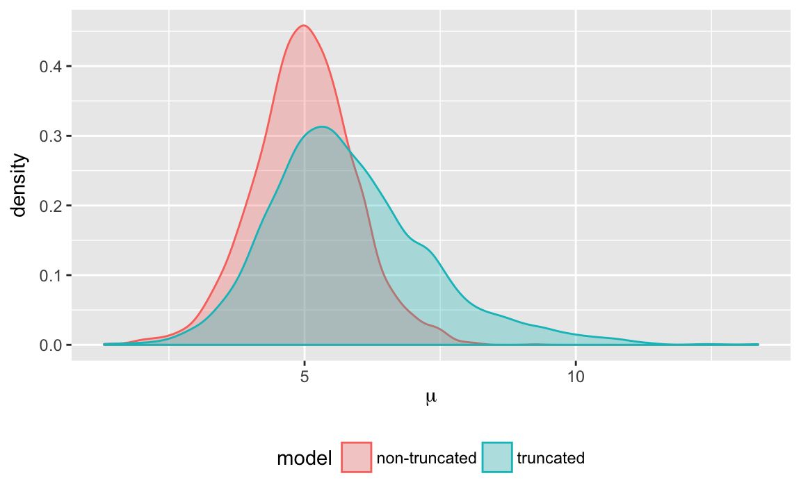
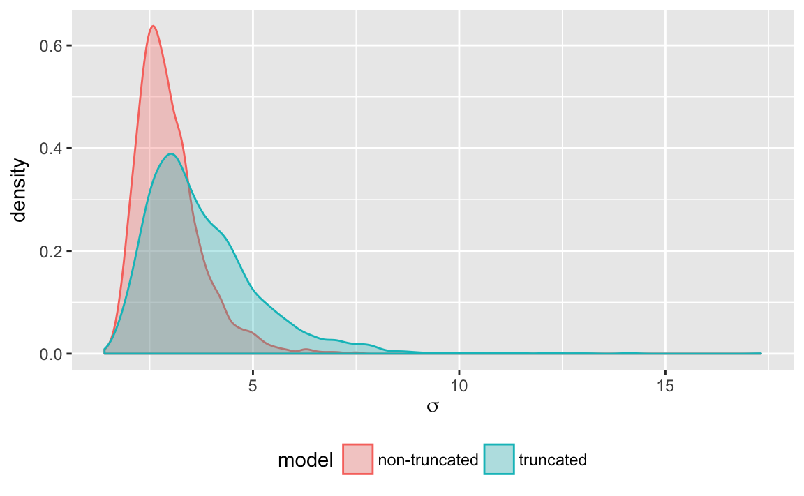

# Truncation: How does Stan deal with truncation?


```r
library("tidyverse")
library("rstan")
```

Suppose we observed $y = (1, \dots, 9)$,[^truncated-source]

```r
y <- 1:9
```
These observations are drawn from a population distributed normal with unknown mean ($\mu$) and variance ($\sigma^2$), with the constraint that $y < 10$,
$$
\begin{aligned}[t]
y_i &\sim \mathsf{Normal}(\mu, \sigma^2) I(-\infty, 10) .
\end{aligned}
$$

With the censoring taken into account, the log likelihood is 
$$
\log L(y; \mu, \sigma) = \sum_{i = 1}^n \left( \log \phi(y_i; \mu, \sigma^2) - \log\Phi(y_i; \mu, \sigma^2) \right)
$$
where $\phi$ is the normal distribution PDF, and $\Phi$ is the normal distribution $

The posterior of this model is not well identified by the data, so the mean, $\mu$, and scale, $\sigma$, are given informative priors based on the data,
$$
\begin{aligned}[t]
\mu &\sim \mathsf{Normal}(\bar{y}, s_y) ,\\
\sigma &\sim \mathsf{HalfCauchy}(0, s_y) .
\end{aligned}
$$
where $\bar{y}$ is the mean of $y$, and $s_y$ is the standard deviation of $y$. Alternatively, we could have standardized the data prior to estimation.

## Stan Model

See @Stan2016a, Chapter 11 "Truncated or Censored Data" for more on how Stan handles truncation and censoring. 
In Stan the `T` operator used in sampling statement,
```
y ~ distribution(...) T[upper, lower];
```
is used to adjust the log-posterior contribution for truncation.


```r
truncate_mod <- stan_model("stan/truncated.stan")
```
<pre>
  <code class="stan">data {
  int N;
  vector[N] y;
  real U;
  real mu_mean;
  real mu_scale;
  real sigma_scale;
}
parameters {
  real mu;
  real<lower = 0.> sigma;
}
model {
  mu ~ normal(mu_mean, mu_scale);
  sigma ~ cauchy(0., sigma_scale);
  for (i in 1:N) {
    y[i] ~ normal(mu, sigma) T[, U];
  }
}</code>
</pre>


## Estimation


```r
truncate_data <- within(list(), {
  y <- y
  N <- length(y)
  U <- 10
  mu_mean <- mean(y)
  mu_scale <- sd(y)
  sigma_scale <- sd(y)
})
```


```r
truncate_fit1 <- sampling(truncate_mod, data = truncate_data)
```

```r
truncate_fit1
#> Inference for Stan model: truncated.
#> 4 chains, each with iter=2000; warmup=1000; thin=1; 
#> post-warmup draws per chain=1000, total post-warmup draws=4000.
#> 
#>         mean se_mean   sd   2.5%    25%    50%    75%  97.5% n_eff Rhat
#> mu      5.82    0.04 1.48   3.39   4.84   5.63   6.63   9.41  1201    1
#> sigma   3.76    0.04 1.39   1.97   2.80   3.46   4.40   7.20  1250    1
#> lp__  -13.54    0.03 1.08 -16.30 -13.99 -13.22 -12.75 -12.44  1258    1
#> 
#> Samples were drawn using NUTS(diag_e) at Tue Jun  6 23:42:17 2017.
#> For each parameter, n_eff is a crude measure of effective sample size,
#> and Rhat is the potential scale reduction factor on split chains (at 
#> convergence, Rhat=1).
```

We can compare these results to that of a model in which the truncation is not taken into account:
$$
\begin{aligned}[t]
y_i &\sim \mathsf{Normal}(\mu, \sigma^2), \\
\mu &\sim \mathsf{Normal}(\bar{y}, s_y) ,\\
\sigma &\sim \mathsf{HalfCauchy}(0, s_y) .
\end{aligned}
$$


```r
truncate_mod2 <- stan_model("stan/normal.stan")
```
<pre>
  <code class="stan">data {
  int N;
  vector[N] y;
  real mu_mean;
  real mu_scale;
  real sigma_scale;
}
parameters {
  real mu;
  real<lower = 0.> sigma;
}
model {
  mu ~ normal(mu_mean, mu_scale);
  sigma ~ cauchy(0., sigma_scale);
  y ~ normal(mu, sigma);
}</code>
</pre>


```r
truncate_fit2 <-
  sampling(truncate_mod2, data = truncate_data)
```

```r
truncate_fit2
#> Inference for Stan model: normal.
#> 4 chains, each with iter=2000; warmup=1000; thin=1; 
#> post-warmup draws per chain=1000, total post-warmup draws=4000.
#> 
#>         mean se_mean   sd   2.5%    25%    50%    75%  97.5% n_eff Rhat
#> mu      5.00    0.02 0.93   3.17   4.43   5.01   5.59   6.91  2193    1
#> sigma   2.97    0.02 0.79   1.87   2.42   2.82   3.33   4.96  1836    1
#> lp__  -13.77    0.03 1.05 -16.69 -14.16 -13.45 -13.03 -12.75  1265    1
#> 
#> Samples were drawn using NUTS(diag_e) at Tue Jun  6 23:42:20 2017.
#> For each parameter, n_eff is a crude measure of effective sample size,
#> and Rhat is the potential scale reduction factor on split chains (at 
#> convergence, Rhat=1).
```

We can compare the densities for $\mu$ and $\sigma$ in each of these models.

```r
plot_density <- function(par) {
  bind_rows(
    tibble(value = rstan::extract(truncate_fit1, par = par)[[1]],
            model = "truncated"),
    tibble(value = rstan::extract(truncate_fit2, par = par)[[1]],
            model = "non-truncated")
  ) %>%
    ggplot(aes(x = value, colour = model, fill = model)) +
    geom_density(alpha = 0.3) +
    labs(x = eval(bquote(expression(.(as.name(par)))))) +
    theme(legend.position = "bottom")
}
```

```r
plot_density("mu")
```

<div class="figure" style="text-align: center">

<p class="caption">Posterior density of $\mu$ when estimated with and without truncation</p>
</div>

```r
plot_density("sigma")
```

<div class="figure" style="text-align: center">

<p class="caption">Posterior density of $\sigma$ when estimated with and without truncation</p>
</div>


## Questions

1. How are the densities of $\mu$ and $\sigma$ different under the two models? Why are they different?
2. Re-estimate the model with improper uniform priors for $\mu$ and $\sigma$. How do the posterior distributions change?
3. Suppose that the truncation points are unknown. Write a Stan model and estimate. See @Stan2016a, Section 11.2 "Unknown Truncation Points" for how to write such a model. How important is the prior you place on the truncation points? 

[^truncated-source]: This example is derived from Simon Jackman. "Truncation: How does WinBUGS deal with truncation?" *BUGS Examples*, 2007-07-24,
 [URL](https://web-beta.archive.org/web/20070724034035/http://jackman.stanford.edu:80/mcmc/SingleTruncation.odc).
